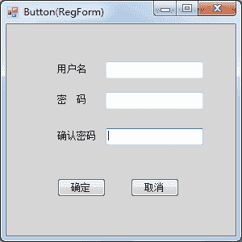
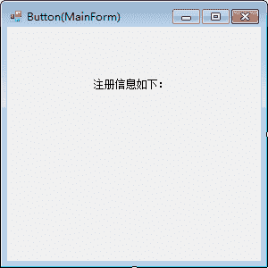
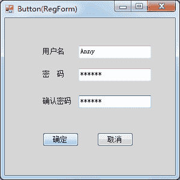
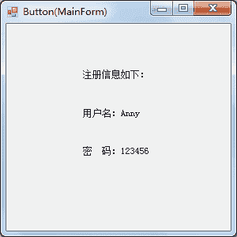

# C# Button：按钮控件

> 原文：[`c.biancheng.net/view/2956.html`](http://c.biancheng.net/view/2956.html)

按钮主要用于提交页面的内容，或者是确认某种操作等。

按钮包括普通的按钮 (Button)、单选按钮 (RadioButton)，本节主要讲解按钮的应用，单选按钮将在下一节《C# RadioButton》为大家讲解。

按钮常用的属性包括在按钮中显示的文字 (Text) 以及按钮外观设置的属性，最常用的事件是单击事件。

【实例】实现一个简单的用户注册功能，并将提交的注册信息显示在新窗体的文本框中。

本例的用户注册界面中仅包括用户名和密码，通过单击“注册”按钮跳转到新窗体中并显示注册的用户名和密码，实现该功能分别使用 RegForm 窗体和 MainForm 窗体。

RegForm 窗体的界面如下图所示。


在注册时判断用户名和密码不能为空，并且要求两次输入的密码一致，实现的代码如下。

```

public partial class RegForm : Form
{
    public RegForm()
    {
        InitializeComponent();
    }
    //“确定”按钮的单击事件，用于判断注册信息并跳转到新窗口显示注册信息
    private void button1_Click(object sender, EventArgs e)
    {
        string name = textBox1.Text;
        string pwd = textBox2.Text;
        string repwd = textBox3.Text;
        if (string.IsNullOrEmpty(name))
        {
            MessageBox.Show("用户名不能为空！");
            return;
        }
        else if (string.IsNullOrEmpty(textBox2.Text))
        {
            MessageBox.Show("密码不能为空！");
            return;
        }
        else if (!textBox2.Text.Equals(textBox3.Text))
        {
            MessageBox.Show("两次输入的密码不一致！");
            return;
        }
        //将用户名和密码传递到主窗体中
        MainForm mainForm = new MainForm(name, pwd);
        mainForm.Show();
    }
    //“取消”按钮的事件，用于关闭窗体
    private void button2_Click(object sender, EventArgs e)
    {
        //关闭窗体
        this.Close();
    }
}
```

MainForm 窗体的界面如下图所示。


在 MainForm 界面中使用标签 label2 和 label3 分别显示用户名和密码，代码如下。

```

public partial class MainForm : Form
{
    public MainForm(string name,string pwd)
    {
        InitializeComponent();
        label2.Text = "用户名："+ name;
        label3.Text = "密  码："+pwd;
    }
}
```

运行 RegForm 窗体，效果如下图所示。


单击“确定”按钮，效果如下图所示。


从上面的实例可以看出，如果需要在两个窗体中传递参数，则可以使用按钮和文本框。