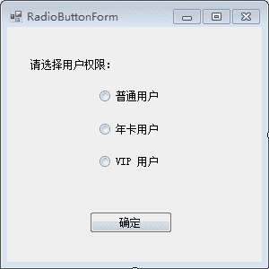
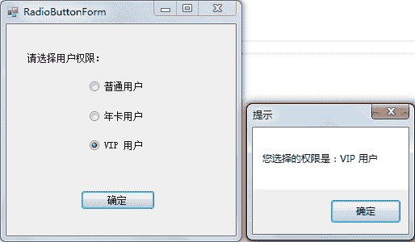

# C# RadioButton：单选按钮控件

> 原文：[`c.biancheng.net/view/2957.html`](http://c.biancheng.net/view/2957.html)

在 C# 语言中 RadioButton 是单选按钮控件，多个 RadioButton 控件可以为一组，这一组内的 RadioButton 控件只能有一个被选中。

下面通过实例来演示单选按钮控件 RadioButton 的应用。

【实例】完成选择用户权限的操作，并在消息框中显示所选的权限名。

根据题目要求，用户权限包括“普通用户”“年卡用户”“VIP 用户”，因此需要 3 个单选按钮。

实现该功能的窗体名称为 RadioButtonForm，界面设计如下图所示。


单击“确认”按钮选择相应的用户权限，实现的代码如下。

```

public partial class RadioButtonForm : Form
{
    public RadioButtonForm()
    {
        InitializeComponent();
    }
    //单击“确定”按钮的事件
    private void button1_Click(object sender, EventArgs e)
    {
        string msg = "";
        if (radioButton1.Checked)
        {
            msg = radioButton1.Text;
        }
        else if (radioButton2.Checked)
        {
            msg = radioButton2.Text;
        }
        else if (radioButton3.Checked)
        {
            msg = radioButton3.Text;
        }
        MessageBox.Show("您选择的权限是：" + msg, "提示");
    }
}
```

RadioButtonForm 窗体的运行效果如下图所示。



> 提示：Checked 属性可用于判断单选按钮是否被选中。如果该属性的返回值为 True，则代表选中；如果返回值为 False，则表示未选中。