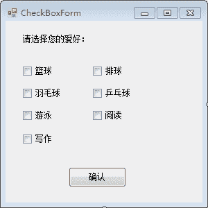
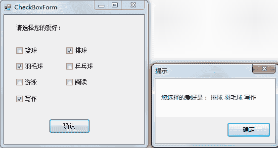

# C# CheckBox：复选框控件

> 原文：[`c.biancheng.net/view/2958.html`](http://c.biancheng.net/view/2958.html)

在 C# 语言中复选框 (CheckBox) 是与上一节《C# RadioButton》中介绍的单选按钮相对应的，用于选择多个选项的操作。

复选框主要的属性是：Name、Text、Checked。

其中：

*   Name：表示这个组件的名称；
*   Text：表示这个组件的标题；
*   Checked：表示这个组件是否已经选中。

主要的事件就是 CheckedChanged 事件。

下面通过实例来演示复选框 (CheckBox) 的应用。

【实例】完成选择用户爱好的操作，并在消息框中显示所选的爱好。

根据题目要求，用户爱好包括篮球、排球、羽毛球、乒乓球、游泳、阅读、写作，因此需要 7 个复选框。

实现该功能的窗体名称为 CheckBoxForm，窗体设计如下图所示。


单击“确认”按钮显示选择的爱好，实现的代码如下。

```

public partial class CheckBoxForm : Form
{
    public CheckBoxForm()
    {
        InitializeComponent();
    }
    //单击“确认”按钮，显示选择的爱好
    private void button1_Click(object sender, EventArgs e)
    {
        string msg = "";
        if (checkBox1.Checked)
        {
            msg = msg + " " + checkBox1.Text;
        }
        if (checkBox2.Checked)
        {
            msg = msg + " " + checkBox2.Text;
        }
        if (checkBox3.Checked)
        {
            msg = msg + " " + checkBox3.Text;
        }
        if (checkBox4.Checked)
        {
            msg = msg + " " + checkBox4.Text;
        }
        if (checkBox5.Checked)
        {
            msg = msg + " " + checkBox5.Text;
        }
        if (checkBox6.Checked)
        {
            msg = msg + " " + checkBox6.Text;
        }
        if (checkBox7.Checked)
        {
            msg = msg + " " + checkBox7.Text;
        }
        if(msg != "")
        {
            MessageBox.Show("您选择的爱好是：" + msg, "提示");
        }
        else
        {
            MessageBox.Show("您没有选择爱好", "提示");
        }
    }
}
```

运行该窗体，效果如下图所示。


与判断单选按钮是否被选中一样，判断复选框是否被选中也使用 Checked 属性。

试想如果界面上的复选框有几十个或更多，每个复选框都需要判断，则会出现很多的冗余代码。

由于都要获取复选框是否被选中了，界面上的每一个控件都继承自 Control 类，直接判断界面上的控件是否为复选框即可，实现上述功能的代码可以简化为如下。

```

private void button1_Click(object sender, EventArgs e)
{
    string msg = "";
    foreach(Control c in Controls)
    {
        //判断控件是否为复选框控件
        if(c is CheckBox)
        {
            if (((CheckBox)c).Checked)
            {
                msg = msg + " " + ((CheckBox)c).Text;
            }
        }
    }
    if(msg != "")
    {
        MessageBox.Show("您选择的爱好是：" + msg, "提示");
    }
    else
    {
        MessageBox.Show("您没有选择爱好", "提示");
    }
}
```

执行以上代码的效果与上图一致，但从代码量上来说已经减少了很多的冗余代码， 减轻了程序员的工作量。

Control 除了可以在界面上查找复选框以外，还可以查找其他控件。