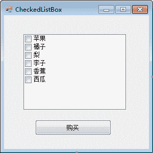
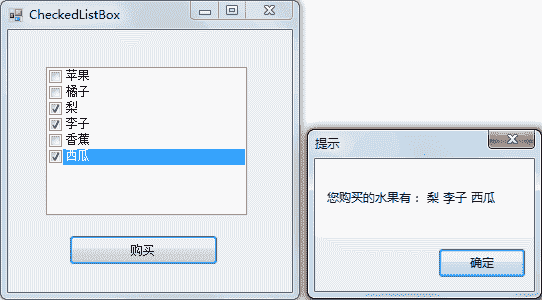

# C# CheckedListBox：复选列表框控件

> 原文：[`c.biancheng.net/view/2960.html`](http://c.biancheng.net/view/2960.html)

在 C# 语言中提供了与《C# CheckBox》一节中介绍的复选框功能类似的复选列表框 (CheckedListBox)，方便用户设置和获取复选列表框中的选项。

复选列表框显示的效果与复选框类似，但在选择多个选项时操作比一般的复选框更方便。

下面通过实例来演示复选列表框的应用。

【实例】使用复选列表框完成选购水果的操作。

根据题目要求，创建一个名为 CheckedListBox 窗体，在复选列表框中添加 6 种水果， 单击“购买”按钮，弹出消息框显示购买的水果种类。

该窗体的设计界面如下图所示。


实现单击“购买”按钮的代码如下。

```

public partial class CheckedListBox : Form
{
    public CheckedListBox()
    {
        InitializeComponent();
    }
    //“购买”按钮的点击事件，用于在消息框中显示购买的水果种类
    private void button1_Click(object sender, EventArgs e)
    {
        string msg = "";
        for(int i = 0; i < checkedListBox1.CheckedItems.Count; i++)
        {
            msg = msg + " " + checkedListBox1.CheckedItems[i].ToString();
        }
        if (msg != "")
        {
            MessageBox.Show("您购买的水果有：" + msg, "提示");
        }
        else
        {
            MessageBox.Show("您没有选购水果！", "提示");
        }
    }
}
```

运行该窗体，效果如下图所示。


在使用复选列表框控件时需要注意获取列表中的项使用的是 Checkedltems 属性，获取当前选中的文本（上图中蓝色的区域）使用的是 Selectedltem 属性。