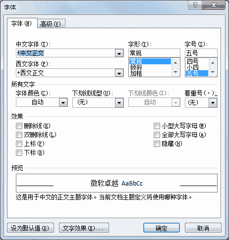
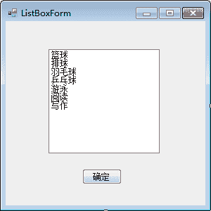
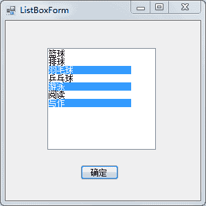
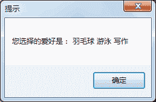
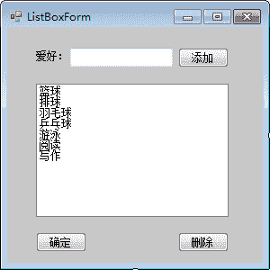
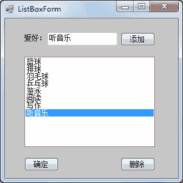

# C# ListBox：列表框控件

> 原文：[`c.biancheng.net/view/2962.html`](http://c.biancheng.net/view/2962.html)

列表框 (ListBox) 将所提供的内容以列表的形式显示出来，并可以选择其中的一项或多项内容，从形式上比使用复选框更好一些。

例如，在 Word 中设置字体时界面如下图所示。


在列表框控件中有一些属性与前面介绍的控件不同，如下表所示。

| 属性名 | 作用 |
| MultiColumn | 获取或设置列表框是否支持多列，如果设置为 True，则表示支持多列； 如果设置为 False，则表示不支持多列，默认为 False |
| Items | 获取或设置列表框控件中的值 |
| SelectedItems | 获取列表框中所有选中项的集合 |
| SelectedItem | 获取列表框中当前选中的项 |
| SelectedIndex | 获取列表框中当前选中项的索引，索引从 0 开始 |
| SelectionMode | 获取或设置列表框中选择的模式，当值为 One 时，代表只能选中一项， 当值为 MultiSimple 时，代表能选择多项，当值为 None 时，代表不能选 择，当值为 MultiExtended 时，代表能选择多项，但要在按下 Shift 键后 再选择列表框中的项 |

列表框还提供了一些方法来操作列表框中的选项，由于列表框中的选项是一个集合形式的，列表项的操作都是用 Items 属性进行的。

例如 `Items.Add` 方法用于向列表框中添加项，`Items.Insert` 方法用于向列表框中的指定位置添加项，`Items.Remove` 方法用于移除列表框中的项。

【实例 1】使用列表框的形式完成《C# CheckBox》一节中爱好的选择。

根据题目要求，使用列表框列出所需的爱好，将窗体命名为 ListBoxForm，界面设计如下图所示。



> 提示：ListBox 实现多选需要设置窗体的 SelectionMode 属性为 MultiSimple。

单击“确定”按钮以消息框弹出所选的爱好，实现的代码如下。

```

public partial class ListBoxForm : Form
{
    public ListBoxForm()
    {
        InitializeComponent();
    }
    //单击“确定”按钮事件
    private void button1_Click(object sender, EventArgs e)
    {
        string msg = "";
        for(int i = 0; i < listBox1.SelectedItems.Count; i++)
        {
            msg = msg + " " + listBox1.SelectedItems[i].ToString();
        }
        if (msg != "")
        {
            MessageBox.Show("您选择的爱好是：" + msg, "提示");
        }
        else
        {
            MessageBox.Show("您没有选择爱好", "提示");
        }
    }
}
```

运行 ListBoxForm 窗体，效果如下图所示。


单击“确定”按钮后弹出消息框显示被选中的项目，效果如下图所示。


【实例 2】在实例 1 的基础上添加两个按钮，一个负责向列表框中添加爱好，一个负责删除选中的列表项。

根据题目要求，ListBoxForm 窗体的设计效果如下图所示。


实现的代码如下。

```

//将列表框中的选中项删除
private void button2_Click(object sender, EventArgs e)
{
    //由于列表框控件中允许多选所以需要循环删除所有已选项
    int count = listBox1.SelectedItems.Count;
    List<string> itemValues = new List<string>();
    if (count != 0)
    {
        for(int i = 0; i < count; i++)
        {
            itemValues.Add(listBox1.SelectedItems[i].ToString());
        }
        foreach(string item in itemValues)
        {
            listBox1.Items.Remove(item);
        }
    }
    else
    {
        MessageBox.Show("请选择需要删除的爱好！");
    }
}
//将文本框中的值添加到列表框中
private void button3_Click(object sender, EventArgs e)
{
    //当文本框中的值不为空时将其添加到列表框中
    if (textBox1.Text != "")
    {
        listBox1.Items.Add(textBox1.Text);
    }
    else
    {
        MessageBox.Show("请添加爱好！");
    }
}
```

在编写删除操作的功能时需要注意，首先要将列表框中的选中项存放到一个集合中, 然后再对该集合中的元素依次使用 Remove 方法移除。

向列表框中添加选项的效果如下图所示。


当选中列表框中的值并单击“删除”按钮后，列表中的相应选项即可被删除。