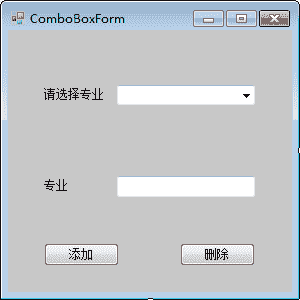
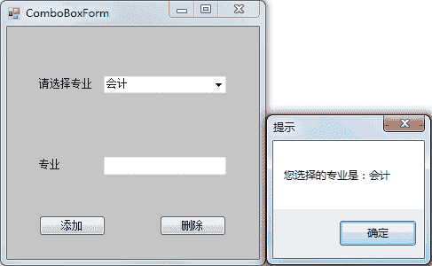

# C# ComboBox：组合框控件

> 原文：[`c.biancheng.net/view/2963.html`](http://c.biancheng.net/view/2963.html)

在 C# WinForm 开发中组合框（ComboBox）控件也称下拉列表框，用于选择所需的选项，例如在注册学生信息时选择学历、专业等。

使用组合框可以有效地避免非法值的输入。

在组合框中也有一些经常使用的属性，如下表所示。

| 属性名 | 作用 |
| DropDownStyle | 获取或设置组合框的外观，如果值为 Simple，同时显示文本框和列表框，并且文本框可以编辑；如果值为 DropDown，则只显示文本框，通过鼠标或键盘的单击事件展开文本框，并且文本框可以编辑；如果值为 DropDownList，显示效果与 DropDown 值一样，但文本框不可编辑。默认情况下为 DropDown |
| Items | 获取或设置组合框中的值 |
| Text | 获取或设置组合框中显示的文本 |
| MaxDropDownltems | 获取或设置组合框中最多显示的项数 |
| Sorted |  指定是否对组合框列表中的项进行排序，如果值为 True，则排序， 如果值为 False，则不排序。默认情况下为 False |

在组合框中常用的事件是改变组合框中的值时发生的，即组合框中的选项改变事件 SelectedlndexChanged。

此外，在组合框中常用的方法与列表框类似，也是向组合框中添加项、从组合框中删除项。

【实例】实现一个选择专业的实例。

根据题目要求，创建一个名为 ComboBoxForm 的窗体，界面设计如下图所示。


在窗体的设计界面中为组合框填入 5 个专业，或者使用代码添加值，在本实例中使用代码向组合框中添加值；通过“添加”或“删除”按钮将文本框中输入的值添加到组合框中或从组合框中删除。

实现的代码如下。

```

public partial class ComboBoxForm : Form
{
    public ComboBoxForm()
    {
        InitializeComponent();
    }
    //窗体加载事件，为组合框添加值
    private void ComboBoxForm_Load(object sender, EventArgs e)
    {
        comboBox1.Items.Add("计算机应用");
        comboBox1.Items.Add("英语");
        comboBox1.Items.Add("会计");
        comboBox1.Items.Add("软件工程");
        comboBox1.Items.Add("网络工程");
    }
    //组合框中选项改变的事件
    private void comboBox1_SelectedIndexChanged(object sender, EventArgs e)
    {
        //当组合框中选择的值发生变化时弹出消息框显示当前组合框中选择的值
        MessageBox.Show("您选择的专业是：" + comboBox1.Text, "提示");
    }
    //“添加”按钮的单击事件，用于向组合框中添加文本框中的值
    private void button1_Click(object sender, EventArgs e)
    {
        //判断文本框中是否为空，不为空则将其添加到组合框中
        if (textBox1.Text != "")
        {
            //判断文本框中的值是否与组合框中的的值重复
            if (comboBox1.Items.Contains(textBox1.Text))
            {
                MessageBox.Show("该专业已存在！");
            }
            else
            {
                comboBox1.Items.Add(textBox1.Text);
            }
        }
        else
        {
            MessageBox.Show("请输入专业！", "提示");
        }
    }
    //“删除按钮的单击事件，用于删除文本框中输入的值”
    private void button2_Click(object sender, EventArgs e)
    {
        //判断文本框是否为空
        if (textBox1.Text != "")
        {
            //判断组合框中是否存在文本框中输入的值
            if (comboBox1.Items.Contains(textBox1.Text))
            {
                comboBox1.Items.Remove(textBox1.Text);
            }
            else
            {
                MessageBox.Show("您输入的专业不存在", "提示");
            }
        }
        else
        {
            MessageBox.Show("请输入要删除的专业","提示");
        }
    }
}
```

运行该窗体，效果如下图所示。

