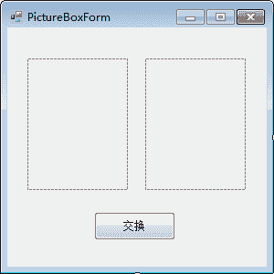
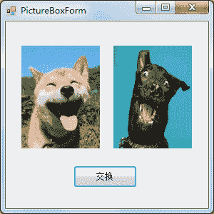
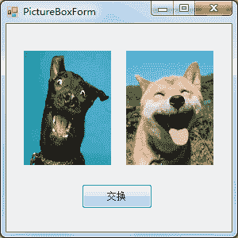

# C# PictureBox：图片控件

> 原文：[`c.biancheng.net/view/2965.html`](http://c.biancheng.net/view/2965.html)

在 Windows 窗体应用程序中显示图片时要使用图片控件 ( PictureBox )，图片的设置方式与背景图片的设置方式相似。

图片控件中常用的属性如下表所示。

| 属性名 | 作用 |
| Image | 获取或设置图片控件中显示的图片 |
| ImageLocation | 获取或设置图片控件中显示图片的路径 |
| SizeMode | 获取或设置图片控件中图片显示的大小和位置，如果值为 Normal，则图片显不在控件的左上角；如果值为 Stretchimage，则图片在图片控件中被拉伸或收缩，适合图片的大小；如果值为 AutoSize，则控件的大小适合图片的大小；如果值为 Centerimage，图片在图片控件中居中；如果值为 Zoom，则图片会自动缩放至符合图片控件的大小 |

图片控件中图片的设置除了可以直接使用 ImageLocation 属性指定图片路径以外，还可以通过 Image.FromFile 方法来设置。

实现的代码如下。

图片控件的名称 .Image = Image. FromFile( 图像的路径 );

【实例】实现图片交换。

根据题目要求，定义一个名为 PictureBoxForm 的窗体，并在该窗体上放置两个图片控件和 一个按钮，界面设计如下图所示。


单击“交换”按钮完成图片的交换，并在窗体加载时为图片控件设置图片，实现的代码如下。

```

public partial class PictureBoxForm : Form
{
    public PictureBoxForm()
    {
        InitializeComponent();
    }
    //窗体加载事件，设置图片空间中显示的图片
    private void PictureBoxForm_Load(object sender, EventArgs e)
    {
        pictureBox1.Image = Image.FromFile(@"D:\\C#_test\\111.jpg");
        pictureBox1.SizeMode = PictureBoxSizeMode.StretchImage;
        pictureBox2.Image = Image.FromFile(@"D:\\C#_test\\222.jpg");
        pictureBox2.SizeMode = PictureBoxSizeMode.StretchImage;
    }
    //“交换”按钮的单击事件，用于交换图片
    private void button1_Click(object sender, EventArgs e)
    {
        //定义中间变量存放图片地址，用于交换图片地址
        PictureBox pictureBox = new PictureBox();
        pictureBox.Image = pictureBox1.Image;
        pictureBox1.Image = pictureBox2.Image;
        pictureBox2.Image = pictureBox.Image;
    }
}
```

运行该窗体，效果如下图所示。


单击“交换”按钮，效果如图 9-27 所示。


在 Windows 窗体应用程序中，图片也可以用二进制的形式存放到数据库中，并使用文件流的方式读取数据库中的图片。

通过图片控件的 FromStream 方法来设置使用流读取的图片文件。