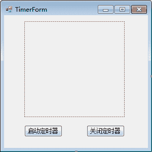
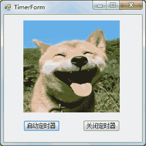

# C# Timer：定时器控件

> 原文：[`c.biancheng.net/view/2967.html`](http://c.biancheng.net/view/2967.html)

在 Windows 窗体应用程序中，定时器控件（Timer）与其他的控件略有不同，它并不直接显示在窗体上，而是与其他控件连用，表示每隔一段时间执行一次 Tick 事件。

定时器控件中常用的属性是 Interval，用于设置时间间隔，以毫秒为单位。

此外，在使用定时器控件时还会用到启动定时器的方法（Start）、停止定时器的方法（Stop）。

下面通过实例来演示定时器的使用。

【实例】实现图片每秒切换一次的功能

根据题目要求，使用定时器和图片控件完成每秒切换一次图片的功能，这里仅使用两张图片做切换。

将实现该功能的窗体命名为 TimerForm，界面设计如下图所示。


实现该功能的代码如下。

```

public partial class TimerForm : Form
{
    //设置当前图片空间中显示的图片
    //如果是 Timer1.jpg   flag 的值为 FALSE
    //如果是 Timer2.jpg   flag 的值为 TRUE
    bool flag = false;
    public TimerForm()
    {
        InitializeComponent();
    }
    //窗体加载事件，在图片空间中设置图片
    private void TimerForm_Load(object sender, EventArgs e)
    {
        pictureBox1.Image = Image.FromFile(@"D:\C#_test\Timer1.jpg");
        pictureBox1.SizeMode = PictureBoxSizeMode.StretchImage;
        //设置每隔 1 秒调用一次定时器 Tick 事件
        timer1.Interval = 1000;
        //启动定时器
        timer1.Start();
    }
    //触发定时器的事件，在该事件中切换图片
    private void timer1_Tick(object sender, EventArgs e)
    {
        //当 flag 的值为 TRUE 时将图片控件的 Image 属性切换到 Timer1.jpg
        //否则将图片的 Image 属性切换到 Timer2.jpg
        if (flag)
        {
            pictureBox1.Image = Image.FromFile(@"D:\C#_test\Timer1.jpg");
            flag = false;
        }
        else
        {
            pictureBox1.Image = Image.FromFile(@"D:\C#_test\Timer2.jpg");
            flag = true;
        }
    }
    //“启动定时器”按钮的单击事件
    private void button1_Click(object sender, EventArgs e)
    {
        timer1.Start();
    }
    //“停止定时器”按钮的单击事件
    private void button2_Click(object sender, EventArgs e)
    {
        timer1.Stop();
    }
}
```

运行该窗体，效果如下图所示。


由于切换是动态的，从运行效果看不出来，读者可以直接通过演示程序查看效果。

另外，在本实例中将时间间隔属性 Interval 设置为 1000 毫秒，即 1 秒，读者可以根据实际情况更改该值。