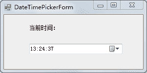

# C# DateTimePicker：日期时间控件

> 原文：[`c.biancheng.net/view/2969.html`](http://c.biancheng.net/view/2969.html)

在 C# 语言中日期时间控件（DateTimePicker）在时间控件中的应用最多，主要用于在界面上显示当前的时间。

日期时间控件中常用的属性是设置其日期显示格式的 Format 属性。

Format 属性提供了 4 个属性值，如下所示。

*   Short：短日期格式，例如 2017/3/1；
*   Long：长日期格式，例如 2017 年 3 月 1 日；
*   Time：仅显示时间，例如，22:00:01；
*   Custom：用户自定义的显示格式。

如果将 Format 属性设置为 Custom 值，则需要通过设置 CustomFormat 属性值来自定义显示日期时间的格式。

【实例】在窗体上设置动态的日期时间（使用定时器）。

根据题目要求，界面设计如下图所示。


实现该功能的代码如下。

```

public partial class DateTimePickerForm : Form
{
    public DateTimePickerForm()
    {
        InitializeComponent();
    }
    //DateTimePickerForm 窗体加载事件
    private void DateTimePickerForm_Load(object sender, EventArgs e)
    {
        //设置日期时间控件中仅显示时间
        dateTimePicker1.Format = DateTimePickerFormat.Time;
        //设置每隔一秒调用一次定时器 Tick 事件
        timer1.Interval = 1000;
        //启动定时器
        timer1.Start();
    }

    private void timer1_Tick(object sender, EventArgs e)
    {
        //重新设置日期时间控件的文本
        dateTimePicker1.ResetText();
    }
}
```