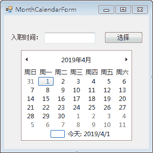
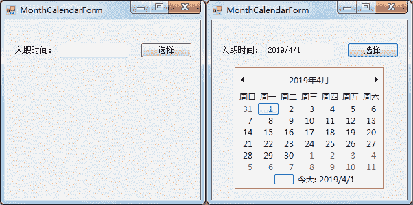

# C#日历控件（MonthCalendar）

> 原文：[`c.biancheng.net/view/2971.html`](http://c.biancheng.net/view/2971.html)

在 C# 中日历控件（MonthCalendar）用于显示日期，通常是与文本框联用，将日期控件中选择的日期添加到文本框中。

下面通过实例来学习日历控件的应用。

【实例】使用日历控件实现入职日期的选择。

根据题目要求，通过单击“选择”按钮显示日历控件，并将选择的日期显示在文本框中，界面设计如下图所示。


实现该功能的代码如下。

```

public partial class MonthCalendarForm : Form
{
    public MonthCalendarForm()
    {
        InitializeComponent();
    }
    //窗体加载事件
    private void MonthCalendarForm_Load(object sender, EventArgs e)
    {
        //隐藏日历控件
        monthCalendar1.Hide();
    }
    //“选择”按钮的单击事件
    private void button1_Click(object sender, EventArgs e)
    {
        //显示日历控件
        monthCalendar1.Show();
    }
    //日历控件的日期改变事件
    private void monthCalendar1_DateSelected(object sender, DateRangeEventArgs e)
    {
        //将选择的日期显示在文本框中
        textBox1.Text = monthCalendar1.SelectionStart.ToShortDateString();
        //隐藏日历控件
        monthCalendar1.Hide();
    }
}
```

运行该窗体，效果如下图所示。

