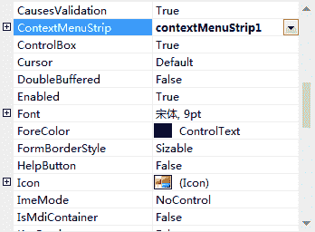
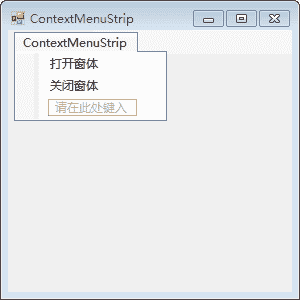
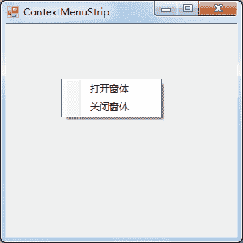

# C# ContextMenuStrip：右键菜单控件（上下文菜单）

> 原文：[`c.biancheng.net/view/2972.html`](http://c.biancheng.net/view/2972.html)

在 C# WinForm 开发中的右键菜单又叫上下文菜单，即右击某个控件或窗体时出现的菜单，它也是一种常用的菜单控件。

在 Windows 窗体应用程序中，上下文菜单在设置时直接与控件的 ContextMenuStrip 属性绑定即可。

下面通过实例来演示上下文菜单的应用。

【实例】创建 Windows 窗体应用程序，并为该窗体创建上下文菜单，菜单项包括打开窗体、关闭窗体。

根据题目要求创建 Windows 窗体，并在该窗体中添加上下文菜单。

在 Windows 窗体的 ContextMenuStrip 属性中设置所添加上下文菜单的名称。

设置属性的界面如下图所示。


设置 ContextMenuStrip1 菜单中的选项，如下图所示。


在每个菜单项的单击事件中加入相关的操作代码，即可实现右键菜单的功能，具体代码如下。

```

public partial class ContextMenuStrip : Form
{
    public ContextMenuStrip()
    {
        InitializeComponent();
    }
    //打开新窗体的菜单项单击事件
    private void 打开窗体 ToolStripMenuItem_Click(object sender, EventArgs e)
    {
        ContextMenuStrip menu1 = new ContextMenuStrip();
        menu1.Show();
    }
    //关闭窗体菜单项的单击事件
    private void 关闭窗体 ToolStripMenuItem_Click(object sender, EventArgs e)
    {
        this.Close();
    }
}
```

运行该窗体并右击，展开的右键菜单如下图所示。


从运行效果可以看出，右击窗体后会出现如上图所示的右键菜单。选择相应的菜单项即可执行相应的打开窗体和关闭窗体的功能。