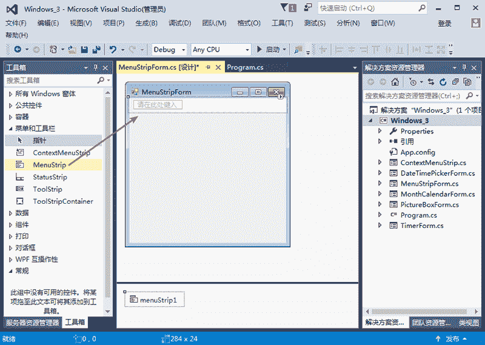
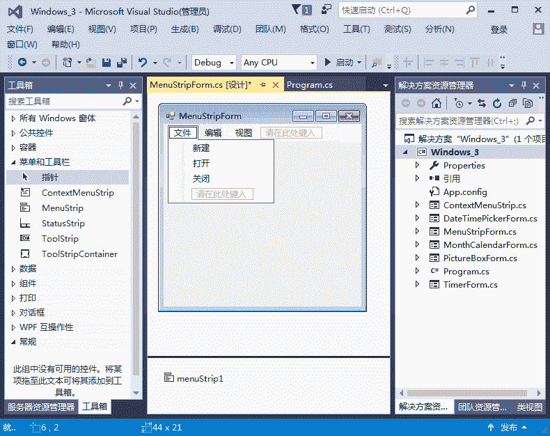

# C# MenuStrip：菜单栏控件

> 原文：[`c.biancheng.net/view/2973.html`](http://c.biancheng.net/view/2973.html)

在窗体上添加菜单栏控件 MenuStrip，直接按住 MenuStrip 不放，将其拖到右边的 Windows 窗体中即可，如下图所示。

完成 MenuStrip 控件的添加后，在 Windows 窗体设计界面中就能看到“请在此处键入” 选项，直接单击它，然后输入菜单的名称，例如，“文件”“编辑”“视图”等。

此外，添加一级菜单后还能添加二级菜单，例如，为“文件”菜单添加“新建”“打开”“关闭”等二级菜单，如下图所示，模拟一个文件菜单（包括二级菜单）和编辑菜单。

