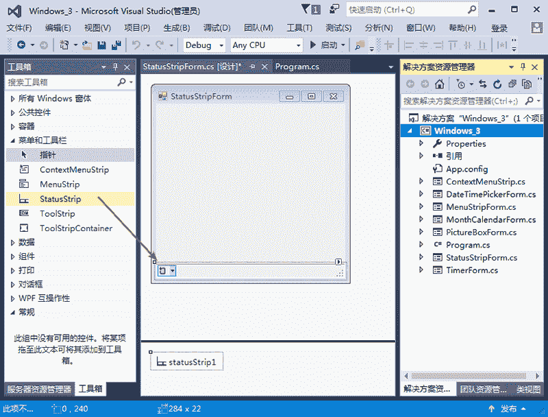
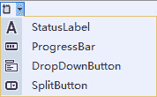

# C# StatusStrip：状态栏菜单控件

> 原文：[`c.biancheng.net/view/2974.html`](http://c.biancheng.net/view/2974.html)

在 Windows 窗体应用程序中，状态栏菜单（StatusStrip）用于在界面中给用户一些提示，例如登录到一个系统后，在状态栏上显示登录人的用户名、系统时间等信息。

在 Office 的 Word 软件中，状态中显示的是当前的页数、当前页的字数统计、页面分辨率等信息，如下图所示。

在添加状态栏菜单时，按住 StatusStrip 选项不放，将其拖到右边的 Windows 窗体中即可，如下图所示。

在状态栏上不能直接编辑文字，需要添加其他的控件来辅助。

单击上图所示界面中新添加的状态栏控件，则会显示如下图所示的下拉菜单，其中包括标签控件（StatusLabel）、进度条（ProgressBar）、下拉列表按钮（DropDownButton）、分割按钮（SplitButton）。

