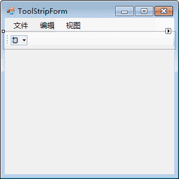
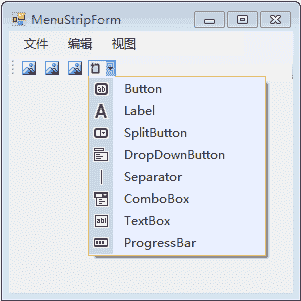

# C# ToolStrip：工具栏控件

> 原文：[`c.biancheng.net/view/2975.html`](http://c.biancheng.net/view/2975.html)

在 C# WinForm 开发中添加工具栏（ToolStrip）和添加菜单栏类似，在工具箱中将 ToolStrip 控件直接拖到 Windows 窗体中即可。

为了美观和界面的统一，应将其拖到菜单栏的下方，如下图所示。

在添加了 ToolStrip 控件之后，它只是一个工具条，上面并没有控件，所以它不能响应 一些事件，从而没有功能。

我们可以把它理解成一个占位符，就像是占着一个区域的位置，然后在其上面再添加按钮。

添加按钮也很简单，如下图所示。

