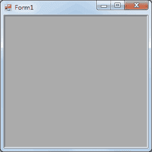
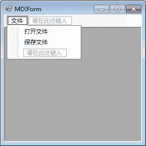
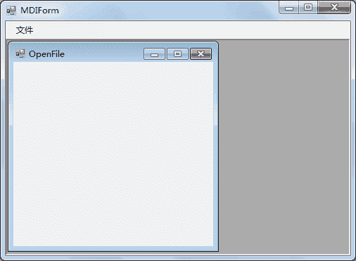

# C# MDI 窗体

> 原文：[`c.biancheng.net/view/2977.html`](http://c.biancheng.net/view/2977.html)

在 Windows 窗体应用程序中，经常会在一个窗体中打开另一个窗体， 通过窗体上的不同菜单选择不同的操作，这种在一个窗体中打开另一个窗体的方式可以通过设置 MDI 窗体的方式实现。

MDI (Multiple Document Interface) 窗体被称为多文档窗体，它是很多 Windows 应用程序中常用的界面设计。

MDI 窗体的设置并不复杂，只需要将窗体的属性 IsMdiContainer 设置为 True 即可。

该属性既可以在 Windows 窗体的属性窗口中设置，也可以通过代码设置，这里在窗体加载事件 Load 中设置窗体为 MDI 窗体，代码如下。

this.IsMdiContainer = True;

此外，还可以在窗体类的构造方法中加入上面的代码。

在设置 MDI 窗体以后，窗体的运行效果如下图所示。


在 MDI 窗体中，弹出窗体的代码与直接弹出窗体有些不同，在使用 Show 方法显示窗体前需要使用窗体的 MdiParent 设置显示当前窗体的父窗体，实现的代码如下。

```

Test t = new Test();
t.MdiParent = this;
t.Show();
```

这里，`this`代表的是当前窗体。

下面通过实例来演示 MDI 窗体的使用。

【实例】创建 MDI 窗体，并在该窗体上设置菜单，包括打开文件、保存文件两个菜单项。

根据题目要求创建名为 MDIForm 的窗体，并设置该界面为 MDI 窗体，然后为该界面添加一个菜单和两个菜单项，界面设计如下图所示。


创建打开文件窗体和保存文件窗体，并分别通过菜单项的单击事件在 MDI 窗体中打开相应的窗体，代码如下。

```

public partial class MDIForm : Form
{
    public MDIForm()
    {
        InitializeComponent();
        this.IsMdiContainer = true;
    }
    //打开文件菜单项的单击事件
    private void 打开文件 ToolStripMenuItem_Click(object sender, EventArgs e)
    {
        OpenFile f = new OpenFile();
        f.MdiParent = this;
        f.Show();
    }
    //保存文件菜单项单击事件
    private void 保存文件 ToolStripMenuItem_Click(object sender, EventArgs e)
    {
        SaveFile f = new SaveFile();
        f.MdiParent = this;
        f.Show();
    }
}
```

运行该窗体并单击“打开文件”菜单项，界面如下图所示。


从运行效果可以看出，打开文件窗体（OpenFile）在 MDI 窗体（MDIForm）中打开。