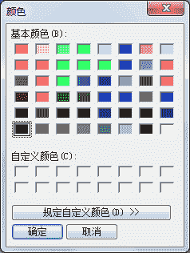
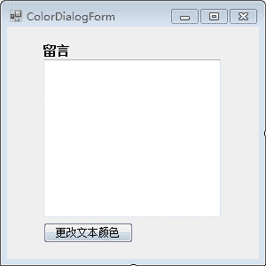
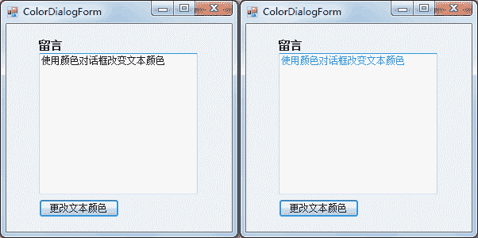

# C# ColorDialog：颜色对话框控件

> 原文：[`c.biancheng.net/view/2978.html`](http://c.biancheng.net/view/2978.html)

在 C# WinForm 开发中颜色对话框控件（ColorDialog）用于对界面中的文字设置颜色，例如在 Word 中为文字设置颜色。

颜色对话框的运行效果如下图所示。


在使用颜色对话框时不会在窗体中直接显示该控件，需要通过事件调用该控件的 ShowDialog 方法显示对话框。

下面通过实例学习颜色对话框的应用。

【实例】使用颜色对话框完成文本框中字体颜色的设置。

根据题目要求，界面设计如下图所示。


在激活“更改文本颜色”按钮的单击事件时弹出颜色对话框，并为界面中文本框的文本设置文本颜色，实现的代码如下。

```

public partial class ColorDialogForm : Form
{
    public ColorDialogForm()
    {
        InitializeComponent();
    }
    //“更改文本颜色”按钮的单击事件
    private void button1_Click(object sender, EventArgs e)
    {
        //显示颜色对话框
        DialogResult dr = colorDialog1.ShowDialog();
        //如果选中颜色，单击“确定”按钮则改变文本框的文本颜色
        if (dr == DialogResult.OK)
        {
            textBox1.ForeColor = colorDialog1.Color;
        }
    }
}
```

运行该窗体，并将文本框中的文本设置为蓝色，效果如下图所示。


通过运行前后的效果可以看出，文本框中的文字已经通过颜色对话框更改为蓝色。