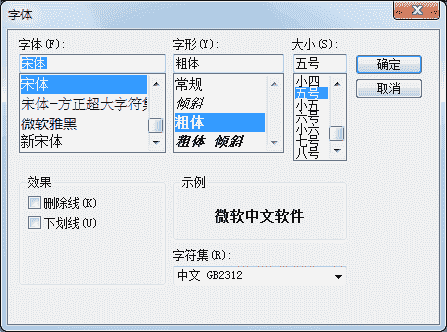
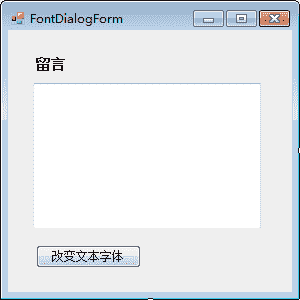
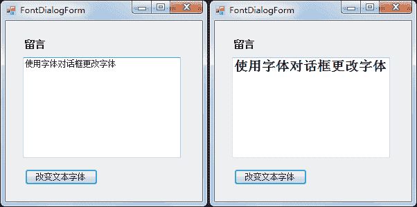

# C# FontDialog：字体对话框控件

> 原文：[`c.biancheng.net/view/2979.html`](http://c.biancheng.net/view/2979.html)

在 C# WinForm 开发中字体对话框 (FontDialog) 用于设置在界面上显示的字体，与 Word 中设置字体的效果类似，能够设置字体的大小以及显示的字体样式等。

字体对话框的运行效果如下图所示。


下面通过实例演示字体对话框的应用。

【实例】使用字体对话框改变文本框中的字体。

根据题目要求，界面设计如下图所示。


实现的代码如下。

```

public partial class FontDialogForm : Form
{
    public FontDialogForm()
    {
        InitializeComponent();
    }
    //“改变文本字体”按钮的单击事件
    private void button1_Click(object sender, EventArgs e)
    {
        //显示字体对话框
        DialogResult dr = fontDialog1.ShowDialog();
        //如果在对话框中单击“确认”按钮，则更改文本框中的字体
        if (dr == DialogResult.OK)
        {
            textBox1.Font = fontDialog1.Font;
        }
    }
}
```

运行该窗体，并更改字体的大小，效果如下图所示。


从运行效果的前后对比可以看出，文本框中的字体已经通过字体对话框改变了。