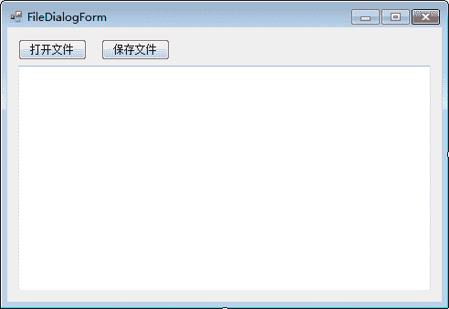

# C# OpenFileDialog 和 SaveFileDialog：打开文件与保存文件

> 原文：[`c.biancheng.net/view/2980.html`](http://c.biancheng.net/view/2980.html)

在 C# WinForm 开发中文件对话框（FileDialog）主要包括文件浏览对话框，以及用于查找、打开、保存文件的功能，与 Windows 中的文件对话框类似，下面通过实例来演示文件对话框的使用。

【实例】打开一个记事本文件，并更改记事本中的内容，保存到文件中。

根据题目要求，界面设计如下图所示。


在该界面中文本框使用的仍然是 TextBox，并将其设置为允许显示多行文本。

在该界面中“打开文件”和“保存文件”按钮的单击事件分别使用文件读入流和文件写入流来完成对文本信息的读写操作，实现的代码如下。

```

public partial class FileDialogForm : Form
{
    public FileDialogForm()
    {
        InitializeComponent();
    }
    //打开文件
    private void button1_Click(object sender, EventArgs e)
    {
        DialogResult dr = openFileDialog1.ShowDialog();
        //获取所打开文件的文件名
        string filename = openFileDialog1.FileName;
        if(dr==System.Windows.Forms.DialogResult.OK && !string.IsNullOrEmpty(filename))
        {
            StreamReader sr = new StreamReader(filename);
            textBox1.Text = sr.ReadToEnd();
            sr.Close();
        }
    }
    //保存文件
    private void button2_Click(object sender, EventArgs e)
    {
        DialogResult dr = saveFileDialog1.ShowDialog();
        string filename = saveFileDialog1.FileName;
        if(dr==System.Windows.Forms.DialogResult.OK && !string.IsNullOrEmpty(filename))
        {
            StreamWriter sw = new StreamWriter(filename, true, Encoding.UTF8);
            sw.Write(textBox1.Text);
            sw.Close();
        }
    }
}
```

运行该窗体，即可完成读取记事本文件的操作。