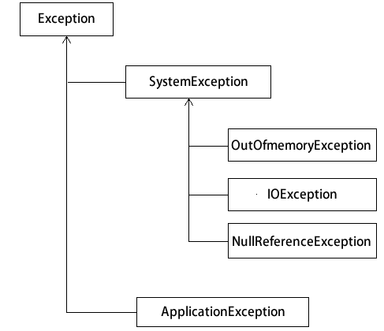

# C# Exception：异常类

> 原文：[`c.biancheng.net/view/2982.html`](http://c.biancheng.net/view/2982.html)

.NET Framework 类库中的所有异常都派生于 Exception 类，异常包括系统异常和应用异常。

默认所有系统异常派生于 System.SystemException，所有的应用程序异常派生于 System.ApplicationException。

系统异常包括 OutOfMemoryException、IOException、NullReferenceException。

常用的异常类如下图所示。

常用的系统异常类如下表所示。

| 异常类 | 说明 |
| System.OutOfMemoryException | 用 new 分配内存失败 |
| System.StackOverflowException | 递归过多、过深 |
| System.NullReferenceException | 对象为空 |
| Syetem.IndexOutOfRangeException | 数组越界 |
| System.ArithmaticException | 算术操作异常的基类 |
| System.DivideByZeroException | 除零错误 |