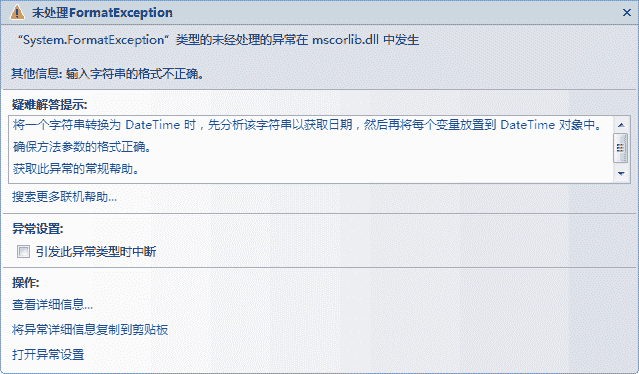
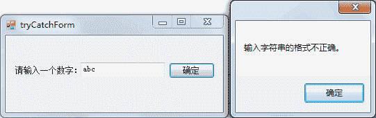
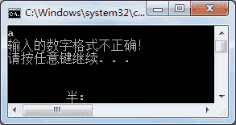
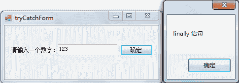
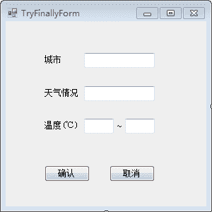
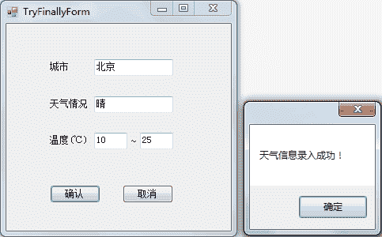

# C# try catch finally：异常处理

> 原文：[`c.biancheng.net/view/2986.html`](http://c.biancheng.net/view/2986.html)

在 C# 语言中异常与异常处理语句包括三种形式，即 try catch、try finally、try catch finally。

在上述三种异常处理的形式中所用到关键字其含义如下：

*   try：用于检查发生的异常，并帮助发送任何可能的异常。 
*   catch：以控制权更大的方式处理错误，可以有多个 catch 子句。 
*   finally：无论是否引发了异常，finally 的代码块都将被执行。 

下面我们将分别为大家讲解这三种形式的应用。

## 1) try catch

在 try 语句中放置可能出现异常的语句，而在 catch 语句中放置异常时处理异常的语句，通常在 catch 语句中输出异常信息或者发送邮件给开发人员等。

下面通过实例来演示 try catch 的应用。

另外，在处理异常时，catch 语句是允许多次使用的，相当于多分支的 if 语句，仅能执行其中一个分支。

【实例 1】在文本框中输入一个整数，并判断其是否大于 100。

根据题目要求，如果在文本框中输入的是一个字符串或者浮点数，就会出现类型转换错误，如下图所示。


如果使用异常处理的语句来处理数据类型转换，则不会岀现上图中的提示，而是出现 catch 语句中弹出的消息框，实现的代码如下。

```

public partial class tryCatchForm : Form
{
    public tryCatchForm()
    {
        InitializeComponent();
    }
    //“确认”按钮单击事件
    private void button1_Click(object sender, EventArgs e)
    {
        //获取文本框中的值
        string str = textBox1.Text;
        //将字符串装换为整数
        try
        {
            int num = int.Parse(str);
            MessageBox.Show("您输入的数字是：" + num);
        }
        catch (Exception ex)
        {
            MessageBox.Show(ex.Message);
        }
    }
}
```

运行该窗体，输入字符串“abc”，并单击“确定”按钮，效果如下图所示。


从运行效果可以看出，使用异常处理后不会再出现上面所示的异常提示，而是弹出 catch 子句中的消息框。

【实例 2】使用多个 catch 语句对程序做异常处理。

从控制台输入 5 个数存入整数数组中，首先判断输入的值是否为数值，再判断数组元素是否越界。

根据题目要求，创建控制台应用程序完成该实例，具体的代码如下。

```

class Program
{
    static void Main(string[] args)
    {
        //定义存放 5 个整数的数组
        int[] a = new int[5];
        try
        {
            for(int i = 0; i < a.Length; i++)
            {
                a[i] = int.Parse(Console.ReadLine());
            }
            for(int i = 0; i < a.Length; i++)
            {
                Console.Write(a[i] + " ");
            }
        }
        catch(FormatException f)
        {
            Console.WriteLine("输入的数字格式不正确！");
        }
        catch(OverflowException o)
        {
            Console.WriteLine("输入的值已经超出 int 类型的最大值！");
        }
        catch(IndexOutOfRangeException r)
        {
            Console.WriteLine("数组越界异常！");
        }
    }
}
```

运行该程序，效果如下图所示。


从运行效果可以看出，捕获该程序产生的异常类是 FormatException。

这样，在出现不同的异常时都会有相应的异常类来处理异常，这也是比较推荐的一种编程方法。

## 2) try finally

在 try finally 形式中没有单独对出现异常时处理的代码，finally 语句是无论 try 中的语句是否正确执行都会执行的语句。

通常在 finally 中编写的代码是关闭流、关闭数据库连接等操作，以免造成资源的浪费。

下面通过实例来演示 try finally 形式的应用。

【实例 3】验证 finally 语句的使用。

将实例 1 中的 catch 语句换成 finally 语句，代码如下。

```

public partial class tryCatchForm : Form
{
    public tryCatchForm()
    {
        InitializeComponent();
    }
    //“确认”按钮单击事件
    private void button1_Click(object sender, EventArgs e)
    {
        //获取文本框中的值
        string str = textBox1.Text;
        //将字符串装换为整数
        try
        {
            int num = int.Parse(str);
            MessageBox.Show("您输入的数字是：" + num);
        }
        finally
        {
            MessageBox.Show("finally 语句");
        }
    }
}
```

运行该窗体，单击“确定”按钮后效果如下图所示。


从运行效果可以看出，当文本框中输入的值是一个数字字符串时也会执行 finally 语句中的内容。

【实例 4】从文本框中输入当天的天气情况，并将其写入文件中，无论写入是否成功都将文件流关闭。

根据题目要求，使用 Windows 应用程序完成该实例，界面设计如下图所示。


单击“确认”按钮后，将界面的文本框中的信息写入名为 weather.txt 的文本文件中, 代码如下。

```

public partial class TryFinallyForm : Form
{
    public TryFinallyForm()
    {
        InitializeComponent();
    }
    //"确认"按钮的单击事件
    private void button1_Click(object sender, EventArgs e)
    {
        //获取文本框
        string city = txtCity.Text;
        string msg = txtMsg.Text;
        string min = txtMin.Text;
        string max = txtMax.Text;
        //将文本框中的内容组成一个字符串
        string message = city + "：" + msg + "：" + min + "~" + max;
        //定义文件路径
        string path = "D:\\C#_test\\weather.txt";
        FileStream fileStream = null;
        try
        {
            //创建 fileSteam 类的对象
            fileStream = new FileStream(path, FileMode.OpenOrCreate);
            //将字符串转换成字节数组
            byte[] bytes = Encoding.UTF8.GetBytes(message);
            //向文件中写入字节数组
            fileStream.Write(bytes, 0, bytes.Length);
            //刷新缓冲区
            fileStream.Flush();
            //弹出录入成功的消息框
            MessageBox.Show("天气信息录入成功！");
        }
        finally
        {
            if (fileStream != null)
            {
                //关闭流
                fileStream.Close();
            }
        }
    }
}
```

运行该窗体，并在界面中填入所需的信息，单击“确认”按钮，效果如下图所示。



## 3) try catch finally

try catch finally 形式语句是使用最多的一种异常处理语句。

在出现异常时能提供相应的异常处理，并能在 finally 语句中保证资源的回收。

下面通过实例来演示 try catch finally 语句的应用。

【实例 5】使用 try catch finally 形式完成实例 4 的题目要求。

在实例 4 中使用了 try finally 的形式来处理异常，这样在岀现异常时并不会在程序中给予任何提示。

下面使用 try catch finally 的形式来实现，代码如下。

```

public partial class TryFinallyForm : Form
{
    public TryFinallyForm()
    {
        InitializeComponent();
    }
    //"确认"按钮的单击事件
    private void button1_Click(object sender, EventArgs e)
    {
        //获取文本框
        string city = txtCity.Text;
        string msg = txtMsg.Text;
        string min = txtMin.Text;
        string max = txtMax.Text;
        //将文本框中的内容组成一个字符串
        string message = city + "：" + msg + "：" + min + "~" + max;
        //定义文件路径
        string path = "D:\\C#_test\\weather.txt";
        FileStream fileStream = null;
        try
        {
            //创建 fileSteam 类的对象
            fileStream = new FileStream(path, FileMode.OpenOrCreate);
            //将字符串转换成字节数组
            byte[] bytes = Encoding.UTF8.GetBytes(message);
            //向文件中写入字节数组
            fileStream.Write(bytes, 0, bytes.Length);
            //刷新缓冲区
            fileStream.Flush();
            //弹出录入成功的消息框
            MessageBox.Show("天气信息录入成功！");
        }
        catch(Exception ex)
        {
            MessageBox.Show("出现错误！" + ex.Message);
        }
        finally
        {
            if (fileStream != null)
            {
                //关闭流
                fileStream.Close();
            }
        }
    }
}
```

运行该窗体，效果与实例 4 所示的一样，但是当程序出现错误时会弹出 catch 语句中的提示消息。