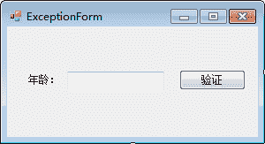
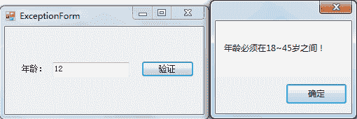

# C#自定义异常（throw 抛出异常）

> 原文：[`c.biancheng.net/view/2987.html`](http://c.biancheng.net/view/2987.html)

虽然在 C# 语言中已经提供了很多异常处理类，但在实际编程中还是会遇到未涉及的一些异常处理。

例如想将数据的验证放置到异常处理中，即判断所输入的年龄必须为 18〜45，此时需要自定义异常类来实现。

自定义异常类必须要继承 Exception 类。

声明异常的语句如下。

class 异常类名 :Exception
{
}

抛出自己的异常，语句如下

throw( 异常类名 );

下面通过实例来演示自定义异常的应用。

【实例】自定义异常类，判断从文本框中输入的年龄值处于 18〜45。

根据题目要求，设计一个 Windows 窗体，界面如下图所示。


编写自定义异常类，代码如下。

```

class MyException :Exception
{
    public MyException(string message) : base(message)
    {

    }
}
```

在“验证”按钮的单击事件中根据输入的年龄判断是否抛出自定义异常，代码如下。

```

private void button1_Click(object sender, EventArgs e)
{
    try
    {
        int age = int.Parse(textBox1.Text);
        if (age < 18 || age > 45)
        {
            throw new MyException("年龄必须在 18~45 岁之间！");
        }
        else
        {
            MessageBox.Show("输入的年龄正确！");
        }
    }
    catch(MyException myException)
    {
        MessageBox.Show(myException.Message);
    }
    catch(Exception ex)
    {
        MessageBox.Show(ex.Message);
    }
}
```

运行该窗体，若在窗体上输入不符合要求的年龄，效果如下图所示。


从运行效果可以看出，若在文本框中输入的年龄不在 18〜45 岁即会抛出自定的异常。

自定义异常也继承自 Exception 类，因此如果不直接处理 MyException 异常，也可以直接使用 Exception 类来处理该异常。