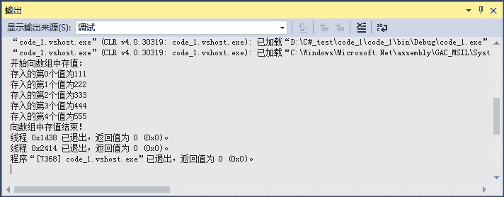
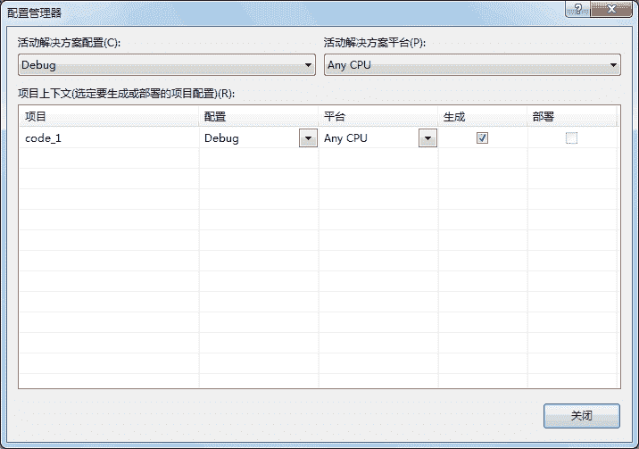

# C# Debug 和 Trace：输出调试信息

> 原文：[`c.biancheng.net/view/2989.html`](http://c.biancheng.net/view/2989.html)

在 C# 语言中允许在程序运行时输出程序的调试信息，类似于使用 Console.WriteLine 的方式向控制台输出信息。

所谓调试信息是程序员在程序运行时需要获取的程序运行的过程，以便程序员更好地解决程序中出现的问题，这种调试也被称为是非中断调试。

输出调试信息的类保存在 System.Diagnostics 命名空间中，通常用 Debug 类或 Trace 类实现调试时输出调试信息，具体的语句如下。

Debug.WriteLine();
Trace.WriteLine();

其中，Debug.WriteLine() 是在调试模式下使用的；Trace.WriteLine 除了可以在调试模式下使用，还可以用于发布的程序中。

下面通过实例来演示 Debug 类和 Trace 类的使用。

【实例】创建一个字符串类型的数组，在数组中存入从控制台输入的值，并输出每次向数组中存入的值。

本实例使用控制台程序完成，代码如下。

```

class Program
{
    static void Main(string[] args)
    {
        string[] str = new string[5];
        Debug.WriteLine("开始向数组中存值：");
        for(int i = 0; i < str.Length; i++)
        {
            str[i] = Console.ReadLine();
            Debug.WriteLine("存入的第{0}个值为{1}", i, str[i]);
        }
        Debug.WriteLine("向数组中存值结束！");
    }
}
```

运行该程序，在输岀界面中查看通过 Debug 类输出的信息，界面如下图所示。


从输出窗口的内容可以看出，通过 Debug 类所打印的内容全部显示在该窗口中。

使用 Trace 类也能完成同样的效果，只需将上述代码中的 Debug 类换成 Trace 类即可。

> 提示：Trace 类的 WriteLine 方法中的参数不支持上述代码中 Debug 类的 WriteLine 方法的参数形式，只能传递字符串。

需要注意的是当程序在 Debug 状态下执行时使用 Debug 类打印的信息才会在输出窗口中显示，在 Release 状态下执行时只有 Trace 类输出的内容才会显示在输出窗口中。

更改程序执行的状态可以在 Visual Studio 2015 的工具栏中进行选择，如下图所示。


默认情况下，在 Visual Studio 2015 中的执行方式是 Debug，如果需要更改为其他状态, 可以在其下拉列表框中选择 Release 方式，并且在一个解决方案中不同的项目可以选择不同的执行方法。

在上图中 Debug 处的下拉列表框中选择“配置管理器”选项，弹出如下图所示的对话框。


在其中通过选择“配置”栏中的选项即可为每个项目设置 Debug 形式或 Release 形式。