# C#程序调试：VS2015 调试程序详解

> 原文：[`c.biancheng.net/view/2990.html`](http://c.biancheng.net/view/2990.html)

在 C# 语言中程序调试主要指在 Visual Studio 2015 中调试程序，包括设置断点、监视断点，以及逐语句、逐过程、使用一些辅助窗口来调试程序。

在 Visual Studio 2015 的菜单栏中单击“调试”，菜单项如下图所示。

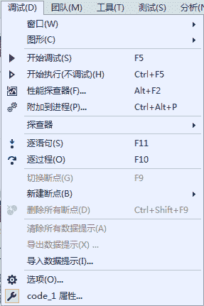
其中列出的内容即为调试时可用的选项，下面介绍其常用的调试功能。

## 1) 设置断点

所谓断点是程序自动进入中断模式的标记，即当程序运行到此处时自动中断。

在断点所在行的前面用红色的圆圈标记，设置标记时直接用鼠标单击需要设置断点的行前面的灰色区域即可，或者直接按键盘上的 F9 键。

例如在程序中设置断点，效果如下图

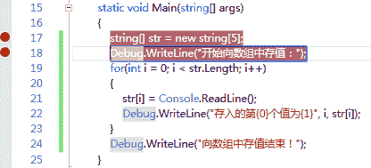
在设置断点时单击齿轮图标进入断点设置界面，如下图所示。

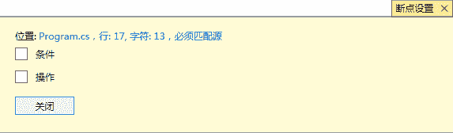
在该界面中允许为断点设置条件或操作，条件是指在满足指定条件时才会命中该断点。

此外，每个断点也允许设置多个条件，每个条件之间的关系是“与”的关系。界面如下图所示。

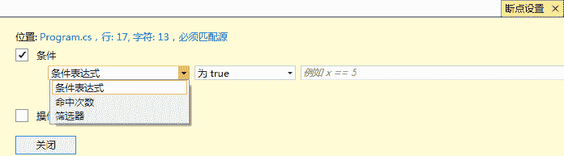
在设置条件时可以设置条件表达式、命中次数以及筛选器。

其中：

*   条件表达式是指一个布尔类型的表达式，如果满足条件则触发断点；
*   命中次数若满足指定次数，则触发断点；
*   筛选器用于限制只在某些进程和线程中设置断点。

在上图所示的界面中还可以为断点设置操作，用于指定在命中断点时打印追踪信息，界面如下图所示。

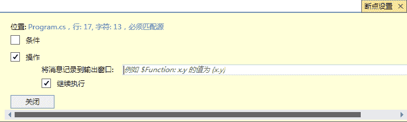
在该界面中，如果在“将消息记录到输出窗口”文本框中输出断点“string[] str = new string[5];”处，其中 str 的值，则可以写成“str={str}”的形式，在调试输出窗口中会发现“str=Null”的信息输出。

此外，右击断点，弹出的右键菜单如下图所示。

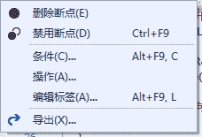
在该菜单中选择“条件”或“操作”命令也可以完成对断点的上述设置。

## 2) 管理断点

在断点设置完成后，还可以在上图所示的菜单中选择进行“删除断点”“禁用断点”“编辑标签”“导出”的操作。

其中：

*   “删除断点”操作是取消当前断点，也可以再次单击断点的红点取消；
*   “禁用断点”操作是指暂时跳过该断点，将断点设置为禁用状态后，断点的右键菜单中的“禁用断点”选项更改为“启用断点”，在需要该断点时还可以选择“启用断点”恢复断点；
*   “编辑标签” 操作是为断点设置名称；
*   “导出”操作是将断点信息导出到一个 XML 文件中存放。

## 3) 程序的调试过程

在设置好断点后，调试程序可以直接按 F5 键，或者直接在菜单栏中选择“调试”→“开始调试”命令。

在调试程序的过程中，可以直接使用工具栏上的调试快捷键，如下图所示，或者直接在菜单栏中选择所需的调试命令。

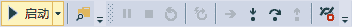
下面介绍常用的调试命令。

*   逐语句（）：按 F11 键也可以，用于逐条语句运行。
*   逐过程（）：按 F10 键也可以，过程是指可以将方法作为一个整体去执行，不会跳进方法中执行。
*   跳出（）：按 Shift+F11 组合键也可以，跳出是将程序的调试状态结束，并结束整个程序。

此外，在调试过程中右击，会出现如下图所示的右键菜单。

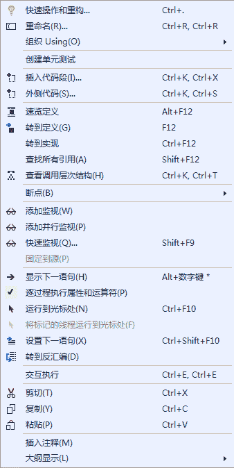
在该菜单中也可以选择相应的命令实现调试功能。

在调试过程中经常使用该菜单中的“运行到光标处”命令将程序执行到指定的光标处，忽略程序中设置的断点，用于快速调试程序和定位可能出错的位置。

## 4) 监视器

在调试程序的过程中经常需要知道某些变量的值在运行过程发生的变化，以便发现其在何时发生错误。

将程序中的变量或某个表达式放入监视器中即可监视其变化状态。

假设将 for 循环中的循环变量 i 加入监视器，在程序中右击变量 i，在弹出的如上图所示的菜单中选择“添加监视”命令，效果如下图所示。

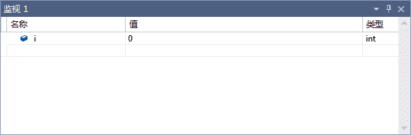
从上图中可以看出，在监视器界面的“名称”列中是变量名、“值”列中是当前变量 i 的值，“类型”列中是当前变量的数据类型。

在一个监视器中可以设置多个需要监视的变量或表达式。

对于监视器中不需要再监视的变量，可以右击该变量，在弹出的右键菜单中选择“删除监视”命令，如下图所示。

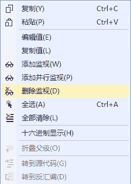
此外，通过上图所示的菜单还可以进行编辑值、复制值、全部清除等操作。

## 5) 快速监视

在调试程序时，如果需要监视变量或表达式的值也可以使用快速监视。

例如仍然要监视变量 i 的值，右击变量 i，在弹出的右键菜单中选择“快速监视”命令，弹出如下图所示的对话框。

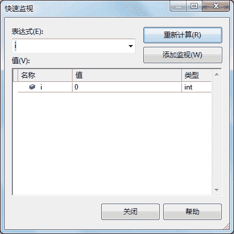
通常，快速监视用于查看变量当前值的状态，与直接加入监视不同的是快速监视一次只能监视一个变量。

此外，在“快速监视”对话框处于打开状态时程序是无法继续调试的，如果需要继续监视“快速监视”对话框中的变量，可以单击“添加监视”按钮将当前监视的变量加入到监视器界面中。

## 6) 即时窗口

在调试程序时，如果需要对变量或表达式做相关运算，在即时窗口中都可以实现，并显示当前状态下变量或表达式的值。

在调试时可以使用“调试”菜单中“窗口”下的命令，在“调试”菜单中单击“窗口”出现如下图所示的子菜单。

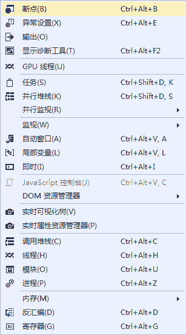
在其中选择“即时”命令即可出现即时窗口， 如下图所示。

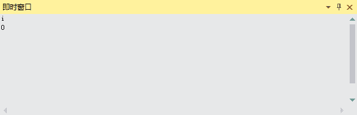
在即时窗口中输入变量 i 的值并按回车键，即出现当前 i 在程序运行到此时的值。