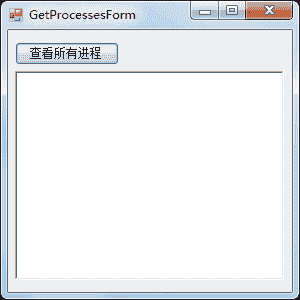
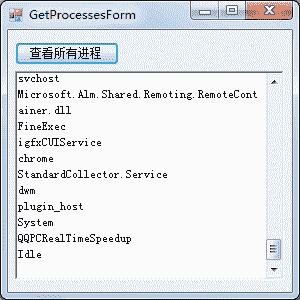
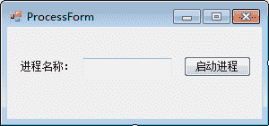
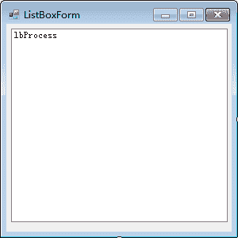
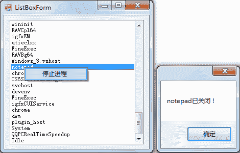

# C# Process：进程类

> 原文：[`c.biancheng.net/view/2992.html`](http://c.biancheng.net/view/2992.html)

在 C# 语言中进程类是指 Process 类，该类所在的命名空间是 System.Diagnostics。

## Process 简介

Process 类主要提供对本地和远程进程的访问，并提供对本地进程的启动、停止等操作。

Process 类的常用属性和方法如下表所示。

| 属性或方法 | 说明 |
| MachineName | 属性，获取关联进程正在其上运行的计算机的名称 |
| Id | 属性，获取关联进程的唯一标识符 |
| ExitTime | 属性，获取关联进程退出的时间 |
| ProcessName | 属性，获取该进程的名称 |
| StartTime | 属性，获取关联进程启动的时间 |
| Threads | 属性，获取在关联进程中运行的一组线程 |
| TotalProcessorTime | 属性，获取此进程的总的处理器时间 |
| UserProcessorTime | 属性，获取此进程的用户处理器时间 |
| Close() | 方法，释放与此组件关联的所有资源 |
| CloseMainWindow() | 方法，通过向进程的主窗口发送关闭消息来关闭拥有用户界面的进程 |
| Dispose() | 方法，释放由 Component 使用的所有资源 |
| GetCurrentProcess() | 方法，获取新的 Process 组件，并将其与当前活动的进程关联 |
| GetProcesses() | 方法，为本地计算机上的每个进程资源创建一个新的 Process 组件 |
| GetProcesses(String) | 方法，为指定计算机上的每个进程资源创建一个新的 Process 组件 |
| GetProcessesByName(String) | 方法，创建新的 Process 组件的数组，并将它们与本地计算机上共享指定的进程名称的所有进程资源关联 |
| Kill() | 方法，立即停止关联的进程 |
| Start() | 方法，启动（或重用）此 Process 组件的 Startinfo 属性指定的进程资源， 并将其与该组件关联 |
| Start(String) | 方法，通过指定文档或应用程序文件的名称来启动进程资源，并将资源与新的 Process 组件关联 |

## 操作进程

在实际应用中经常会用到获取本地的进程、启动进程、关闭进程等操作，下面分别以实例形式介绍其具体的操作方法。

在获取当前操作系统中运行的进程时，如果要获取所有运行的进程的信息可以使用上表中的 GetProcesses() 方法，如果要获取指定名称的线程可以使用 GetProcessesByName(String) 方法。

【实例 1】创建 Windows 应用程序，在 RichTextBox 控件中显示所有当前系统中正在运行的进程。

根据题目要求，Windows 窗体的界面设计如下图所示。


在“查看所有进程”按钮的单击事件中添加查看所有进程的代码，具体如下。

```

public partial class GetProcessesForm : Form
{
    public GetProcessesForm()
    {
        InitializeComponent();
    }
    //“查看所有进程”按钮的单击事件
    private void btnOk_Click(object sender, EventArgs e)
    {
        Process[] processes = Process.GetProcesses();
        foreach(Process p in processes)
        {
            richTextBox1.Text = richTextBox1.Text + p.ProcessName + "\r\n";
        }
    }
}
```

运行该窗体，效果如下图所示。


从上面的运行效果可以看出，已经将系统中运行的进程名称显示在 RichTextBox 中，由于在当前系统中运行的进程较多，所以需要滑动 RichTextBox 控件中的滚动条来查看。

我们可以观察当前任务管理器中的进程是否与下图中的进程相同。

【实例 2】创建 Windows 应用程序，并在文本框中输入需要启动的进程名称，单击“启动进程”按钮启动该进程。

根据题目要求，窗体设计如下图所示。


在“启动进程”按钮的单击事件中加入相关代码，具体如下。

```

public partial class ProcessForm : Form
{
    public ProcessForm()
    {
        InitializeComponent();
    }
    //“启动进程”按钮的单击事件
    private void button1_Click(object sender, EventArgs e)
    {
        //获取进程名称
        string ProcessName = textBox1.Text;
        //创建 Process 类的对象
        Process p = new Process();
        //设置进程名称
        p.StartInfo.FileName = ProcessName;
        //启动进程
        p.Start();
    }
}
```

运行该窗体，效果如下图。


从上面的运行效果可以看出，在文本框中输入“画图”的进程名称，单击“启动进程” 按钮即可显示出画图进程的界面。

【实例 3】创建 Windows 应用程序，在 ListBox 控件中显示所有的进程名称，并右击选中的进程名称，通过弹出的右键菜单将其关闭。

根据题目要求，该窗体的设计如下图所示。


在窗体加载事件中显示所有进程信息，并在右键菜单中选择“停止进程”命令执行关闭进程的操作，实现该功能的代码如下。

```

public partial class ListBoxForm : Form
{
    public ListBoxForm()
    {
        InitializeComponent();
    }
    //窗体加载事件
    private void ListBoxForm_Load(object sender, EventArgs e)
    {
        //获取所有进程信息
        Process[] processes = Process.GetProcesses();
        foreach(Process p in processes)
        {
            //将进程添加到 ListBox 中
            lbProcess.Items.Add(p.ProcessName);
        }
    }
    //"停止进程"命令的单击事件
    private void 停止进程 ToolStripMenuItem_Click(object sender, EventArgs e)
    {
        //获取进程名称
        string ProcessName = lbProcess.SelectedItem.ToString();
        //根据进程名称获取进程
        Process[] processes = Process.GetProcessesByName(ProcessName);
        //判断是否存在指定进程名称的进程
        if (processes.Length > 0)
        {
            try
            {
                foreach(Process p in processes)
                {
                    //判断进程是否处于运行状态
                    if (!p.HasExited)
                    {
                        //关闭进程
                        p.Kill();
                        MessageBox.Show(p.ProcessName + "已关闭！");
                        //获取所有进程信息
                        processes = Process.GetProcesses();
                        //清空 ListBox 中的项
                        lbProcess.Items.Clear();
                        foreach(Process p1 in processes)
                        {
                            //将进程添加到 ListBox 中
                            lbProcess.Items.Add(p1.ProcessName);
                        }
                    }
                }
            }
            catch
            {
                MessageBox.Show("该进程无法关闭！");
            }
        }
    }
}
```

运行该窗体，效果如下图所示。


运行该程序，则记事本程序被关闭。

需要注意的是，一些进程由于权限不够是无法关闭的，因此在关闭进程的代码中要做异常处理。