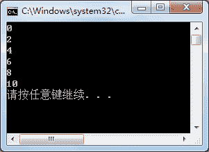
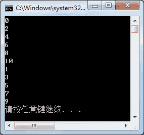

# C# ThreadStart：创建线程

> 原文：[`c.biancheng.net/view/2994.html`](http://c.biancheng.net/view/2994.html)

在 C# 语言中使用线程时首先需要创建线程，在使用 Thread 类的构造方法创建其实例时，需要用到 ThreadStart 委托或者 ParameterizedThreadStart 委托创建 Thread 类的实例。

ThreadStart 委托只能用于无返回值、无参数的方法，ParameterizedThreadStart 委托则可以用于带参数的方法。

本节主要介绍使用 ThreadStart 委托创建 Thread 类的实例，关于 ParameterizedThreadStart 委托我们将在下一节《C# ParameterizedThreadStart》中为大家讲解。

使用 ThreadStart 创建线程首先需要创建 ThreadStart 委托的实例，然后再创建 Thread 类的实例。

具体的代码如下。

ThreadStart ts = new ThreadStart( 方法名 );
Thread t = new Thread(ts);

【实例 1】使用 ThreadStart 委托创建线程，并定义一个方法输出 0〜10 中所有的偶数。

根据题目要求，创建控制台应用程序，实现该程序的代码如下。

```

class Program
{
    static void Main(string[] args)
    {
        ThreadStart ts = new ThreadStart(PrintEven);
        Thread t = new Thread(ts);
        t.Start();
    }
    //定义打印 0~10 中的偶数的方法
    private static void PrintEven()
    {
        for(int i = 0; i <= 10; i=i+2)
        {
            Console.WriteLine(i);
        }
    }
}
```

运行该程序，效果如下图所示。


从上面的运行效果可以看出，使用 Threadstart 委托为 PrintEven 方法创建了线程，通过线程的 Start 方法启动线程并调用了 PrintEven 方法。

在一个应用程序中能同时启动多个线程，下面通过实例演示启动多个线程的效果。

【实例 2】在上一实例的基础上添加一个打印 1〜10 中的奇数的方法，再分别使用两个 Thread 类的实例启动打印奇数和偶数的方法。

根据题目要求，实现的代码如下。

```

class Program
{
    static void Main(string[] args)
    {
        ThreadStart ts1 = new ThreadStart(PrintEven);
        Thread t1 = new Thread(ts1);
        ThreadStart ts2 = new ThreadStart(PrintOdd);
        Thread t2 = new Thread(ts2);
        t1.Start();
        t2.Start();
    }
    //定义打印 0~10 中的偶数的方法
    private static void PrintEven()
    {
        for(int i = 0; i <= 10; i=i+2)
        {
            Console.WriteLine(i);
        }
    }
    //定义打印 1~10 中的奇数的方法
    public static void PrintOdd()
    {
        for(int i = 1; i <= 10; i = i + 2)
        {
            Console.WriteLine(i);
        }
    }
}
```

运行该程序，效果如下图所示。


从上面的运行效果可以看出，两个线程分别打印了 1〜10 中的奇数和 0〜10 中的偶数，但并不是按照线程的调用顺序先打印出所有的偶数再打印奇数。

需要注意的是，由于没有对线程的执行顺序和操作做控制，所以运行该程序每次打印的值的顺序是不一样的。