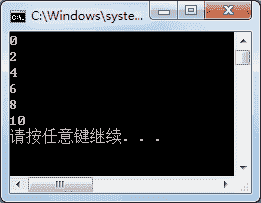

# C# ParameterizedThreadStart：创建进程

> 原文：[`c.biancheng.net/view/2995.html`](http://c.biancheng.net/view/2995.html)

在 C# 语言中使用 ParameterizedThreadStart 创建进程，首先需要创建 ParameterizedThreadStart 委托的实例，然后再创建 Thread 类的实例。

具体的代码如下。

ParameterizedThreadStart pts=new ParameterizedThreadStart( 方法名 );
Thread t=new Thread(pts);

【实例 1】创建一个方法输出 0〜n 的所有偶数，使用 ParameterizedThreadStart 委托调用该方法，并启动打印偶数的线程。

根据题目要求，实现的代码如下。

```

class Program
{
    static void Main(string[] args)
    {
        ParameterizedThreadStart pts = new ParameterizedThreadStart(PrintEven);
        Thread t = new Thread(pts);
        t.Start(10);
    }
    //打印 0~n 中的偶数
    private static void PrintEven(Object n)
    {
        for(int i=0;i<=(int)n; i = i + 2)
        {
            Console.WriteLine(i);
        }
    }
}
```

运行该程序，效果如下图所示。


需要注意的是，在使用 ParameterizedThreadStart 委托调用带参数的方法时，方法中的参数只能是 object 类型并且只能含有一个参数。

在启动线程时要在线程的 Start() 方法中为委托的方法传递参数。

如果需要通过 ParameterizedThreadStart 委托引用多个参数的方法，由于委托方法中的参数是 object 类型的，传递多个参数可以通过类的实例来实现。

下面通过实例来演示使用 ParameterizedThreadStart 委托引用多个参数的方法。

【实例 2】创建一个方法输出指定范围内数值的偶数，并创建线程调用该方法。

根据题目要求，实现的代码如下。

```

class Program
{
    static void Main(string[] args)
    {
        ParameterizedThreadStart pts = new ParameterizedThreadStart(PrintEven);
        ParameterTest pt = new ParameterTest(1, 10);
        Thread t = new Thread(pts);
        t.Start(pt);
    }
    private static void PrintEven(Object n)
    {
        //判断 n 是否为 ParameterTest 类的对象
        if(n is ParameterTest)
        {
            int beginNum = ((ParameterTest)n).beginNum;
            int endNum = ((ParameterTest)n).endNum;
            for(int i = beginNum; i <= endNum; i++)
            {
                if (i % 2 == 0)
                {
                    Console.WriteLine(i);
                }
            }
        }
    }
}
public class ParameterTest
{
    public int beginNum;
    public int endNum;
    public ParameterTest(int a,int b)
    {
        this.beginNum = a;
        this.endNum = b;
    }
}
```

运行该程序，在控制台上将输出 1〜10 的偶数，即 2、4、6、8、10。

从代码可以看出，通过为 ParameterTest 类中的字段赋值，并将其通过线程的 Start 方法传递给委托引用的方法 PrintEven，即可实现在委托引用的方法中传递多个参数的操作。