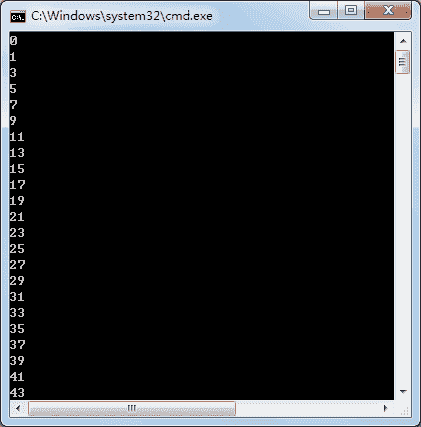
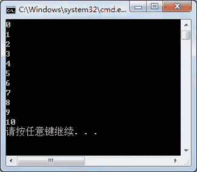
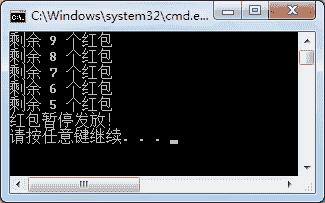

# C# Priority：多线程优先级设置

> 原文：[`c.biancheng.net/view/2998.html`](http://c.biancheng.net/view/2998.html)

在《C# ThreadStart》一节中我们通过两个线程分别打印奇数和偶数，但是每次打印出来的结果是不同的。

如果需要控制输出值的顺序，可以通过对线程优先级的设置以及线程调度来实现。

在 C# 中线程的优先级使用线程的 Priority 属性设置即可，默认的优先级是 Normal。

在设置优先级后，优先级高的线程将优先执行。

优先级的值通过 ThreadPriority 枚举类型来设置，从低到高分别为 Lowest、BelowNormal、Normal、AboveNormal、Highest。

【实例 1】通过设置线程的优先级来控制输出奇数和偶数的线程，为了看出设置线程优先级的效果将输出 1〜100 中的奇数和 0〜100 中的偶数。

根据题目要求，实现的代码如下。

```

class Program
{
    static void Main(string[] args)
    {
        ThreadStart ts1 = new ThreadStart(PrintEven);
        Thread t1 = new Thread(ts1);
        //设置打印偶数线程的优先级
        t1.Priority = ThreadPriority.Lowest;
        ThreadStart ts2 = new ThreadStart(PrintOdd);
        Thread t2 = new Thread(ts2);
        //设置打印奇数线程的优先级
        t2.Priority = ThreadPriority.Highest;
        t1.Start();
        t2.Start();
    }
    //打印 1~100 中的奇数
    public static void PrintOdd()
    {
        for(int i = 1; i <= 100; i = i + 2)
        {
            Console.WriteLine(i);
        }
    }
    //打印 0~100 中的偶数
    public static void PrintEven()
    {
        for(int i = 0; i <= 100; i = i + 2)
        {
            Console.WriteLine(i);
        }
    }
}
```

运行该程序，效果如下图所示。


从上面的运行效果可以看出，由于输岀奇数的线程的优先级高于输出偶数的线程，所以在输出结果中优先输出奇数的次数会更多。

此外，每次输出的结果也不是固定的。通过优先级是不能控制线程中的先后执行顺序的，只能是优先级高的线程优先执行的次数多而已。

线程状态控制的方法包括暂停线程 (Sleep)、中断线程 (Interrupt)、挂起线程 (Suspend)、唤醒线程 (Resume)、终止线程 (Abort)。

下面通过实例来演示线程控制的效果。

【实例 2】使用暂停线程 (Sleep) 的方法让打印奇数和打印偶数的线程交替执行，即打印 0〜10 的数。

根据题目要求，代码如下。

```

class Program
{
    static void Main(string[] args)
    {
        ThreadStart ts1 = new ThreadStart(PrintOdd);
        Thread t1 = new Thread(ts1);
        ThreadStart ts2 = new ThreadStart(PrintEven);
        Thread t2 = new Thread(ts2);
        t1.Start();
        t2.Start();
    }
    //打印 1~100 中的奇数
    public static void PrintOdd()
    {
        for(int i = 1; i <= 10; i = i + 2)
        {
            //让线程休眠 1 秒
            Thread.Sleep(1000);
            Console.WriteLine(i);
        }
    }
    //打印 0~100 中的偶数
    public static void PrintEven()
    {
        for(int i = 0; i <= 10; i = i + 2)
        {
            Console.WriteLine(i);
            //让线程休眠 1 秒
            Thread.Sleep(1000);
        }
    }
}
```

运行该程序，效果如下图所示。


从上面的运行效果可以看出，通过 Sleep 方法能控制两个线程执行的先后顺序。

需要注意的是，两个线程虽然交替执行，但每次运行该程序的效果依然是不同的。

【实例 3】模拟发放 10 个红包，当剩余 5 个红包时线程终止。

根据题目要求，代码如下。

```

class Program
{
    private static int count = 10;
    private static void GiveRedEnvelop()
    {
        while (count > 0)
        {
            count--;
            if(count == 4)
            {
                //终止当前线程
                Console.WriteLine("红包暂停发放！");
                Thread.CurrentThread.Abort();
            }
            Console.WriteLine("剩余 {0} 个红包", count);
        }
    }
    static void Main(string[] args)
    {
        ThreadStart ts = new ThreadStart(GiveRedEnvelop);
        Thread t = new Thread(ts);
        t.Start();
    }
}
```

运行该程序，效果如下图所示。


目前，由于挂起线程 (Suspend) 和唤醒线程 (Resume) 的操作很容易造成线程的死锁状态，已经被弃用了，而是使用标识字段来设置线程挂起和唤醒的状态。

所谓线程死锁就是多个线程之间处于相互等待的状态。

线程分为前台线程和后台线程，前台线程不用等主程序结束，后台线程则需要应用程序运行结束后才能结束。

此外，在应用程序运行结束后，后台线程即使没有运行完也会结束，前台线程必须等待自身线程运行结束后才会结束。

使用 Thread 对象的 IsBackground 属性来判断线程是否为后台线程。

【实例 4】在上一实例的基础上判断发红包的线程是否为后台线程，如果不是后台线程，将其设置为后台线程。

根据题目要求，这里只在 Main() 方法中添加了对线程是否为后台线程的判断，Main() 方法中的代码如下。

```

static void Main(string[] args)
{
    ThreadStart ts = new ThreadStart(GiveRedEnvelop);
    Thread t = new Thread(ts);
    t.Start();
    if (t.IsBackground == false)
    {
        Console.WriteLine("该线程不是后台线程！");
        t.IsBackground = true;
    }
    else
    {
        Console.WriteLine("该线程是后台线程！");
    }
}
```

运行该程序，直接输出“该线程不是后台线程!”，由于将该线程设置为后台线程，则不会输出红包发放的信息。