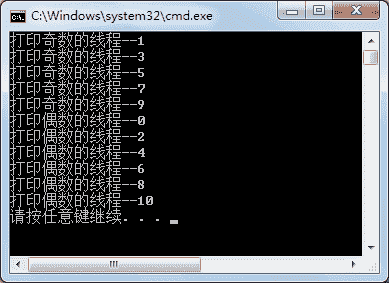

# C# lock：给线程加锁，保证线程同步

> 原文：[`c.biancheng.net/view/2999.html`](http://c.biancheng.net/view/2999.html)

虽然 Sleep 方法能控制线程的暂停时间，从而改变多个线程之间的先后顺序，但每次调用线程的结果是随机的。

线程同步的方法是将线程资源共享，允许控制每次执行一个线程，并交替执行每个线程。

在 C# 语言中实现线程同步可以使用 lock 关键字和 Monitor 类、Mutex 类来解决。

对于线程同步操作最简单的一种方式就是使用 lock 关键字，通过 lock 关键字能保证加锁的线程只有在执行完成后才能执行其他线程。

关于 Monitor 类和 Mutex 类的应用，我们将在《C# Monitor》、《C# Mutex》中为大家讲解。

lock 的语法形式如下。

lock(object)
{
    //临界区代码
}

这里 lock 后面通常是一个 Object 类型的值，也可以使用 this 关键字来表示。

最好是在 lock 中使用私有的非静态或负变量或私有的静态成员变量，即使用 Private 或 Private static 修饰的成员。

例如：

private Object obj = new Object();
lock (obj)
{
    //临界区代码
}

【实例】创建控制台应用程序，使用 lock 关键字控制打印奇数和偶数的线程，要求先执行奇数线程，再执行偶数线程。

根据题目要求，代码如下。

```

class Program
{
    public void PrintEven()
    {
        lock (this)
        {
            for(int i = 0; i <= 10; i = i + 2)
            {
                Console.WriteLine(Thread.CurrentThread.Name + "--" + i);
            }
        }
    }
    public void PrintOdd()
    {
        lock (this)
        {
            for(int i = 1; i <= 10; i = i + 2)
            {
                Console.WriteLine(Thread.CurrentThread.Name + "--" + i);
            }
        }
    }
    static void Main(string[] args)
    {
        Program program = new Program();
        ThreadStart ts1 = new ThreadStart(program.PrintOdd);
        Thread t1 = new Thread(ts1);
        t1.Name = "打印奇数的线程";
        t1.Start();
        ThreadStart ts2 = new ThreadStart(program.PrintEven);
        Thread t2 = new Thread(ts2);
        t2.Name = "打印偶数的线程";
        t2.Start();
    }
}
```

运行该程序，效果如下图所示。


从上面的运行效果可以看出，当打印奇数的线程结束后才执行打印偶数的线程，并且每次打印的效果是一样的。