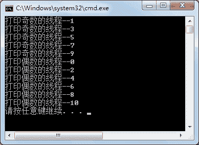

# C# Monitor：锁定资源

> 原文：[`c.biancheng.net/view/3000.html`](http://c.biancheng.net/view/3000.html)

在 C# 中 Monitor 类的命名空间是 System.Threading，它的用法要比《C# lock》一节中介绍的 lock 的用法复杂一些，但本质是一样的。

使用 Monitor 类锁定资源的代码如下。

Monitor.Enter(object);
try
{
    //临界区代码
}
finally
{
    Monitor.Exit(object);
}

在这里，object 值与 lock 中的 object 值是一样的。

简而言之，lock 的写法是 Monitor 类的一种简写。

【实例】将上一节《C# lock》实例中的 lock 关键字替换成 Monitor 类。

根据题目要求，代码如下。

```

class Program
{
    public void PrintEven()
    {
        Monitor.Enter(this);
        try
        {
            for(int i = 0; i <= 10; i = i + 2)
            {
                Console.WriteLine(Thread.CurrentThread.Name + "--" + i);
            }
        }
        finally
        {
            Monitor.Exit(this);
        }
    }
    public void PrintOdd()
    {
        Monitor.Enter(this);
        try
        {
            for(int i = 1; i <= 10; i = i + 2)
            {
                Console.WriteLine(Thread.CurrentThread.Name + "--" + i);
            }
        }
        finally
        {
            Monitor.Exit(this);
        }
    }
    static void Main(string[] args)
    {
        Program program = new Program();
        ThreadStart ts1 = new ThreadStart(program.PrintOdd);
        Thread t1 = new Thread(ts1);
        t1.Name = "打印奇数的线程";
        t1.Start();
        ThreadStart ts2 = new ThreadStart(program.PrintEven);
        Thread t2 = new Thread(ts2);
        t2.Name = "打印偶数的线程";
        t2.Start();
    }
}
```

运行该程序，效果如下图所示。


Monitor 类的用法虽然比 lock 关键字复杂，但其能添加等待获得锁定的超时值，这样就不会无限期等待获得对象锁。

使用 TryEnter() 方法可以给它传送一个超时值，决定等待获得对象锁的最长时间。

使用 TryEnter() 方法设置获得对象锁的时间的代码如下。

Monitor.TryEnter(object, 毫秒数 );

该方法能在指定的毫秒数内结束线程，这样能避免线程之间的死锁现象。

此外，还能使用 Monitor 类中的 Wait() 方法让线程等待一定的时间，使用 Pulse() 方法通知处于等待状态的线程。