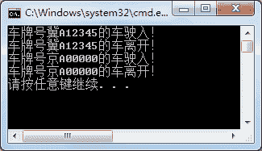

# C# Mutex：（互斥锁）线程同步

> 原文：[`c.biancheng.net/view/3002.html`](http://c.biancheng.net/view/3002.html)

C# 中 Mutex 类也是用于线程同步操作的类，例如，当多个线程同时访问一个资源时保证一次只能有一个线程访问资源。

在 Mutex 类中，WaitOne() 方法用于等待资源被释放， ReleaseMutex() 方法用于释放资源。

WaitOne() 方法在等待 ReleaseMutex() 方法执行后才会结束。

【实例】使用线程互斥实现每个车位每次只能停一辆车的功能。

根据题目要求，停车位即为共享资源，实现的代码如下。

```

class Program
{
    private static Mutex mutex = new Mutex();
    public static void PakingSpace(object num)
    {
        if (mutex.WaitOne())
        {
            try
            {
                Console.WriteLine("车牌号{0}的车驶入！", num);
                Thread.Sleep(1000);
            }
            finally
            {
                Console.WriteLine("车牌号{0}的车离开！", num);
                mutex.ReleaseMutex();
            }
        }
    }
    static void Main(string[] args)
    {
        ParameterizedThreadStart ts = new ParameterizedThreadStart(PakingSpace);
        Thread t1 = new Thread(ts);
        t1.Start("冀 A12345");
        Thread t2 = new Thread(ts);
        t2.Start("京 A00000");
    }
}
```

运行该程序，效果如下图所示。


从上面的运行效果可以看出，每辆车驶入并离开后其他车才能占用停车位，即当一个线程占用资源时，其他线程是不使用该资源的。