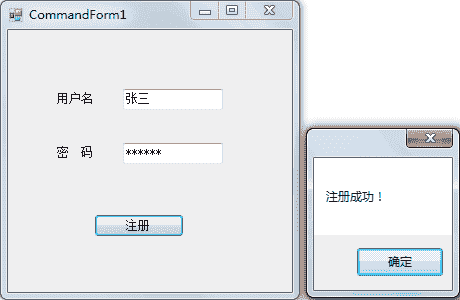
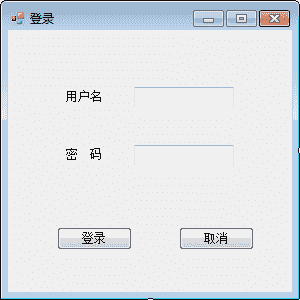
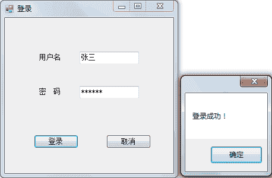
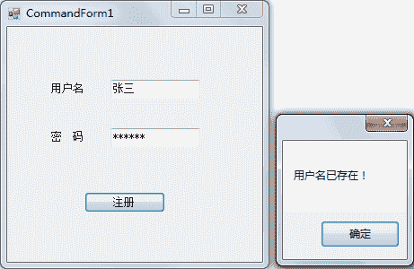

# C# Command：操作数据库

> 原文：[`c.biancheng.net/view/3017.html`](http://c.biancheng.net/view/3017.html)

在上一节《C# Connection》中我们讲解了 C# 语言连接数据库的方法，在与数据库建立连接之后即可开始操作数据库中的对象。

操作数据库需则要用到 Command 类中提供的属性和方法。下面来介绍一下如何使用 Command 类来操作数据表中的数据。

## Command 类概述

在 System.Data.SqlClient 命名空间下，对应的 Command 类为 SqlCommand，在创建 SqlCommand 实例前必须已经创建了与数据库的连接。

SqlCommand 类中常用的构造方法如下表所示。

| 构造方法 | 说明 |
| SqlCommand() | 无参构造方法 |
| SqlCommand(string commandText,SqlConnection conn) | 带参的构造方法，第 1 个参数是要执行的 SQL 语句，第 2 个参数是数据库的连接对象 |

对数据库中对象的操作不仅包括对数据表的操作，还包括对数据库、视图、存储过程等数据库对象的操作，接下来主要介绍的是对数据表和存储过程的操作。

在对不同数据库对象进行操作时，SqlCommand 类提供了不同的属性和方法，常用的属性和方法如下表所示。

| 属性或方法 | 说明 |
| CommandText | 属性，Command 对象中要执行的 SQL 语句 |
| Connection | 属性，获取或设置数据库的连接对象 |
| CommandType | 属性，获取或设置命令类型 |
| Parameters | 属性，设置 Command 对象中 SQL 语句的参数 |
| ExecuteReader() | 方法，获取执行查询语句的结果 |
| ExecuteScalar() | 方法，返回查询结果中第 1 行第 1 列的值 |
| ExecuteNonQuery() | 方法，执行对数据表的增加、删除、修改操作 |

## 使用 Command 类操作数据库

Command 类中提供了 3 种命令类型，分别是 Text、TableDirect 以及 StoredProcedure，默认情况下是 Text。

所谓 Text 类型是指使用 SQL 语句的形式，包括增加、删除、修改以及查询的 SQL 语句。

StoredProcedure 用于执行存储过程；TableDirect 仅在 OLE DB 驱动程序中有效。

在使用 Command 类操作数据库时需要通过以下步骤完成。

### 1) 创建 SqlCommand 类的实例

创建 SqlCommand 类的实例分两种情况，一种是命令类型为 Text 的，一种是命令类型为 StoredProcedure 的。

#### 命令类型为 Text

SqlCommand SqlCommand 类的实例名 = new SqlCommand( SQL 语句 , 数据库连接类的实例 );

其中：

*   SQL 语句：指该 SqlCommand 类的实例要执行的 SQL 语句。
*   数据库连接类的实例：指使用 SqlConnection 类创建的实例，通常数据库连接类的实例处于打开的状态。

#### 命令类型为 StoredProcedure

SqlCommand SqlCommand 类的实例名 = new SqlCommand( 存储过程名称 , 数据库连接类的实例 );

需要注意的是，存储过程必须是当前数据库实例中的存储过程，并且在调用带参数的存储过程时，还需要在 SqlCommand 类的实例中添加对应的存储过程参数。

为存储过程添加参数，需要使用 SqlCommand 类实例的 Parameters 属性来设置，具体的代码如下。

SqlCommand 类实例 .Parameters.Add( 参数名 , 参数值 );

在这里，参数名与存储过程中定义的参数名要一致。

### 2) 执行对数据表的操作

在执行对数据表的操作时通常分为两种情况，一种是执行非查询 SQL 语句的操作，即增加、修改、删除的操作，一种是执行查询 SQL 语句的操作。

#### 执行非查询 SQL 语句的操作

在执行非查询 SQL 语句时并不需要返回表中的数据，直接使用 SqlCommand 类的 ExecuteNonQuery 方法即可，该方法的返回值是一个整数，用于返回 SqlCommand 类在执行 SQL 语句后，对表中数据影响的行数。

当该方法的返回值为 -1 时，代表 SQL 语句执行失败，当该方法的返回值为 0 时，代表 SQL 语句对当前数据表中的数据没有影响。

例如 要删除学号为 1100 的学生的信息，而表中不存在该学号的学生的信息，SQL 语句可以正常执行，但对表中的影响行数是 0。

具体的代码如下。

SqlCommand 类的实例 .ExecuteNonQuery();

需要注意的是，如果执行的 SQL 语句在数据库中执行错误，则会产生异常，因此该部分需要进行异常处理。

#### 执行查询语句的操作

在执行查询语句时通常需要返回查询结果，SqlCommand 类中提供的 ExecuteReader 方法在执行查询 SQL 语句后，会返回一个 SqlDataReader 类型的值，通过遍历 SqlDataReader 类中的结果即可得到返回值。

具体的代码如下。

SqlDataReader dr = SqlCommand 类的实例 .ExecuteReader();

此外，如果在执行查询语句后并不需要返回所有的查询结果，而仅需要返回一个值，例如查询表中的记录行数，这时可以使用 ExecuteScalar 方法。具体的代码如下。

int returnvalue = SqlCommand 类的实例 .ExecuteScalar();

下面通过实例来演示 SqlCommand 类的使用。

【实例 1】制作一个用户注册界面，使用 SqlCommand 类向用户信息表中添加一条记录。

根据题目要求，先在 SQL Server 2014 中创建用户信息表 userinfo，SQL 语句如下。

```

create table userinfo
(
    id int identity(1,1) primary key,
    name varchar(20),
    password varchar(20)
)
```

为了方便，将表中的 id 设置为主键，并设置为标识列，以保证值的唯一性。

使用 SqlCommand 类向表中添加数据的语句如下。

```

//“注册”按钮的单击事件
private void button1_Click(object sender, EventArgs e)
{
    //编写数据库连接串
    string connStr = "Data Source=.;Initial Catalog=test;User ID=sa;Password=root";
    //创建 SqlConnection 的实例
    SqlConnection conn = null;
    try
    {
        conn = new SqlConnection(connStr);
        //打开数据库连接
        conn.Open();
        string sql = "insert into userinfo(name,password) values('{0}','{1}')";
        //填充 SQL 语句
        sql = string.Format(sql, textBox1.Text, textBox2.Text);
        //创建 SqlCommand 对象
        SqlCommand cmd = new SqlCommand(sql, conn);
        //执行 SQL 语句
        int returnvalue = cmd.ExecuteNonQuery();
        //判断 SQL 语句是否执行成功
        if(returnvalue != -1)
        {
            MessageBox.Show("注册成功！");
        }
    }
    catch(Exception ex)
    {
        MessageBox.Show("注册失败！"+ex.Message);
    }
    finally
    {
        if (conn != null)
        {
            //关闭数据库连接
            conn.Close();
        }
    }
}
```

运行窗体，效果如下图所示。


从上面的运行效果可以看出，通过 SqlCommand 对象已经将用户信息添加到数据表 userinfo 中。

【实例 2】制作一个登录界面，使用 SqlCommand 类判断用户是否登录成功。

根据题目要求，登录功能通过查询语句来实现，即将界面上输入的用户名和密码与数据表中存储的用户信息相比较，如果有与之匹配的用户信息则弹出消息框提示登录成功， 否则提示登录失败。

实现登录功能的界面如下图所示。


在登录界面中的“登录”按钮的单击事件中实现用户登录功能，并在“取消”按钮的单击事件中实现关闭登录窗体的功能。

实现的代码如下。

```

//"登录"按钮的单击事件
private void button1_Click(object sender, EventArgs e)
{
    //编写数据库连接串
    string connStr = "Data Source=.;Initial Catalog=test;User ID=sa;Password=root";
    //创建 SQLConnection 的实例
    SqlConnection conn = null;
    try
    {
        conn = new SqlConnection(connStr);
        //打开数据库连接
        conn.Open();
        string sql = "Select count(*) from userinfo where name='{0}' and password='{1}'";
        //填充 SQL 语句
        sql = string.Format(sql, textBox1.Text, textBox2.Text);
        //创建 SqlCommand 对象
        SqlCommand cmd = new SqlCommand(sql, conn);
        //执行 SQL 语句
        int returnvalue = (int)cmd.ExecuteScalar();
        //判断 SQL 语句是否执行成功
        if (returnvalue != 0)
        {
            MessageBox.Show("登录成功！");
        }
        else
        {
            MessageBox.Show("登录失败！");
        }
    }
    catch (Exception ex)
    {
        MessageBox.Show("注册失败！" + ex.Message);
    }
    finally
    {
        if (conn != null)
        {
            //关闭数据库连接
            conn.Close();
        }
    }
}
//“取消”按钮的单击事件
private void button2_Click(object sender, EventArgs e)
{
    this.Close();
}
```

运行该窗体，效果如下图所示。


从上面的运行效果可以看出，通过使用 SqlCommand 类中的 ExecuteScalar 方法即可判断是否存在界面中输入的用户名和密码。

【实例 3】改进用户注册功能，使用户在注册时用户名唯一。

在上一实例的登录功能中有可能出现不同的人注册时的用户名和密码相同的情况，因此很难判断究竟是哪个用户登录。

在很多软件中，用户注册功能都会判断用户名是否唯一，或者直接使用邮箱或手机号作为登录名。

下面在实例 1 的注册功能中添加判断用户名是否唯一的功能，实现的代码如下。

```

//“注册”按钮的单击事件
private void button1_Click(object sender, EventArgs e)
{
    //编写数据库连接串
    string connStr = "Data Source=.;Initial Catalog=test;User ID=sa;Password=root";
    //创建 SqlConnection 的实例
    SqlConnection conn = null;
    try
    {
        conn = new SqlConnection(connStr);
        //打开数据库连接
        conn.Open();
        //判断用户名是否重复
        string checkNameSql = "select count(*) from userinfo where name='{0}'";
        checkNameSql = string.Format(checkNameSql, textBox1.Text);
        //创建 SqlCommand 对象
        SqlCommand cmdCheckName = new SqlCommand(checkNameSql, conn);
        //执行 SQL 语句
        int isRepeatName = (int)cmdCheckName.ExecuteScalar();
        if (isRepeatName != 0)
        {
            //用户名重复，则不执行注册操作
            MessageBox.Show("用户名已存在！");
            return;
        }
        string sql = "insert into userinfo(name,password) values('{0}','{1}')";
        //填充 SQL 语句
        sql = string.Format(sql, textBox1.Text, textBox2.Text);
        //创建 SqlCommand 对象
        SqlCommand cmd = new SqlCommand(sql, conn);
        //执行 SQL 语句
        int returnvalue = cmd.ExecuteNonQuery();
        //判断 SQL 语句是否执行成功
        if(returnvalue != -1)
        {
            MessageBox.Show("注册成功！");
        }
    }
    catch(Exception ex)
    {
        MessageBox.Show("注册失败！"+ex.Message);
    }
    finally
    {
        if (conn != null)
        {
            //关闭数据库连接
            conn.Close();
        }
    }
}
```

运行该窗体，输入已经存在的用户名“张三”，执行效果如下图。


从上面的运行效果可以看出，由于“张三”用户在表中已经存在，所以在注册时会弹出“用户名已存在！”的提示。

【实例 4】创建一个存储过程实现用户注册功能，并使用 SqlCommand 类调用存储过程。

用户注册功能的存储过程比较简单，只需要写一个带参数的存储过程将用户名和密码传递给存储过程，并使用 insert 语句将用户名和密码添加到用户信息表中。

在存储过程中暂不考虑判断用户名是否重复。创建存储过程的语句如下。

```

create procedure AddUser(@name varchar(20), @password varchar(20))
as
begin
insert into userinfo (name, password) values (@name, @password);
end
```

注册页面与实例 1 一样，在“注册”按钮的单击事件中调用 AddUser 存储过程，代码如下。

```

//编写数据库连接串
string connStr = "Data Source=.;Initial Catalog=test;User ID=sa;Password=root";
//创建 SqlConnection 的实例
SqlConnection conn = null;
try
{
    conn = new SqlConnection(connStr);
    //打开数据库连接
    conn.Open();
    //创建 SqlCommand 对象
    SqlCommand cmd = new SqlCommand("AddUser", conn);
    //设置 SQLCommand 对象的命令类型（CommandType）是存储过程
    cmd.CommandType = CommandType.StoredProcedure;
    //设置存储过程需要的参数
    cmd.Parameters.AddWithValue("name", textBox1.Text);
    cmd.Parameters.AddWithValue("password", textBox2.Text);
    //执行存储过程
    int returnvalue = cmd.ExecuteNonQuery();
    Console.WriteLine(returnvalue);
    //判断 SQL 语句是否执行成功
    if(returnvalue != -1)
    {
        MessageBox.Show("注册成功！");
    }
}
catch(Exception ex)
{
    MessageBox.Show("注册失败！"+ex.Message);
}
finally
{
    if (conn != null)
    {
        //关闭数据库连接
        conn.Close();
    }
}
```

运行该窗体，效果与实例 1 一致。从上面的代码可以看出，调用存储过程并不复杂，只需要在 SqlCommand 对象中将 CommandType 属性的值改成 StoredProcedure，并添加存储过程中所需要的参数即可。