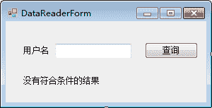
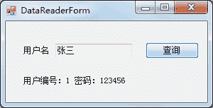

# C# DataReader：读取查询结果

> 原文：[`c.biancheng.net/view/3022.html`](http://c.biancheng.net/view/3022.html)

在 C# 中 DataReader 类的作用是读取查询结果，与在《C# Command》一节中介绍的 Command 类中的 ExecuteReader 方法一起使用。

下面来介绍一下 DataReader 类中常用的属性和方法，以及如何使用该类查询表中的数据。

## DataReader 类概述

DataReader 类在 System.Data.SqlClient 命名空间中，对应的类是 SqlDataReader，主要用于读取表中的查询结果，并且是以只读方式读取的（即不能修改 DataReader 中存放的数据）。

正是由于 DataReader 类的特殊的读取方式，其访问数据的速度比较快，占用的服务器资源比较少。

SqlDataReader 类中常用的属性和方法如下表所示。

| 属性或方法 | 说明 |
| FieldCount | 属性，获取当前行中的列数 |
| HasRows | 属性，获取 DataReader 中是否包含数据 |
| IsClosed | 属性，获取 DataReader 的状态是否为已经被关闭 |
| Read | 方法，让 DataReader 对象前进到下一条记录 |
| Close | 方法，关闭 DataReader 对象 |
| Get XXX (int i) | 方法，获取指定列的值，其中 XXX 代表的是数据类型。例如获取当前行第 1 列 double 类型的值，获取方法为 GetDouble(o) |

## 使用 DataReader 类读取查询结果

在使用 DataReader 类读取查询结果时需要注意，当查询结果仅为一条时，可以使用 if 语句查询 DataReader 对象中的数据，如果返回值是多条数据，需要通过 while 语句遍历 DataReader 对象中的数据。

在使用 DataReader 类读取查询结果时需要通过以下步骤完成：

#### 1) 执行 SqlCommand 对象中的 ExecuteReader 方法

具体代码如下。

SqlDataReader dr=SqlCommand 类实例 .ExecuteReader();

#### 2) 遍历 SqlDataReader 中的结果

SqlDataReader 类中提供的 Read 方法用于判断其是否有值，并指向 SqlDataReader 结果中的下一条记录。

dr.Read()

如果返回值为 True，则可以读取该条记录，否则无法读取。

在读取记录时，要根据表中的数据类型来读取表中相应的列。

#### 3) 关闭 SqlDataReader

下面通过实例来演示 SqlDataReader 类的使用。

【实例】根据用户姓名查询用户的编号和密码，并将编号和密码显示在标签控件 (Label) 上。

根据姓名查询用户信息的界面如下图所示。


在该界面中默认情况下显示“没有符合条件的结果”，如果根据文本框中输入的用户名能查询到指定用户的信息，则将默认文字替换成用户编号和密码。

实现该功能的代码 如下。

```

//“查询”按钮单击事件
private void button1_Click(object sender, EventArgs e)
{
    //编写数据库连接串
    string connStr = "Data Source=.;Initial Catalog=test;User ID=sa;Password=root";
    //创建 SqlConnection 的实例
    SqlConnection conn = null;
    //定义 SqlDataReader 类的对象
    SqlDataReader dr = null;
    try
    {
        conn = new SqlConnection(connStr);
        //打开数据库连接
        conn.Open();
        string sql = "select id,password from userinfo where name='{0}'";
        //填充 SQL 语句
        sql = string.Format(sql, textBox1.Text);
        //创建 SqlCommand 对象
        SqlCommand cmd = new SqlCommand(sql, conn);
        //执行 Sql 语句
        dr = cmd.ExecuteReader();
        //判断 SQL 语句是否执行成功
        if (dr.Read())
        {
            //读取指定用户名对应的用户编号和密码
            string msg = "用户编号：" + dr[0] + " 密码：" + dr[1];
            //将 msg 的值显示在标签上
            label2.Text = msg;
        }
    }
    catch (Exception ex)
    {
        MessageBox.Show("查询失败！" + ex.Message);
    }
    finally
    {
        if (dr != null)
        {
            //判断 dr 不为空，关闭 SqlDataReader 对象
            dr.Close();
        }
        if (conn != null)
        {
            //关闭数据库连接
            conn.Close();
        }
    }
}
```

运行该窗体，效果如下图所示。


从上面的运行效果可以看出，“张三”用户对应的用户编号为 1、密码为 123456。

需要注意的是，实现上述功能的要求是用户表中的用户名是唯一的，以避免出现查询错误。