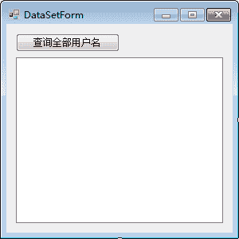
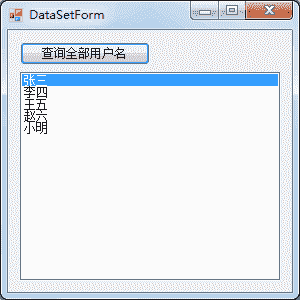

# C# DataSet 和 DataTable：将查询结果保存到 DataSet 或 DataTable 中

> 原文：[`c.biancheng.net/view/3026.html`](http://c.biancheng.net/view/3026.html)

在执行对表中数据的查询时还能将数据保存到 DataSet 中，但需要借助 DataAdapter 类来实现。

在实际应用中，DataAdapter 与 DataSet 是在查询操作中使用最多的类。

此外，还可以通过 DataSet 实现对表中数据的增加、修改、删除操作。

## DataAdapter 与 DataSet 类简介

DataAdapter 类用于将数据表中的数据查询出来并添加到 DataSet 中，DataAdapter 在 System.Data.SqlClient 命名空间下对应的类名是 SqlDataAdapter。

SqlDataAdapter 类的主要构造方法如下表所示。

| 构造方法 | 说明 |
| SqlDataAdapter(SqlCommand cmd) | 带参数的构造方法，传递 SqlCommand 类的对象作为参数 |
| SqlDataAdapter(string sql, SqlConnection conn) | 带参数的构造方法，sql 参数是指定对数据表执行的 SQL 语句，conn 是数据库的连接对象 |
| SqlDataAdapter() | 不带参数的构造方法 |

从 SqlDataAdapter 类的构造方法可以看出，SqlDataAdapter 类需要与 SqlCommand 类和 SqlConnection 类一起使用。

SqlDataAdapter 类常用的属性和方法如下表所示。

| 属性或方法 | 说明 |
| SelectCommand | 属性，设置 SqlDataAdapter 中要执行的查询语句 |
| InsertCommand | 属性，设置 SqlDataAdapter 中要执行的添加语句 |
| UpdateCommand | 属性，设置 SqlDataAdapter 中要执行的修改语句 |
| DeleteCommand | 属性，设置 SqlDataAdapter 中要执行的删除语句 |
| Fill(DataSet ds) | 方法，将 SqlDataAdapter 类中查询出的结果填充到 DataSet 对象中 |
| Fill(DataTable dt) | 方法，将 SqlDataAdapter 类中查询出的结果填充到 DataTable 对象 中，DataTable 是数据表对象，在一个 DataSet 对象中由多个 DataTable 对象构成 |
| Update(DataSet ds) | 方法，更新 DataSet 对象中的数据 |
| Update(DataTable dt) | 方法，更新 DataTable 对象中的数据 |

DataSet 类是一种与数据库结构类似的数据集，每个 DataSet 都是由若干个数据表构成的，DataTable 即数据表，每个 DataTable 也都是由行和列构成的，行使用 DataRow 类表示、列使用 DataColumn 类表示。

此外，用户还可以通过 DataRelation 类设置数据表之间的关系。

下面介绍 DataSet 类以及 DataTable 类的使用。

#### 1) DataSet 类

DataSet 类中的构造方法如下表所示。

| 构造方法 | 说明 |
| DataSet() | 无参构造方法 |
| DataSet(string DataSetName) | 带参数的构造方法，DataSetName 参数用于指定数据集名称 |

DataSet 类中常用的属性和方法如下表所示。

| 属性或方法 | 说明 |
| Tables | 属性，获取 DataSet 中所有数据表的集合，Tables[0] 代表集合中的第一个数据表 |
| CaseSensitive | 属性，获取或设置 DataSet 中的字符串是否区分大小写 |
| Relations | 属性，获取 DataSet 中包含的关系集合 |
| Clear() | 方法，清空 DataSet 中的数据 |
| Copy() | 方法，复制 DataSet 中的数据 |
| AcceptChanges() | 方法，更新 DataSet 中的数据 |
| HasChanges() | 方法，获取 DataSet 中是否有数据发生变化 |
| RejectChanges() | 方法，撤销对 DataSet 中数据的更改 |

#### 2) DataTable

DataTable 作为 DataSet 中的重要对象，其与数据表的定义是类似的，都是由行和列构成，并有唯一的表名。

从 SqlDataAdapter 类的填充方法 (Fill) 中可以看出允许将数据直接填充到 DataTable 中，这样既能节省存储空间也能简化查找数据表中的数据。

DataTable 中常用的构造方法如下表所示。

| 构造方法 | 说明 |
| DataTable()  | 无参构造方法 |
| DataTable(string TableName) | 带参数的构造方法， TableName 参数用于指定数据表的名称 |

DataTable 与 DataSet 有很多相似的属性和方法，在下表中列出了一些与 DataSet 类不同的属性。

| 属性 | 说明 |
| TableName | 属性，获取或设置 DataTable 的名称 |
| Columns | 属性，获取 DataTable 中列的集合 |
| Rows | 属性，获取 DataTable 中行的集合 |
| DataSet | 属性，获取 DataTable 所在的 DataSet |
| Constraints | 属性，获取 DataTable 中的所有约束 |

## 使用 DataSet 和 DataTable 类存放查询结果

在实际应用中，将查询结果存储到 DataSet 类或 DataTable 类中均可，在操作查询结果时也非常类似。

下面分别通过实例来演示 DataSet 和 DataTable 的使用。

【实例】创建 Windows 应用程序，查询用户信息表（userinfo）中的所有用户名，并将用户名显示在列表控件（ListBox）中。

根据题目要求，设置用户信息查询界面如下图所示。


单击“查询全部用户名”按钮，将所有用户名显示到 ListBox 控件中，首先使用 DataSet 对象存储查询结果，代码如下。

```

//“查询全部用户”按钮的单击事件
private void button1_Click(object sender, EventArgs e)
{
    //编写数据库连接串
    string connStr = "Data Source=.; Initial Catalog=test;User ID=sa;Password=root";
    //创建 SQLConnection 的实例
    SqlConnection conn = null;
    try
    {
        conn = new SqlConnection(connStr);
        //打开数据库连接
        conn.Open();
        string sql = "select name from userinfo";
        //创建 SQLDataAdapter 类的对象
        SqlDataAdapter sda = new SqlDataAdapter(sql, conn);
        //创建 DataSet 类的对象
        DataSet ds = new DataSet();
        //使用 SQLDataAdapter 对象 sda 将查询结果填充到 Dataset 对象 ds 中
        sda.Fill(ds);
        //设置 ListBox 控件的数据源（DataSource）属性
        listBox1.DataSource = ds.Tables[0];
        //在 listBox 控件中显示 name 列的值
        listBox1.DisplayMember = ds.Tables[0].Columns[0].ToString();
    }
    catch(Exception ex)
    {
        MessageBox.Show("查询失败！" + ex.Message);
    }
    finally
    {
        if (conn != null)
        {
            //关闭数据库连接
            conn.Close();
        }
    }
}
```

运行该窗体，效果如下图所示。


从上面的运行效果可以看出，已经将用户信息表 (userinfo) 中的所有用户名显示在列表控件 (ListBox) 中。

需要注意的是，ListBox 控件中的 DataSource 属性用于设置控件中内容的数据源，并需要通过 DisplayMember 属性来指定显示在 ListBox 控件中的内容。

在本实例中将 DataSet 对象换成 DataTable 对象，更改部分代码如下。

```

//创建 SqlDataAdapter 类的对象
SqlDataAdapter sda = new SqlDataAdapter(sql, conn);
//创建 DataTable 类的对象
DataTable dt = new DataTable();
//使用 SqlDataAdapter 对象 sda 将查询结果填充到 DataSet 对象 dt 中
sda.Fill(dt);
//设置 ListBox 控件的数据源(DataSource)属性
listBox1.DataSource = dt;
//在 ListBox 控件中显示 name 列的值
listBox1.DisplayMember = dt.Columns[0].ToStiring();
```

更改后再次运行窗体，效果与上图—样。

对于 Windows 应用程序中的控件，除了可以使用代码为其 DataSource 属性设置数据源外，也可以用 Windows 应用程序中所带的自动绑定功能实现。