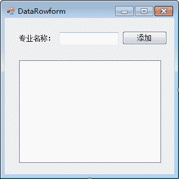
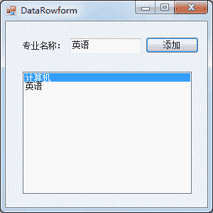

# C# DataRow 和 DataColumn：更新数据表

> 原文：[`c.biancheng.net/view/3028.html`](http://c.biancheng.net/view/3028.html)

在前面《C# Command》一节中已经介绍了使用 SqlCommand 对象中的 ExecuteNonQuery 方法执行非查询 SQL 语句来实现对数据表的更新操作，使用 DataSet 对象也能实现相同的功能， 并且能节省数据访问时间。

每个 DataSet 都是由多个 DataTable 构成的，更新 DataSet 中的数据实际上是通过更新 DataTable 来实现的。

每个 DataTable 对象都是由行 (DataRow) 和列 (DataColumn) 构成的，下面分别介绍 DataRow 类和 DataColumn 类的使用。

#### 1) DataRow 类

DataRow 类代表数据表中的行，并允许通过该类直接对数据表进行添加、修改、删除行的操作。

DataRow 类中常用的属性和方法如下表所示。

| 属性或方法 | 说明 |
| Table | 属性，设置 DataRow 对象所创建 DataTable 的名称 |
| RowState | 属性，获取当前行的状态 |
| HasErrors | 属性，获取当前行是否存在错误 |
| AcceptChanges() | 方法，更新 DataTable 中的值 |
| RejectChanges() | 方法，撤销对 DataTable 中的值的更新 |
| Delete() | 方法，标记当前的行被删除，并在执行 AcceptChanges 方法后更新数据表 |

在 DataRow 类中没有提供构造方法，需要通过 DataTable 中的 NewRow 方法创建 DataRow 类的对象，具体的语句如下。

```

DataTable dt = new DataTable();
DataRow dr = dt.NewRow();
```

这样，dr 即为新添加的行，每行数据是由多列构成的，如果在 DataTable 对象中已经存在表结构，则直接使用`dr[ 编号或列名 ]= 值`的形式即可为表中的列赋值。

#### 2) DataColumn 类

DataColumn 类是数据表中的列对象，与数据库中表的列定义一样，都可以为其设置列名以及数据类型。

DataColumn 类中常用的构造方法如下表所示。

| 构造方法 | 说明 |
| DataColumn() | 无参构造方法 |
| DataColumn(string columnName) | 带参数的构造方法，columnName 参数代表的是列名 |
| DataColumn(string columnName,Type dataType) | 带参数的构造方法，columnName 参数代表的是列名，dataType 参数代表的是列的数据类型 |

DataColumn 类提供了一些属性对 DataColumn 对象进行设置，常用的属性如下表所示。

| 属性 | 说明 |
| ColumnName | 属性，设置 DataColumn 对象的列名 |
| DataType | 属性，设置 DataColumn 对象的数据类型 |
| MaxLength | 属性，设置 DataColumn 对象值的最大长度 |
| Caption | 属性，设置 DataColumn 对象在显示时的列名，类似于给表中的列设置别名 |
| DefaultValue | 属性，设置 DataColumn 对象的默认值 |
| AutoIncrement | 属性，设置 DataColumn 对象为自动增长列，与 SQL Server 中数据表的标识列类似 |
| AutoIncrementSeed | 属性，与 AutoIncrement 属性联用,用于设置自动增长列的初始值 |
| AutoIncrementStep | 属性，与 AutoIncrement 属性联用，用于设置自动增长列每次增加的值 |
| Unique | 属性，设置 DataColumn 对象的值是唯一的，类似于数据表的唯一约束 |
| AllowDBNull | 属性，设置 DataColumn 对象的值是否允许为空 |

下面通过实例来演示 DataRow 类和 DataColumn 类的使用。

【实例】通过 DataRow 类、DataColumn 类以及 DataTable 类设计专业信息表，并向该表中添加专业，在 ListBox 控件中显示所有专业信息。

专业信息表的列包括专业编号、专业名称，要求专业编号是自动增长列，专业名称是唯一值。

创建 Windows 应用程序，添加专业信息并查询的界面设计如下图所示。


在每次新添加专业名称时将新的专业添加到 ListBox 控件中，实现的代码如下。

```

public partial class DataRowform : Form
{
    //创建 DataTable 类的对象其表明为 major
    private DataTable dt = new DataTable("major");
    //在构造方法中初始化 DataTable 对象，设置 DataTable 中的列
    public DataRowform()
    {
        InitializeComponent();
        //创建专业编号列，列明为 id 、数据类型为整型
        DataColumn id = new DataColumn("id", typeof(int));
        //设置 id 为自动增长列
        id.AutoIncrement = true;
        //设置 id 的初始值
        id.AutoIncrementSeed = 1;
        //设置 id 每次增长的值
        id.AutoIncrementStep = 1;
        //将 id 列加入到 DataTable 中
        dt.Columns.Add(id);
        //创建专业名称列，列明为 name，数据类型为字符串类型
        DataColumn name = new DataColumn("name", typeof(string));
        //设置 name 列的值是唯一的
        name.Unique = true;
        //将 name 列加入到 DataTable 对象中
        dt.Columns.Add(name);
    }
    //添加按钮的单击事件
    private void button1_Click(object sender, EventArgs e)
    {
        //向 DataTable 中天加一行，创建 DataRow 对象
        DataRow dr = dt.NewRow();
        //添加专业名称列的值
        dr["name"] = textBox1.Text;
        //将 DataRow 添加到 DataTable 对象中
        dt.Rows.Add(dr);
        //设置 ListBox 控件中的 DataSource 属性
        listBox1.DataSource = dt;
        //设置在 listBox 控件中显示的列
        listBox1.DisplayMember = dt.Columns["name"].ToString();
    }
}
```

运行该窗体，效果如下图所示。


从上面的运行效果可以看出，DataTable 类的使用与直接设计数据库中的表是类似的，只是没有将数据存储到数据库中。

既然使用 DataTable 类能完成与表设计和操作相同的功能，那么通过更新 DataTable 来更新数据库中的数据表效果会事半功倍，并能在离线状态下保存数据。