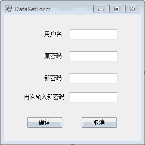
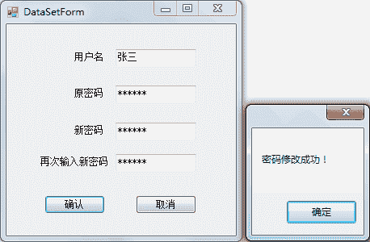

# C# DataSet：更新数据库

> 原文：[`c.biancheng.net/view/3031.html`](http://c.biancheng.net/view/3031.html)

在 C# 语言中使用 DataSet 类更新数据库中的数据，还需要使用 System.Data.SqlClient 命名空间中的 SqlCommandBuilder 类自动生成 SqlDataAdapter 对象的添加、修改以及删除方法。

在与 SqlDataAdapter 类联用时，只需要在创建 SqlCommandBuilder 类的实例时使用 SqlDataAdapter 对象作为参数即可，语法形式如下。

SqlCommandBuilder 对象名 = new SqlCommandBuilder(SqlDataAdapter 类的对象 );

下面通过实例来演示如何使用 DataSet 更新数据库。

【实例 1】使用 DataSet 实现用户注册功能。

根据题目要求在“注册”按钮的单击事件中使用 DataSet 向表中添加用户信息。实现的代码如下。

```

//注册按钮的单击事件
private void button1_Click(object sender, EventArgs e)
{
    //数据库连接串
    string connStr = "Data Source=.;Initial Catalog=test;User ID=sa;Password=root";
    //创建 SQLConnection 的实例
    SqlConnection conn = null;
    try
    {
        conn = new SqlConnection(connStr);
        //打开数据库连接
        conn.Open();
        string sql = "select * from userinfo";
        //创建 SqlDataAdapter 类的对象
        SqlDataAdapter sda = new SqlDataAdapter(sql, conn);
        //创建 DataSet 类的对象
        DataSet ds = new DataSet();
        //使用 SQLDataAdapter 对象 sda 将查询结果填充到 DataTable 对象 ds 中
        sda.Fill(ds);
        //创建 SqlCommandBuilder 类的对象
        SqlCommandBuilder cmdBuilder = new SqlCommandBuilder(sda);
        //创建 DataRow 类的对象
        DataRow dr = ds.Tables[0].NewRow();
        //设置 name 列的值
        dr["name"] = textBox1.Text;
        //设置 password 列的值
        dr["password"] = textBox2.Text;
        //向 DataTable 对象中添加一行
        ds.Tables[0].Rows.Add(dr);
        //更新数据库
        sda.Update(ds);
        MessageBox.Show("注册成功！");
    }
    catch(Exception ex)
    {
        MessageBox.Show("注册失败！"+ex.Message);
    }
    finally
    {
        if (conn != null)
        {
            //关闭数据库连接
            conn.Close();
        }
    }
}
```

运行该窗体，输入用户名和密码，单击“注册”按钮后即可将用户信息添加到数据表中。

将上述代码中的 DataSet 类换成 DataTable 类也能完成同样的功能，并可以简化代码。

使用 DataTable 类完成上面的功能，将 DataSet 替换成 DataTable 的部分代码如下。

```

//创建 DataTable 类的对象
DataTable dt=new DataTable();
//使用 SqlDataAdapter 对象 sda 将查询结果填充到 DataTable 对象 dt 中
sda.Fill(dt);
//创建 SqlCommandBuilder 类的对象
SqlCommandBuilder cmdBuilder = new SqlCommandBuilder(sda);
/ /创建 DataRow 类的对象
DataRow dr=dt.NewRow();
//设置 name 列的值
dr["name"] = txtName.Text;
//设置 password 列的值
dr["password"] = txtPwd.Text;
//向 DataTable 对象中添加一行
dt.Rows.Add(dr);
//更新数据库
sda.Update(dt);
```

【实例 2】使用 DataSet 实现更改用户密码的功能。

根据题目要求，在界面上通过文本框输入用户名、原密码以及新密码更新用户密码，界面设计如下图所示。


在“确认”按钮的单击事件中实现密码的修改操作，代码如下。

```

//确认按钮的单击事件
private void button1_Click(object sender, EventArgs e)
{
    //数据库连接串
    string connStr = "Data Source=.;Initial Catalog=test;User ID=sa;Password=root";
    //创建 SQLConnection 的实例
    SqlConnection conn = null;
    try
    {
        conn = new SqlConnection(connStr);
        //打开数据库连接
        conn.Open();
        string sql = "select * from userinfo where name='{0}' and password='{1}'";
        //填充 SQL 语句
        sql = string.Format(sql, textBox1.Text, textBox2.Text);
        //创建 SqlDataAdapter 类的对象
        SqlDataAdapter sda = new SqlDataAdapter(sql, conn);
        //创建 DataSet 类的对象
        DataSet ds = new DataSet();
        //使用 SQLDataAdapter 对象 sda 将查询结果填充到 DataTable 对象 ds 中
        sda.Fill(ds);
        if (ds.Tables[0].Rows.Count == 1)
        {
            //判断新密码不能为空，以及判断两次输入的密码一致
            if (!"".Equals(textBox3.Text) && textBox3.Text.Equals(textBox4.Text))
            {
                //创建 SqlCommandBuilder 类的对象
                SqlCommandBuilder cmdBuilder = new SqlCommandBuilder(sda);
                //创建 DataRow 类的对象
                DataRow dr = ds.Tables[0].Rows[0];
                //设置 password 列的值
                dr["password"] = textBox3.Text;
                //更新数据库
                sda.Update(ds);
                //更新 DataSet 对象中的数据
                ds.Tables[0].AcceptChanges();
                MessageBox.Show("密码修改成功！");
            }
            else
            {
                MessageBox.Show("新密码为空或者两侧输入的密码不一致！");
            }
        }
    }
    catch(Exception ex)
    {
        MessageBox.Show("密码修改失败！"+ex.Message);
    }
    finally
    {
        if (conn != null)
        {
            //关闭数据库连接
            conn.Close();
        }
    }
}
```

运行该窗体，效果如下图所示。


从上面的运行效果可以看出密码修改成功，也可以在数据库中查看用户信息表 (userinfo) 的数据验证密码是否被修改。

如果需要通过 DataSet 删除数据表中的数据，则使用以下代码即可。

```

//删除 DataTable 中的指定行，ds 代表 DataSet 对象
ds.Tables[0].Rows[ 行数 ].Delete();
//更新数据库，sda 代表 SqlDataAdapter 对象
sda.Update(ds);
//更新 DataSet 对象中的数据
ds.Tables[0] .AcceptChanges();
```