# C# ComboBox：组合框控件数据绑定

> 原文：[`c.biancheng.net/view/3034.html`](http://c.biancheng.net/view/3034.html)

在 Windows 应用程序中很多控件都提供了 DataSource 属性，并将 DataSet 或 DataTable 的值直接赋给该属性，这样在控件中即可显示从数据库中查询出来的数据。

常用的数据绑定控件有文本框（TextBox）、标签（Label）、列表框（ListBox）、组合框（ComboBox）、数据表格（DataGridView）等。

下面以组合框控件为例来讲解一下数据绑定的应用。

## 可视化数据绑定

组合框控件（ComboBox）在 Windows 窗体应用程序中是常用的控件，例如用于存放省市信息、专业、图书类型、房间类型等。

在 Windows 窗体应用程序中提供了可视化数据绑定和使用代码绑定数据的方法。

使用数据绑定的方式绑定组合框控件直接单击组合框的 "" 图标，弹出“ComboBox 任务”菜单，如下图所示。

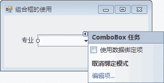
在其中选中“使用数据绑定项”复选框，显示“数据绑定模式”菜单，如下图所示。

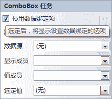
在该菜单中

*   “数据源”组合框用于选择要连接数据库中的数据表，相当于为控件设置 DataSource 属性；
*   “显示成员”组合框用于设置在组合框中显示的列名，可以通过组合框的 Text 属性获取；
*   “值成员”组合框用于设置组合框中的隐藏值，可以通过组合框的 Value 属性获取；
*   “选定值”组合框用于设置组合框中所选值使用的列名。

下面通过实例来演示组合框的绑定。

【实例 1】创建 Windows 窗体应用程序，设置显示专业信息的组合框，并将“显示成员”设置为专业名称列、将“值成员”设置为专业编号、将“选定值”设置为“计算机”。

根据题目要求，先创建专业信息表，建表语句如下。

```

create table major
(
    id int primary key identity(1,1),
    name varchar(20) unique
);
```

向该表中添加计算机、英语、自动化 3 个专业信息，通过“ComboEox 任务”菜单设置数据绑定项，首先选择“数据源”组合框，并单击“添加项目数据源”链接，弹出如下图所示的对话框。

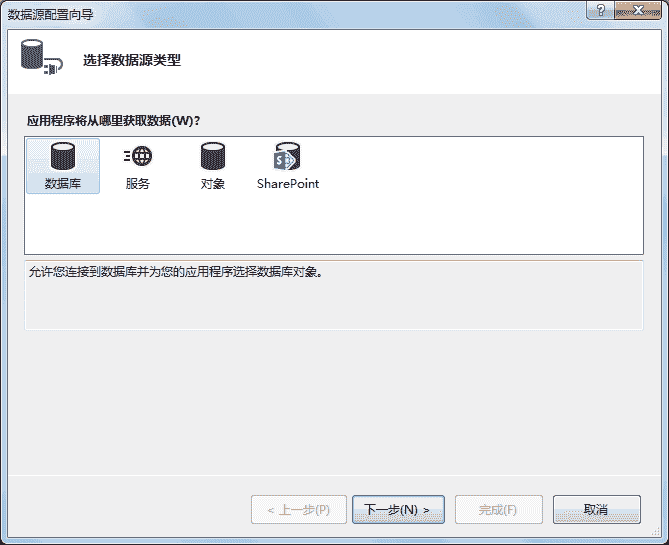
选择“数据库”选项，单击“下一步”按钮，显示如下图所示的对话框。

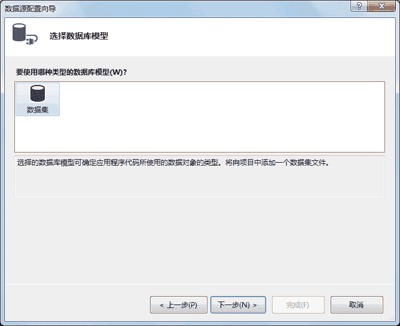
选择“数据集”选项，单击“下一步”按钮，显示如下图所示的对话框。

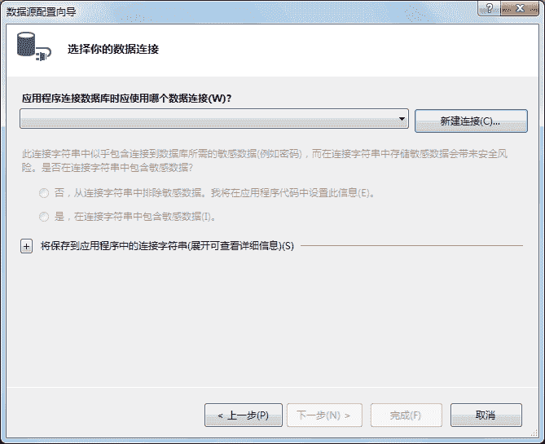
在该界面中选择数据连接，如果没有建立数据连接，则需要新建连接。

单击“新建连接”按钮，弹出如下图所示的对话框。

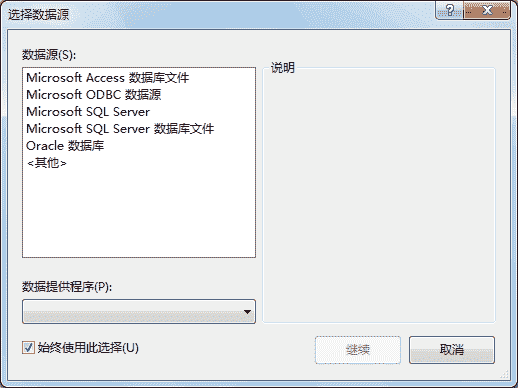
其中列出了供用户选择的数据源，也可以添加其他的数据源，这里选择 Microsoft SQL Server 选项，单击“继续”按钮，弹出如下图所示的对话框。

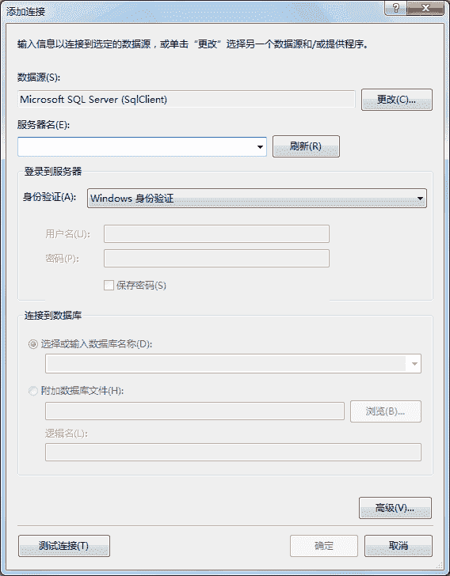
在其中输入服务器名，选择登录服务器的身份验证方式以及连接的数据库名或数据库文件信息，添加信息后的效果如下图所示。

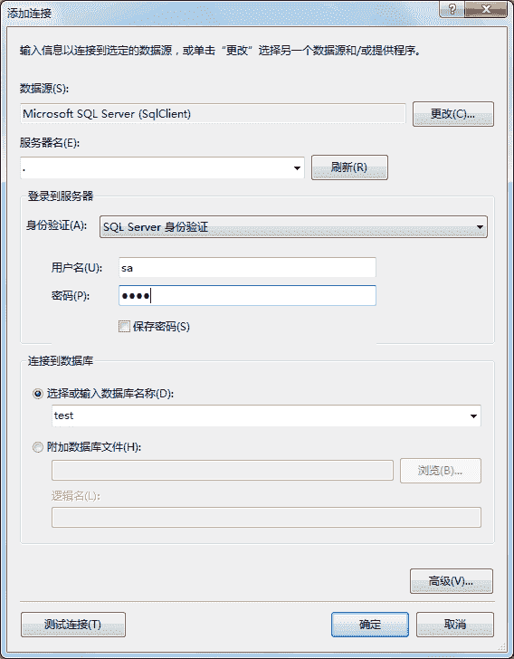
单击“测试连接”按钮，如果弹出“测试连接成功”提示，则数据库连接设置正确。

单击“确定”按钮，回到“选择你的数据连接”对话框，如下图所示。

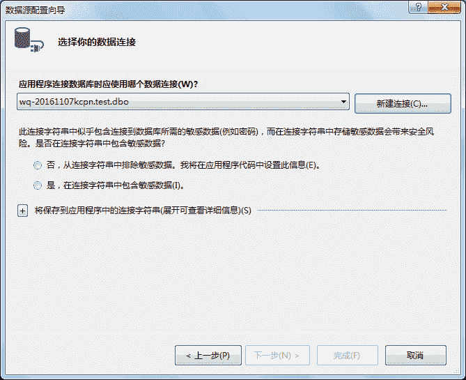
由于连接字符串存储一些敏感信息，在界面中提供了两个供用户选择的单选按钮，这里选择“是，在连接字符串中包含敏感数据”单选按钮，单击“下一步”按钮，显示如下图所示的对话框。

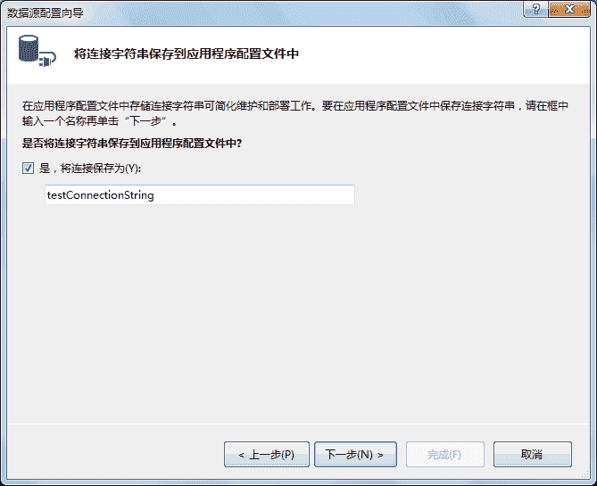
在其中可以为连接字符串设置名称，也可以选择不保存连接串，保存后的连接字符串能在下一次建立数据库连接时使用。

单击“下一步”按钮，显示如下图所示的对话框。

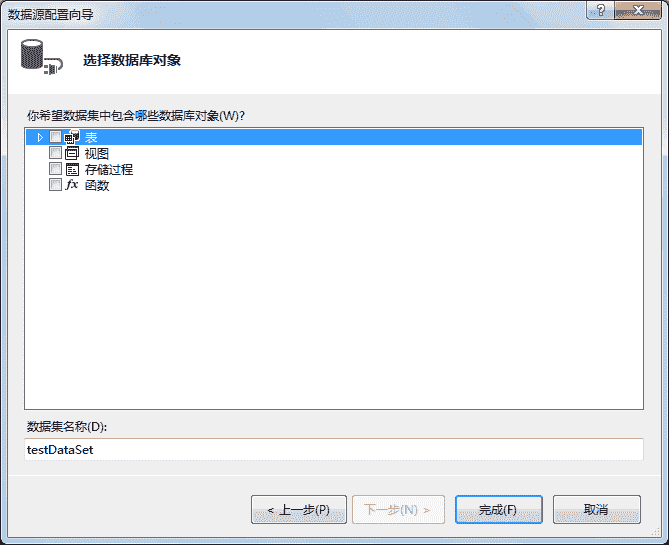
在其中选择数据库对象，包括表、视图、存储过程、函数，可以选择一个对象，也可以选择多个对象，这里仅选择专业信息表（major）,并设置数据集名称，如下图所示。

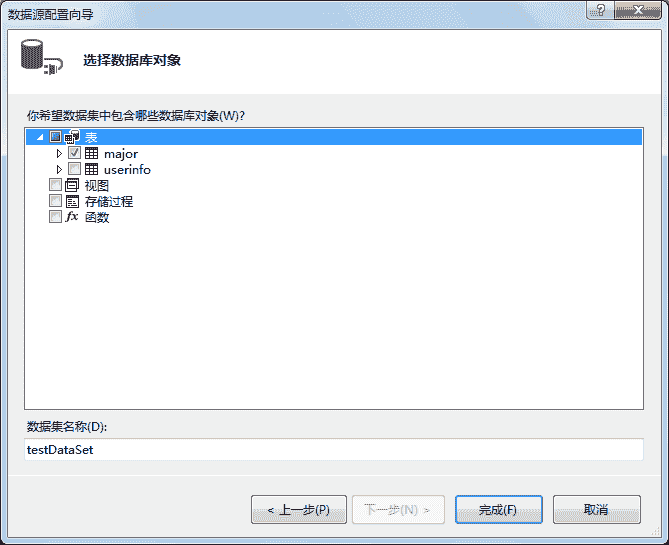
单击“完成”按钮，即可完成对数据源的设置。

完成数据源的设置以后，分别设置“显示成员”“值成员”“选定值”组合框，设置后的效果如下图所示。

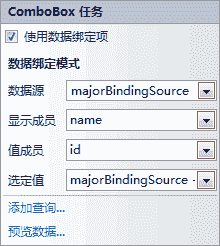
在数据绑定后运行该窗体，效果如下图所示。

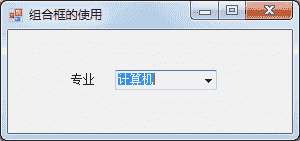
从上面的运行效果可以看出，在组合框中显示了专业信息表中的专业名称列的值。

## 使用代码绑定组合框

与数据绑定控件设置的属性类似，需要通过代码设置组合框的数据源、显示成员、值成员等内容。

具体设置的语句如下。

组合框对象.DataSource = DataTable 的对象
//设置组合框的显示成员属性
组合框对象.DisplayMember = 列名
//设置组合框的值成员属性
组合框对象.ValueMember = 列名

下面通过实例演示如何通过编写代码绑定组合框。

【实例 2】使用代码的方式绑定组合框显示专业名称，每次切换选项后弹出消息框显 示组合框中当前选择的值。

将上一实例中的数据绑定方式换成代码方式来绑定组合框显示专业名称，在窗体的加载事件中加入绑定组合框的代码，代码如下。

```

//窗体加载事件
private void ComboBoxForm_Load(object sender, EventArgs e)
{
    //数据库连接串
    string connStr = "Data Source=.;Initial Catalog=test;User ID=sa;Password=root";
    //创建 SqlConnection 的实例
    SqlConnection conn = null;
    try
    {
        conn = new SqlConnection(connStr);
        //打开数据库
        conn.Open();
        string sql = "select * from major";
        //创建 SqlDataAdapter 类的对象
        SqlDataAdapter sda = new SqlDataAdapter(sql, conn);
        //创建 DataSet 类的对象
        DataSet ds = new DataSet();
        //使用 SqlDataAdapter 对象 sda 将查新结果填充到 DataSet 对象 ds 中
        sda.Fill(ds);
        //设置组合框的 DataSource 属性
        comboBox1.DataSource = ds.Tables[0];
        //设置组合框的 DisPlayMember 属性
        comboBox1.DisplayMember = "name";
        //设置组合框的 ValueMember 属性
        comboBox1.ValueMember = "id";
    }
    catch(Exception ex)
    {
        MessageBox.Show("出现错误！" + ex.Message);
    }
    finally
    {
        if (conn != null)
        {
            //关闭数据库连接
            conn.Close();
        }
    }
}
```

运行该窗体，效果与上一实例相同。

在组合框的选项改变事件中将组合框中当前显示的内容显示到消息框中，代码如下。

```

private void comboBox1_SelectedIndexChanged(object sender, EventArgs e)
{
    if (comboBox1.Tag != null)
    {
        //获取组合框中显示的值
        string name = comboBox1.Text;
        //弹出消息框
        MessageBox.Show("您选择的专业是：" + name);
    }
}
```

运行该窗体，效果如下图所示。

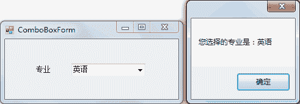
在实际工作中，使用代码绑定的方式是应用最多的方式，一方面体现了代码的灵活性，另一个方面也增强了代码的可移植性。