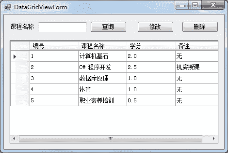
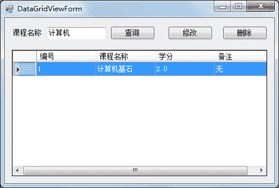
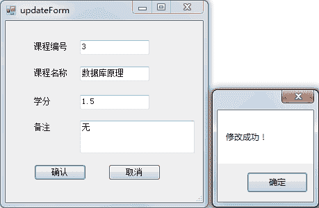
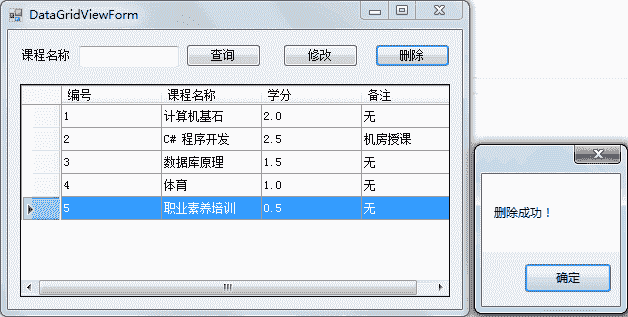

# C# 数据表格（DataGridView）控件的应用案例

> 原文：[`c.biancheng.net/view/3040.html`](http://c.biancheng.net/view/3040.html)

接下来我们通过一个完整的实例来实现课程信息管理功能的操作，包括查询、修改、删除课程信息的操作。

为了简化实例，添加课程信息的操作直接在 SQL Server 数据库中完成。

下面分几个步骤完成。

#### 1) 创建课程信息表

创建课程信息表的 SQL 语句如下。

```

use test;
create table course
(
    id int primary key identity(1,1),
    name varchar(20),
    credit numeric(3,1),
    remark varchar(50)
);
```

向表中添加数据的语句如下。

```

insert into course (name, credit, remark) values ('计算机基石 ' , 2, '无');
insert into course (name, credit, remark) values ('C# 程序开发', 2.5 , '机房授课');
insert into course (name, credit, remark) values ('数据库原理',1,'无');
insert into course (name, credit, remark) values ('体育',1,'无');
insert into course (name, credit, remark) values ('职业素养培训',0.5,'无');
```

在 SQL Server 中执行上述 SQL 语句即可完成课程信息表（course）的创建和数据的添加。

#### 2) 课程信息管理界面的设计

在课程信息管理界面中提供了 DataGridView 控件用于显示课程信息，并提供了根据课程名称查找课程信息、修改以及删除的功能。

具体的界面设计如下图所示。


#### 3) 在加载窗体时显示所有课程信息

本例中使用编写代码的方式实现 DataGridView 控件的数据绑定，并在窗体的加载事件中加入数据绑定的代码。

由于查询所有课程信息的代码将在后面的修改和删除功能中重复使用，所以单独定义一个方法来实现查询所有课程信息。代码如下。

```

//窗体加载事件
private void DataGridViewForm_Load(object sender, EventArgs e)
{
    //调用查询全部课程的方法
    QueryAllCourse();

}
//查询全部课程
private void QueryAllCourse()
{
    //数据库连接串
    string connStr = "Data Source=.;Initial Catalog=test;User ID=sa;Password=root";
    //创建 SqlConnection 的实例
    SqlConnection conn = null;
    try
    {
        conn = new SqlConnection(connStr);
        //打开数据库
        conn.Open();
        string sql = "select * from course";
        //创建 SqlDataAdapter 类的对象
        SqlDataAdapter sda = new SqlDataAdapter(sql, conn);
        //创建 DataSet 类的对象
        DataSet ds = new DataSet();
        //使用 SqlDataAdapter 对象 sda 将查新结果填充到 DataSet 对象 ds 中
        sda.Fill(ds);
        //设置表格控件的 DataSource 属性
        dataGridView1.DataSource = ds.Tables[0];
        //设置数据表格上显示的列标题
        dataGridView1.Columns[0].HeaderText = "编号";
        dataGridView1.Columns[1].HeaderText = "课程名称";
        dataGridView1.Columns[2].HeaderText = "学分";
        dataGridView1.Columns[3].HeaderText = "备注";
        //设置数据表格为只读
        dataGridView1.ReadOnly = true;
        //不允许添加行
        dataGridView1.AllowUserToAddRows = false;
        //背景为白色
        dataGridView1.BackgroundColor = Color.White;
        //只允许选中单行
        dataGridView1.MultiSelect = false;
        //整行选中
        dataGridView1.SelectionMode = DataGridViewSelectionMode.FullRowSelect;
    }
    catch (Exception ex)
    {
        MessageBox.Show("查询错误！" + ex.Message);
    }
    finally
    {
        if (conn != null)
        {
            //关闭数据库连接
            conn.Close();
        }
    }
}
```

运行该窗体，效果如下图所示。



#### 4) 完成课程名称的模糊查询

在“查询”按钮的单击事件中加入根据课程名称模糊查询的代码，具体如下。

```

//查询按钮单击事件
private void button1_Click(object sender, EventArgs e)
{
    if (textBox1.Text != "")
    {
        //数据库连接串
        string connStr = "Data Source=.;Initial Catalog=test;User ID=sa;Password=root";
        //创建 SqlConnection 的实例
        SqlConnection conn = null;
        try
        {
            conn = new SqlConnection(connStr);
            //打开数据库
            conn.Open();
            string sql = "select * from course where name like '%{0}%'";
            //填充占位符
            sql = string.Format(sql, textBox1.Text);
            //创建 SqlDataAdapter 类的对象
            SqlDataAdapter sda = new SqlDataAdapter(sql, conn);
            //创建 DataSet 类的对象
            DataSet ds = new DataSet();
            //使用 SqlDataAdapter 对象 sda 将查新结果填充到 DataSet 对象 ds 中
            sda.Fill(ds);
            //设置表格控件的 DataSource 属性
            dataGridView1.DataSource = ds.Tables[0];
        }
        catch (Exception ex)
        {
            MessageBox.Show("出现错误！" + ex.Message);
        }
        finally
        {
            if (conn != null)
            {
                //关闭数据库连接
                conn.Close();
            }
        }
    }
}
```

运行该窗体，查询效果如下图所示。


从上面的运行效果可以看出，在文本框中输入“计算机”，则可以实现查询所有课程 名称中含有“计算机”字样的课程信息。

#### 5) 实现修改功能

在 DataGridView 控件中选中一条课程信息，单击“修改”按钮，弹出修改课程信息界面并在该界面中显示要修改的信息，修改界面的设计如下图所示。


选中 DataGridView 控件的一条课程信息，单击“修改”按钮。

```

“修改”按钮的单击事件中的代码如下。
//修改课程信息
private void button2_Click(object sender, EventArgs e)
{
    //获取 DataGridView 控件中的值
    //获取课程编号
    string id = dataGridView1.SelectedRows[0].Cells[0].Value.ToString();
    //获取课程名称
    string name = dataGridView1.SelectedRows[0].Cells[1].Value.ToString();
    //获取课程名称
    string credit = dataGridView1.SelectedRows[0].Cells[2].Value.ToString();
    //获取课程名称
    string remark = dataGridView1.SelectedRows[0].Cells[3].Value.ToString();
    //创建 updateForm 类的对象，并将课程信息传递给修改界面
    updateForm updateform = new updateForm(id, name, credit, remark);
    //弹出修改信息窗口
    DialogResult dr = updateForm.ShowDialog();
    //判断是否单击确定按钮
    if (dr == DialogResult.OK)
    {
        //调用查询全部课程方法
        QueryAllCourse();
    }
}
```

修改界面 (UpdateForm) 中的代码如下。

```

//带参数的构造方法
public updateForm(string id,string name,string credit,string remark)
{
    InitializeComponent();
    textBox1.Text = id;
    textBox2.Text = name;
    textBox3.Text = credit;
    textBox4.Text = remark;
}
//确认按钮单击事件
private void button1_Click(object sender, EventArgs e)
{
    //数据库连接串
    string connStr = "Data Source=.;Initial Catalog=test;User ID=sa;Password=root";
    //创建 SqlConnection 的实例
    SqlConnection conn = null;
    try
    {
        conn = new SqlConnection(connStr);
        //打开数据库
        conn.Open();
        string sql = "update course set name='{0}',credit='{1}',remark='{2}' where id='{3}'";
        //填充占位符
        sql = string.Format(sql, textBox2.Text, textBox3.Text, textBox4.Text, textBox1.Text);
        //创建 SqlCommand 类的对象
        SqlCommand cmd = new SqlCommand(sql, conn);
        //执行修改操作的 SQL
        cmd.ExecuteNonQuery();
        //弹出成功提示
        MessageBox.Show("修改成功！");
        //设置当前窗体 DislogResult 结果为 OK
        this.DialogResult = DialogResult.OK;
        //关闭窗体
        this.Close();
    }
    catch (Exception ex)
    {
        MessageBox.Show("修改失败！" + ex.Message);
    }
    finally
    {
        if (conn != null)
        {
            //关闭数据库连接
            conn.Close();
        }
    }
}
//取消按钮单击事件
private void button2_Click(object sender, EventArgs e)
{
    //关闭窗体
    this.Close();
}
```

修改操作的运行效果如下图所示。



#### 6) 实现删除功能

为“删除”按钮添加单击事件，将选中的课程信息删除并刷新界面中查询出来的数据。实现的代码如下。

```

//删除按钮的单击事件
private void button3_Click(object sender, EventArgs e)
{
    //获取 DataGridView 控件中选中行的编号列的值
    int id = int.Parse(dataGridView1.SelectedRows[0].Cells[0].Value.ToString());
    //数据库连接串
    string connStr = "Data Source=.;Initial Catalog=test;User ID=sa;Password=root";
    //创建 SqlConnection 的实例
    SqlConnection conn = null;
    try
    {
        conn = new SqlConnection(connStr);
        //打开数据库
        conn.Open();
        string sql = "delect from course where id='{0}'";
        //填充占位符
        sql = string.Format(sql, id);
        //创建 SqlCommand 类的对象
        SqlCommand cmd = new SqlCommand(sql, conn);
        //执行 SQL 语句
        cmd.ExecuteNonQuery();
        //弹出消息提示删除成功
        MessageBox.Show("删除成功！");
        //调用查询全部的方法，刷新 DataGridView 控件中的数据
        QueryAllCourse();
    }
    catch (Exception ex)
    {
        MessageBox.Show("删除失败！" + ex.Message);
    }
    finally
    {
        if (conn != null)
        {
            //关闭数据库连接
            conn.Close();
        }
    }
}
```

删除操作的运行效果如下图所示。


单击删除消息框中的“确定”按钮,’即可刷新 DataGridView 控件中的数据。