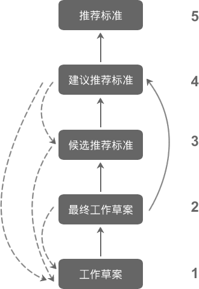

# W3C 标准制定流程

W3C 标准只是推荐标准（Recommendation），并没有强制执行的效力。不过，鉴于 W3C 在 Web 标准领域的影响力和强大号召力，W3C 发布的推荐标准，通常浏览器厂商们都很重视，并积极支持。

一般情况下，W3C 标准制作经历了下面几个阶段，这些阶段都有专有术语，拥有定义好的含义，虽然也有变化，但修订频率不高，最新版是 2005 年制订的，具体说明如下，流程如下图所示。

图 1：W3C 标准制定流程示意图

#### 第 1 阶段：工作草案（WorkingDraft）

工作组依据工作组章程（charter）提出一系列工作草案。公众和 W3C 会员可以提出评论和问题。工作组必须处理这些反馈。本阶段时长依多种因素而变。

#### 第 2 阶段：最终工作草案（Last Call Working Draft）

工作组已完成工作，并要求公众和 W3C 会员提交最后的评论与问题。同样，工作组必须处理这些反馈。如果出现情况，可能要回到工作草案阶段。本阶段时长通常为 3 周，但也可以更长。

#### 第 3 阶段：候选推荐标准（Candidate Recommendation）

当最终工作草案阶段结束，且问题都得到解决后，将进入候选推荐标准（Candidate Recommendation）阶段。

此时可以认为该规范已经稳定，可以展开试验性实施了。工作组必须将实施中得到的反馈整合到规范中。同样，如果出现情况，需返回到工作草案阶段。根据实施进展，本阶段通常持续零到一年。

#### 第 4 阶段：建议推荐标准（Proposed Recommendation）

如无意外，规范将进入建议推荐标准（Proposed Recommendation）阶段。在此阶段，W3C 总监 (TimBemers-Lee）将正式请求 W3C 会员审阅这份建议推荐标准。本阶段时长必须不少于 4 周。

#### 第 5 阶段：推荐标准（Recommendation）

根据审阅结果，要么 W3C 总监宣布该规范成为 W3C 推荐标准（Recommendation），中间可能发生微小改动，要么返回工作草案阶段，或者彻底从 W3C 工作日程上移去。技术规范一旦成为推荐标准，它就是官方的 W3C 标准了。

当然由于种种因素，有些 W3C 草案，未能在 W3C 得到青睐，最终只能成为 Note，这意味着没有厂商会去实现它。

最后，在实际操作中，很多浏览器厂商出于利益或技术上的考虑，可能会不完全遵照 W3C 推荐标准来实现其产品，因此用户会发现各个厂商的浏览器对 CSS3 技术支持程度各不相同。