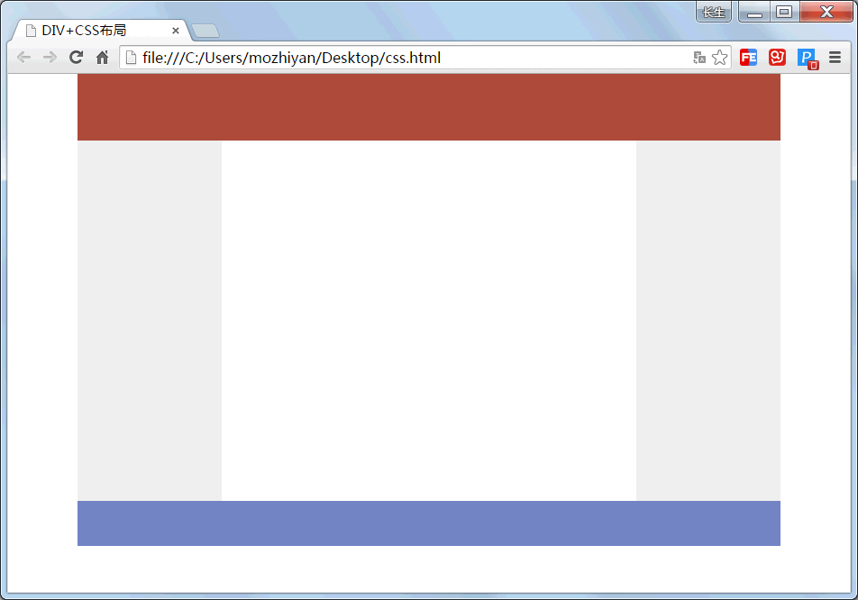
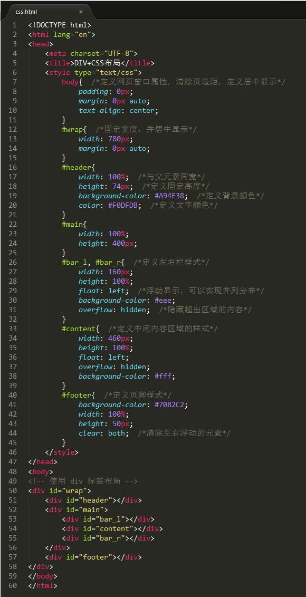

# 初次体验 CSS

早期的设计师习惯使用表格设计网页，直接使用 Photoshop 画图、切图，最后再输出表格页面。表格布局的便捷激发了设计师对网页创意的激情，直到现在，设计师还是喜欢先画图，再重构。

当然，表格布局是不标准的，根据 W3C 制定的规范，表格的目的是用来显示数据的，而不是用来实现布局的，错把表格当布局源于早期对 Web 技术的缺乏和对标准需求的乏力。

为了帮助读者更好地理解表格页面与 CSS 页面孰优孰劣，下面结合一个案例进行比较分析。

本案例设计一个空白布局模板，如下图所示，它是一个典型的 3 行 3 列的网页板式。


图 1：最终要实现的网页布局样式

## 使用表格布局

启动 Dreamweaver 或者文本编辑器（如 Sublime Text、Notepad++、记事本程序等），新建一个 HTML 文档，并保存为 table.html。

输入下面的代码，使用表格来设计网页。

```
<!DOCTYPE html>
<html lang="en">
<head>
    <meta charset="UTF-8">
    <title>表格布局</title>
</head>
<body>
<!-- 表格布局 -->
<table width="778" height="514" border="0" align="center" cellpadding="0" cellspacing="0">
    <tr>
        <td height="74" colspan="3" valign="top" bgcolor="#A94E38"></td>
    </tr>
    <tr>
        <td width="160" height="400" valign="top" bgcolor="#EEEEEE"></td>
        <td valign="top"></td>
        <td width="160" valign="top" bgcolor="#EEEEEE"></td>
    </tr>
    <tr>
        <td height="50" colspan="3" valign="top" bgcolor="#7082C2"></td>
    </tr>
</table>
</body>
</html>
```

在浏览器中打开 table.html，就可以看到上图所示的效果。

## 使用 DIV+CSS 布局

再新建一个文档，保存为 css.html。输入下面的代码，使用 <div> 标签来定义 HTML 框架。

```
<!DOCTYPE html>
<html lang="en">
<head>
    <meta charset="UTF-8">
    <title>DIV+CSS 布局</title>
</head>
<body>
<!-- 使用 div 标签布局 -->
<div id="wrap">
    <div id="header"></div>
    <div id="main">
        <div id="bar_l"></div>
        <div id="content"></div>
        <div id="bar_r"></div>
    </div>
    <div id="footer"></div>
</div>
</body>
</html>
```

> 在标准页面中，应该为结构标签 <div> 定义 id 属性，为页面中不同内容块定义一个名称，以便 CSS 控制。

在 <head> 标签内部插入一个 <style type="text/css"> 标签，然后在标签内部输入下面的 CSS 代码。

```
body{  /*定义网页窗口属性，清除页边距，定义居中显示*/
    padding: 0px;
    margin: 0px auto;
    text-align: center;
}
#wrap{  /*固定宽度，并居中显示*/
    width: 780px;
    margin: 0px auto;
}
#header{
    width: 100%;  /*与父元素同宽*/
    height: 74px;  /*定义固定高度*/
    background-color: #A94E38;  /*定义背景颜色*/
    color: #F0DFDB;  /*定义文字颜色*/
}
#main{
    width: 100%;
    height: 400px;
}
#bar_l, #bar_r{  /*定义左右栏样式*/
    width: 160px;
    height: 100%;
    float: left;  /*浮动显示，可以实现并列分布*/
    background-color: #eee;
    overflow: hidden;  /*隐藏超出区域的内容*/
}
#content{  /*定义中间内容区域的样式*/
    width: 460px;
    height: 100%;
    float: left;
    overflow: hidden;
    background-color: #fff;
}
#footer{  /*定义页脚样式*/
    background-color: #7082C2;
    width: 100%;
    height: 50px;
    clear: both;  /*清除左右浮动的元素*/
}
```

最终的效果如下所示：
图 2：代码在 Sublime Text 中的显示效果
在浏览器中打开 css.html，可以看到与图 1 相同的效果。

单单就 table.html 和 css.html 文档比较，让人感觉不到 CSS 页面的优势，甚至书写的代码比表格布局还要多。但是在一个大型网站中分别采用上面两种方式进行页面设计，如果有一天老板让把左侧通栏宽度改为 120 像素，那么：

*   在传统的表格布局的网站中，需要打开多有的页面逐一进行修改，劳动强度可想而知；
*   而在 DIV+CSS 布局的网站中只需要简单的修改一个 CSS 样式就可以了。

如果所有网页是用 Photoshop 切图实现的，一个简单的改动都会带来毁灭性的打击，因为我们可能需要重新画图、切图，一切都需从头再来。两者相比，孰优孰劣显而易见了。

#### 拓展阅读

评价一个网页设计的好坏，也许没有一个统一的标准。但是，建立在一个良好结构基础上的网页代码，肯定也是组容易维护和扩展的。

表格布局与 DIV+CSS 布局本身没有优劣之分，只要坚持最基本的网页设计原则即可：

*   对于设计者来说容易实现；
*   对于编程者来说容易开发；
*   对于管理者来说容易维护；
*   对于浏览者来说容易阅读和交互。