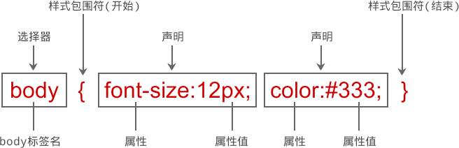

# CSS 样式及其基本语法

CSS 代码可以在任何文本编辑器中打开和编辑。因此，不管读者有没有编程基础，初次接触 CSS 时会感到很简单。本节将介绍 CSS 基本语法。

样式是 CSS 最小语法单元，每个样式包含两部分内容：选择器和声明（规则），如图 1 所示。


图 1：CSS 样式基本结构

#### 1) 选择器（Selector）

选择器告诉浏览器该样式将作用于页面中哪些对象，这些对象可以是某个标签、所有网页对象、指定 class 或 id 值等。浏览器在解析这个样式时，根据选择器来渲染对象的显示效果。

#### 2) 声明（Declaration）

声明可以增加一个或者无数个，这些声明告诉浏览器如何去渲染选择器指定的对象。

声明必须包括两部分：属性和属性值，并用分号来标识一个声明的结束，在一个样式中最后一个声明可以省略分号。

所有声明被放置在一对大括号`{ }`内，然后整体紧邻选择器的后面。

#### 3) 属性（Property）

属性是 CSS 提供的设置好的样式选项。属性名由一个单词或多个单词组成，多个单词之间通过连字符相连。这样能够很直观地表示属性所要设置样式的效果。

#### 4) 属性值（Value）

属性值用来显示属性效果的参数。它包括数值和单位，或者关键字。

【示例 1】定义网页字体大小为 12 像素，字体颜色为深灰色，则可以设置如下样式。

```
body{ font-size: 12px; color: #CCCCCC; }
```

多个样式可以并列在一起，不需要考虑如何进行分隔。

【示例 2】定义段落文本的背景色为紫色，则可以在上面样式基础上定义如下样式。

```
body{ font-size: 12px; color: #CCCCCC;} p{ background-color: #FF00FF; }
```

由于 CSS 语言忽略空格（除了选择器内部的空格外），因此可以利用空格来格式化 CSS 源代码，则上面代码可以进行如下美化：

```
body {
    font-size: 12px;
    color: #CCCCCC;
}
p {
    background-color: #FF00FF;
}
```

这样在阅读 css 源代码时就一目了然了，既方便阅读，也更容易维护。

任何语言都需要注释，HTML 使用`<!- 注释语句->` 来进行注释，而 CSS 使用`/* 注释语句 */`来进行注释。

【示例 3】对于上面样式可以进行如下注释。

```
body {  /*页面基本属性*/
    font-size: 12px;
    color: #CCCCCC;
}
/*段落文本基础属性*/
p {
    background-color: #FF00FF;
}
```