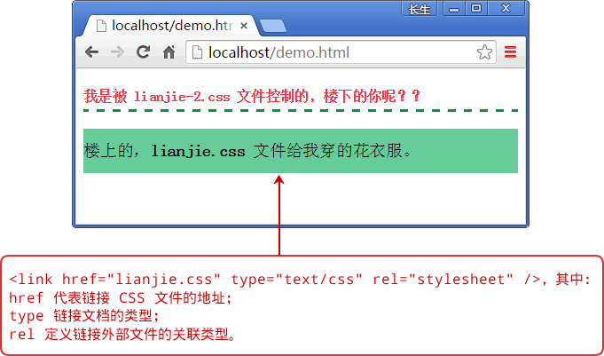

# HTML 嵌入 CSS 样式（四种方法）

CSS 样式代码必须保存在`.css`类型的文本文件中，或者放在网页内 <style> 标签中，或者插在网页标签的 style 属性值中。CSS 样式应用的方法主要包括 4 种：行内样式、内嵌式、链接式以及导入样式，下面分别进行说明。

## 1\. 行内样式

行内样式就是把 CSS 样式直接放在代码行内的标签中，一般都是放入标签的`style`属性中，由于行内样式直接插入标签中，故是最直接的一种方式，同时也是修改最不方便的样式。

【示例 1】针对段落、<h2> 标签、<em> 标签、<strong>标签以及 <div> 标签，分别应用 CSS 行内样式。

```
<!doctype html>
<html>
<head>
<meta charset="utf-8">
<title>行内样式</title>
</head>
<body>
    <p style="background-color: #999900">行内元素，控制段落-1</p>
    <h2 style="background-color: #FF6633">行内元素，h2 标题元素</h2>
    <p style="background-color: #999900">行内元素，控制段落-2</p>
    <strong style="font-size:30px;">行内元素，strong 比 em 效果要强</strong>
    <div style="background-color:#66CC99; color:#993300; height:30px; line-height:30px;">行内元素，div 块级元素</div>
    <em style="font-size:2em;">行内元素，em 强调</em>
</body>
</html>
```

页面演示效果如下图所示。


图 1：行内样式的应用
在上面示例中，行内样式由 HTML 元素的 style 属性，即将 CSS 代码放入`style=""`引号内即可，多个 CSS 属性值则通过分号间隔，例如示例中 <div> 标签块级元素

<div style="background-color:#66CC99; color:#993300; height:30px; line-height:30px;">行内元素，div 块级元素 </div>

的编写，我们拋弃过去 HTML 结构和样式放在一起的写法，即`<body bgcolor="#33ffff">`。

段落 <p> 标签设置背景色为褐色（background-color: #999900），标题 <h2> 标签设置背景色为红色（background-color: #FF6633）。

<strong> 标签设置字体为 30 像素（font-size:30px;），<div> 标签设置高度和行高为 30 像素以及进行背景色、颜色的设置（background-color:#66CC99; color:#993300; height:30px; line-height:30px;），<em> 标签设置字体大小为相对单位（font-size: 2em;）。

两个段落 <p> 标签，虽内容不同，但使用一样的背景色设置，却添加两次 CSS 行内属性设置背景色 background-color: #999900。

<h2> 标签、<p> 标签、<div> 标签为块级元素，设置其 CSS 属性，浏览器支持；<strong> 标签、<em> 标签为行内元素，设置其 CSS 属性，浏览器支持；故无论行内元素、块级元素，CSS 行内样式都有效。

总之，行内元素虽然编写简单，但通过示例可以发现存在以下缺陷：

*   每一个标签要设置样式都需要添加 style 属性。
*   与过去网页制作者将 HTML 的标签和样式糅杂在一起的效果，不同的是现在是通过 CSS 编写行内样式，过去釆用的是 HTML 标签属性实现的样式效果，虽方式不同但结果是一致的：后期维护成本高，即当修改页面时需要逐个打开网站每个页面一一修改，根本看不到 CSS 所起到的作用。
*   添加如此多的行内样式，页面体积大，门户网站若釆用这种方式编写，那将浪费服务器带宽和流量。

网络上有些网页通过查看源文件可以看到这种编写方式，虽然一个网页只有一部分是如此做的， 但需要分情况：

*   若网页制作者编写这样的行内样式，可以快速更改当前样式，不必考虑以前编写的样式冲突问题；
*   网页中若存在这种情况则是后台编辑时，通过编辑器生成的样式，或后台未开发完整，需为编辑人员开发可选择样式的选项而非通过编辑器直接改变颜色、粗细、背景色、倾斜等效果。

## 2\. 内嵌式

内嵌式通过将 CSS 写在网页源文件的头部，即在 <head> 和 <head> 之间，通过使用 HTML 标签中的 <style> 标签将其包围，其特点是该样式只能在此页使用，解决行内样式多次书写的弊端。

【示例 2】为段落设置内嵌式样式书写方法，减少代码量。

```
<!doctype html>
<html>
<head>
<meta charset="utf-8">
<title>内嵌式</title>
<style type="text/css">
p{
    text-align: left;  /*文本左对齐*/
    font-size: 18px;  /*字体大小 18 像素*/
    line-height: 25px;  /*行高 25 像素*/
    text-indent: 2em;  /*首行缩进 2 个文字大小空间*/
    width: 500px;  /*段落宽度 500 像素*/
    margin: 0 auto;  /*浏览器下居中*/
    margin-bottom: 20px;  /*段落下边距 20 像素*/
}
</style>
</head>
<body>
    <p>“百度”这一公司名称便来自宋词“众里寻他千百度”。（百度公司会议室名为青玉案，即是这首词的词牌）。而“熊掌”图标的想法来源于“猎人巡迹熊爪”的刺激，与李博士的“分析搜索技术”非常相似，从而构成百度的搜索概念，也最终成为了百度的图标形象。在这之后，由于在搜索引擎中，大都有动物形象来形象，如 SOHU 的狐，如 GOOGLE 的狗，而百度也便顺理成章称作了熊。百度熊也便成了百度公司的形象物。</p>
    <p>在百度那次更换 LOGO 的计划中，百度给出的 3 个新 LOGO 设计方案在网民的投票下，全部被否决，更多的网民将选票投给了原有的熊掌标志。</p>
    <p>此次更换 LOGO 的行动共进行了 3 轮投票，直到第 2 轮投票结束，新的笑脸 LOGO 都占据了绝对优势。但到最后一轮投票时，原有的熊掌标志却戏剧性地获得了最多的网民选票，从而把 3 个新 LOGO 方案彻底否决。</p>
</body>
</html>
```

页面演示效果如下图所示。


图 2：内嵌式的应用
在上面示例中，段落进行如下设置：文本左对齐、字体为 14 号、行高 25 像素、宽度 500 像素、下边距 20 像素、浏览器下居中、首行缩进两个文字大小空间。首行缩进使用相对单位，此设置的作用是当字体大小改变时，如`font-size: 18px;`依然能够实现缩进两个文字大小空间。

行内样式带来了样式修改的不方便，例如上个示例中两个段落都使用同样的样式，但需要编写两遍；而使用内嵌式样式后，就可以将所有的段落样式放在一起。

style 不仅可定义 CSS 样式，还可以定义 JavaScript 脚本，故使用 style 时需要注意。当 style 的 type 值为`text/css`时，内部编写 CSS 样式；若 style 的 type 值为`text/javascript`时，内部编写 JavaScript 脚本。

#### style 标签的 title 属性

style 中有一个比较特殊的属性 title，使用 title 可以为不同的样式设置一个标题，浏览者就可以根据标题选择不同的样式达到浏览器中切换的效果，但 IE 浏览器不支持，Firefox 浏览器支持此效果。

【示例 3】分别为火狐浏览器设置两种字体大小样式，通过火狐“查看”菜单进行修改。

```
<!doctype html>
<html>
<head>
<meta charset="utf-8">
<style type="text/css" title="字体 14 号">
p{
    text-align: left;  /*文本左对齐*/
    font-size: 14px;  /*字体大小 14 像素*/
    line-height: 25px;  /*行高 25 像素*/
    text-indent: 2em;  /*首行缩进两个文字大小空间*/
    width: 500px;  /*段落宽度 500 像素*/
    margin: 0 auto;  /*浏览器下居中*/
}
</style>
<style type="text/css" title="字体 18 号">
p{
    text-align: left;  /*文本左对齐*/
    font-size: 18px;  /*字体大小 18 像素*/
    line-height: 25px;  /*行高 25 像素*/
    text-indent: 2em;  /*首行缩进两个文字大小空间*/
    width: 500px;  /*段落宽度 500 像素*/
    margin: 0 auto;  /*浏览器下居中*/
    color: #6699FF;  /*字体颜色的改变*/
}
</style>
</head>
<body>
    <p>“百度”这一公司名称便来自宋词“众里寻他千百度”。（百度公司会议室名为青玉案，即是这首词的词牌）。而“熊掌”图标的想法来源于“猎人巡迹熊爪”的刺激，与李博士的“分析搜索技术”非常相似，从而构成百度的搜索概念，也最终成为了百度的图标形象。</p>
</body>
</html>
```

页面演示效果如下图所示。


图 3：火狐浏览器内嵌式更换样式
在上面不例中，通过 <style type="text/css" title="名称"> 定义了两种字体大小，通过火狐浏览器“查看”菜单下的“页面样式”子菜单中有两个选项：字体 14 号、字体 18 号，默认情况下显示的是第一次书写的 <style type="text/css" title="名称">，通过菜单可以改变该页面样式。

## 3\. 链接式

链接式通过 HTML 的 <link> 标签，将外部样式表文件链接到 HTML 文档中，这也是网络上网站应用最多的方式，同时也是最实用的方式。这种方法将 HTML 文档和 CSS 文件完全分离，实现结构层和表示层的彻底分离，增强网页结构的扩展性和 CSS 样式的可维护性。

【示例 4】使用链接式为 HTML 代码应用样式，书写、更改方便。

```
<!doctype html>
<html>
<head>
<meta charset="utf-8">
<title></title>
<link href="lianjie.css" type="text/css" rel="stylesheet" />
<link href="lianjie-2.css" type="text/css" rel="stylesheet" />
</head>
<body>
    <p>我是被 lianjie-2.css 文件控制的，楼下的你呢？？</p>
    <h3>楼上的，<span>lianjie.css</span> 文件给我穿的花衣服。</h3>
</body>
</html>
```

页面演示效果如下图所示。


图 4：链接式的应用
在上面示例中，通过 link 链接两个 CSS 文件，且都有效，这也是网站制作者将公共部分放入一个 CSS 文件，当前页面样式编写新的样式文件。

lianjie.css 文件代码：

```
h3{
    font-weight: normal;  /*取消标题默认加粗效果*/
    background-color: #66CC99;  /* 设置背景色 */
    height: 50px;  /*设置标签的高度*/
    line-height:50px;  /* 设置标签的行高 */
}
span{
    color: #FFOOOO;  /* 字体颜色 */
    font-weight:bold;  /* 字体加粗 */
}
```

lianjie-2.css 文件代码：

```
p{
    color: #FF3333;  /*字体颜色设置*/
    font-weight: bold;  /* 字体加粗 */
    border-bottom: 3px dashed #009933;  /* 设置下边框线 */
    line-height: 30px;  /* 设置行高 */
}
```

链接式样式使 CSS 代码和 HTML 代码完全分离，达到结构与样式的分开，使 HTML 代码专门构建页面结构，而美化工作由 CSS 完成。

CSS 文件可以放在不同的 HTML 文件中，使网站所有页面样式统一；再者将 CSS 代码放入一个 CSS 文件中便于管理、减少代码以及维护时间；当修改 CSS 文件时，所有应用此 CSS 文件的 HTML 文件都将更新，而不必从服务器上将所有的页面取回再修改完毕后上传。

## 4\. 导入样式

导入样式使用 @import 命令导入外部样式表。导入样式有 6 种书写方式：

```
@import daoru.css;
@import 'daomxss';
@import "daoru.css";
@import url(daoru.css);
@import url('daoru.css');
@import url("daoru.css");
```

【示例 5】导入样式表 lianjie.css 和 daoru.css 以及书写 <body> 标签的背景色，注意导入样式表和 <body> 标签样式的前后不可颠倒。

```
<html>
<head>
<meta charset="utf-8">
<title></title>
<style type="text/css">
    @import url(lianjie.css);
    @import url(daoru.css);
    body { background-color: #e4e929; }
</style>
</head>
<body>
    <div>
        <p>我是被 lianjie-2.css 文件控制的，楼下的你呢？？</p>
        <h3>褛上的，<span>lianjie.css</span>文件给我穿的花衣服。</h3>
    </div>
</body>
</html>
```

页面演示效果如下图所示。


图 5：导入样式应用
在上面示例中，必须是`@import url("lianjie-2.css"); p{text-indent: 3em;}`，而不能是`p{text-indent:3em;} @import url("lianjie-2.css");`，否则将导入效果无效。在 CSS 文件中也需要将 @import 放在前面，后面加入 CSS 样式，否则也是无效。

lianjie.css 文件代码，同上一个示例即链接式。

daoru 文件代码：

```
@import url("lianjie-2.css");
p { text-indent: 3em; }
```