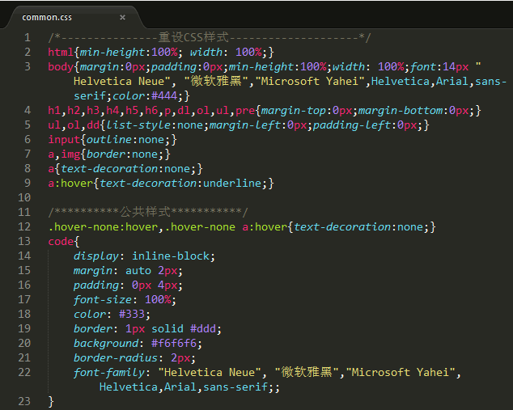

# CSS 样式表（内部样式表和外部样式表）

一个或多个 CSS 样式可以组成一个样式表。样式表包括内部样式表和外部样式表，它们没有本质区别，都是由一个或者多个样式组成。具体说明如下：

## 1\. 内部样式表

内部样式表包含在 <style> 标签内，一个 <style> 标签就表示一个内部样式表。

而通过标签的 style 属性定义的样式属性就不是样式表。如果一个网页文档中包含多个 <style> 标签，就表示该文档包含了多个内部样式表。

## 2\. 外部样式表

如果 CSS 样式被放置在网页文档外部的文件中，则称为外部样式表，一个 CSS 样式表文档就表示一个外部样式表。

实际上，外部样式表也就是一个文本文件，扩展名为`.css`。当把 CSS 样式代码复制到一个文本文件中后，另存为`.css`文件，则它就是一个外部样式表。

如下图所示就是 C 语言中文网的外部样式表（http://c.biancheng.net/templets/new/style/common.css）：

图 1：C 语言中文网外部样式表文件
可以在外部样式表文件顶部定义 CSS 源代码的字符编码。例如，下面代码定义样式表文件的字符编码为中文简体。

@charset "gb2312";

如果不设置 CSS 文件的字符编码，可以保持默认设置，则浏览器会根据 HTML 文件的字符编码 来解析 CSS 代码。