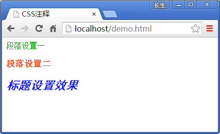

# CSS 注释

在 CSS 中增加注释很简单，所有被放在`/*`和`*/`分隔符之间的文本信息都被称为注释。

CSS 只有一种注释，不管是多行注释还是单行注释，都必须以`/*`开始、以`*/`结束，中间加入注释内容。

【示例 1】注释放在样式表之外。

```
/*定义网页的头部样式*/
.head{ width: 960px; }
/*定义网页的底部样式*/
.footer {width:960px;}
```

【示例 2】注释放在样式表内部。

```
p{
    color: #ff7000;  /*字体颜色设置*/
    height：30px;  /*段落高度设置*/
}
```

下面的例子进行 CSS 代码应用并查看浏览器下的效果。

【示例 3】为段落和标题分别添加 CSS 代码注释。

```
<html>
<head>
<style type="text/css">
/*样式 1*/
.STYLE1 {
    color: #009900;  /*字体颜色是绿色的*/
}

/*样式 2*/
.STYLE2 {
    font-size: 18px;  /*字体大小为 18 号字体*/
    color: #FF3300;  /*字体颜色是红色的*/
    font-weight: bold;  /*字体进行了加粗*/
}

/*样式 3*/
.STYLE3 {
    color: #0000FF;  /*字体颜色为蓝色*/
    font-family: "黑体";  /*字体为黑体*/
    font-style: italic;  /*字体效果为倾斜*/
}
</style>
</head>
<body>
    <p class="STYLE1">段落设置一</p>
    <p class="STYLE2">段落设置二</p>
    <h2 class="STYLE3">标题设置效果</h2>
</body>
</html>
```

页面演示效果如下图所示。


图 1：CSS 代码添加注释