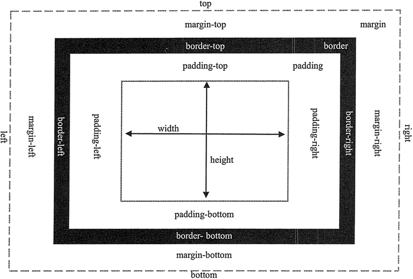

# CSS 属性

在《CSS 样式》一节中讲到，样式是 CSS 语法的最小单元，每一个样式都由选择器和声明（规则）两部分组成，而声明又由属性和属性值组成。本节我们就来说一下“属性”。

CSS 语法和用法比较简单，但是要灵活使用 CSS，应该熟悉和理解 CSS 的众多属性，只有这样才能够轻松驾驭 CSS，并使用 CSS 设计出漂亮的网页效果。

CSS 属性众多，在 W3C CSS 2.0 版本中共有 122 个标准属性（[`www.w3.org/TR/CSS2/propidx.html`](https://www.w3.org/TR/CSS2/propidx.html)），在 W3C CSS 2.1 版本中共有 115 个标准属性（[`www.w3.org/TR/CSS21/propidx.html`](https://www.w3.org/TR/CSS21/propidx.html)），其中删除了 CSS2.0 版本中 7 个属性：font-size-adjust、font-stretch、marker-offset、marks、page、size 和 text-shadow。在 W3C CSS 3.0 版本中又新增加了 20 多个属性（[`www.w3.org/Style/CSS/current-work#CSS3`](https://www.w3.org/Style/CSS/current-work#CSS3)）。

CSS 属性被分为不同的类型，如字体属性、文本属性、边框属性、边距属性、布局属性、定位属性、打印属性等。对于初学者来说，初学 CSS 的最大障碍是如何熟悉并掌握这些属性的使用。

> 提示：不要急于记住每个 CSS 属性，不要急于一下吃透它们的用法，更不能机械记忆，如果使用背英语单词的方法来记忆，效果势必会很差。

最佳的方法是边学习边记忆，在实践中逐个突破。当学习网页排版时，不妨集中精力把字体和文本属性研究一下。当学习网页布局时，不妨再研究与盒模型和布局相关的几个属性。

记忆这些属性时，一定要结合实践，不断去尝试并举一反三。只有这样才能够完全掌握 CSS 所有属性，并能够熟练应用。例如，当准备学习 CSS 布局时，不妨先集中精力把与 CSS 盒模型相关的属性记住，此时可以绘制一个图，如下图所示。

图 1：CSS 盒模型相关的属性
CSS 属性的名称比较有规律，且名称与意思紧密相连，根据意思记忆属性名称是一个不错的方法。

CSS 盒模型讲的就是网页中任何元素都会显示为一个矩形形状，它可以包括外边距、边框、内边距、宽和高等。用英文表示就是：margin（外边距，或称为边界）、border（边框）、padding（内边距，或 称为补白）、height（高）和 width（宽），盒子还有 background（背景）。

外边距按方位又可以包含 margin-top、margin-right、margin-bottom、margin-left 共 4 个分支属性，分别表示顶部外边距、右侧外边距、底部外边距和左侧外边距。

同样的道理，内边距也可以包含 padding-top、padding-right、padding-bottom、padding-left 和 padding 属性。

边框可以分为边框类型、粗细和颜色，因此可以包含 border-width、border-color 和 border-style 属性，这些属性又可以按 4 个方位包含很多属性，例如，border-width 属性又分为 border-top-width、 border-right-width、border-bottom-width、border-left-width 和 border-width 属性。