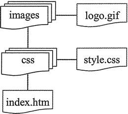

# CSS 属性值和 CSS 单位

上节我们讲到了 CSS 属性，这节接着说一下属性值。定义 CSS 属性值的难点在于单位的选用。它覆盖范围很广，从长度单位到颜色单位，再到 URL 地址等。

单位的取舍很大程度上依赖用户的显示器和浏览器，不恰当的使用单位会给页面布局带来很多麻烦，因此属性值的设置需要网页设计师认真对待。

## 颜色值

颜色值包括颜色名、百分比、数字和十六进制数值。

#### 1) 使用颜色名是最简单的方法

虽然目前已经命名的颜色约有 184 种，但真正被各种浏览器支持，并且作为 CSS 规范推荐的颜色名称只有 16 种，如下表所示。

表 1：CSS 规范推荐的颜色名称

| 名 称 | 颜 色 | 名 称 | 颜 色 | 名 称 | 颜 色 |
| black | 纯黑 | silver | 浅灰 | navy | 深蓝 |
| blue | 浅蓝 | green | 深绿 | lime | 浅绿 |
| teal | 靛青 | aqua | 天蓝 | maroon | 深红 |
| red | 大红 | purple | 深紫 | fuchsia | 品红 |
| olive | 褐黄 | yellow | 明黄 | gray | 深灰 |
| white | 壳白 |   |   |   |   |

不建议在网页中使用颜色名，特别是大规模的使用，避免有些颜色名不被浏览器解析，或者不同浏览器对颜色的解释差异。

#### 2) 使用百分比

这是一种最常用的方法，例如：

color: rgb(100%, 100%, 100%);

这个声明将红、蓝、绿 3 种原色都设置为最大值，结果组合显示为白色。相反，可以设置`rgb(0%, 0%, 0%)`为黑色。3 个百分值相等将显示灰色，同理哪个百分值大就偏向哪个原色。

#### 3) 使用数值

数字范围从 0~255，例如：

color: rgb(255, 255, 255);

上面这个声明将显示白色，相反，可以设置为`rgb(0, 0, 0)`，将显示黑色。3 个数值相等将显示灰色，同理哪个数值大哪个原色的比重就会加大。

#### 4) 十六进制颜色

这是最常用的取色方法，例如：

color: #ffffff;

其中要在十六进制前面加一个`#`颜色符号。上面这个声明将显示白色，相反，可以设置`#000000`为黑色，用 RGB 来描述：

color: #RRGGBB;

从 0~255，实际上十进制的 255 正好等于十六进制的 FF，一个十六进制的颜色值等于 3 组这样的十六进制的值，它们按顺序连接在一起就等于红、蓝、绿 3 种原色。

## 绝对单位

绝对单位在网页中很少使用，一般多用在传统平面印刷中，但在特殊的场合使用绝对单位是很有必要的。绝对单位包括英寸、厘米、毫米、磅和 pica。

*   英寸（in）：是使用最广泛的长度单位。
*   厘米（cm）：生活中最常用的长度单位。
*   毫米（mm）：在研究领域使用广泛。
*   磅（pt）：在印刷领域使用广泛，也称点。CSS 也常用 pt 设置字体大小，12 磅的字体等于六分之一英寸大小。
*   pica（pc）：在印刷领域使用，1 pica 等于 12 磅，所以也称 12 点活字。

## 相对单位

相对单位与绝对单位相比显示大小不是固定的，它所设置的对象受屏幕分辨率、可视区域、浏览器设置以及相关元素的大小等多种因素影响。

#### 1) em

em 单位表示元素的字体高度，它能够根据字体的 font-size 属性值来确定单位的大小。

【示例 1】在下面样式中定义段落文本行高为字体大小的 2 倍。

```
p{  /*设置段落文本属性*/
    font-size: 12px;
    line-height: 2em;  /* 行高为 24px */
}
```

从上面样式代码中可以看出：一个 em 等于 font-size 的属性值，如果设置`font-size: 12pt`，则`line-height: 2em`就会等于 24pt。如果设置 font-size 属性的单位为 em，则 em 的值将根据父元素的 font-size 属性值来确定。

例如有下面的 HTML 结构：

```
<div id="main">
    <p>em 相对长度单位使用</p>
</div>
```

为它设置如下的 CSS 样式：

```
#main { font-size: 12px; }
p { font-size: 2em; }
```

则 p 元素里面的字体大小将为 24px。

同理，如果父对象的 font-size 属性的单位也为 em，则将依次向上级元素寻找参考的 font-size 属性值，如果都没有定义，则会根据浏览器默认字体进行换算，默认字体一般为 16px。

#### 2) ex

ex 单位根据所使用的字体中小写字母 x 的高度作为参考。在实际使用中，浏览器将通过 em 的值除以 2 得到 ex 的值。为什么这样计算呢？

因为 x 高度计算比较困难，且小写 x 的高度值是大写 x 的一半；另一个影响 ex 单位取值的是字体，由于不同字体的形状差异，这也导致相同大小的两段文本，但由于字体设置不同，ex 单位的取值也会存在很大的差异。

#### 3) px

px 单位是根据屏幕像素点来确定的。这样不同的显示分辨率就会使相同取值的 px 单位所显示出来的效果截然不同。

实际设计中，建议网页设计师多使用相对长度单位 em，且在某一类型的单位上使用统一的单位。如设置字体大小，根据个人使用习惯，在一个网站中，可以统一使用 px 或 em。

## 百分比

百分比也是一个相对单位值。百分比值总是通过另一个值来计算，一般参考父对象中相同属性的值。例如，如果父元素宽度为 500px，子元素的宽度为 50%，则子元素的实际宽度为 250px。

百分比可以取负值，但在使用中受到很多限制。

## URL

设置 URL 的值也是读者最容易糊涂的地方，URL 包括绝对地址和相对地址。绝对地址一般不会出错，只要完整输入地址即可。在设置相对地址时，很多初学者容易犯错误。

【示例 2】下面示例演示了如何正确设置样式表文件的相对路径。

如下图所示是一个简单的站点模拟结构，其中在根目录下存在两个文件夹 images 和 css。在 images 文件夹中存放着 logo.gif 图像，在 css 文件夹中存放着 style.css 样式文件。想一想，在 index.htm 网页文件中显示 logo.gif 图像，该如何设置 URL？


图 1：站点模拟结构
第 1 步，把 style.css 导入 index.html

<link href="css/style.css" type="text/css" rel="stylesheet" />

第 2 步，思考：从 logo.gif 到 style.css 的参照物是什么？是 index.htm，还是 style.css。显然是以 style.css 样式文件本身为参照物，正确的写法如下。

background: url(../images/logo.gif);

这与 JavaScript 用法截然不同，假设在 CSS 文件夹中有一个`.js`文件需要导入到 index.htm 网页中， 而`.js`文件也引用了 logo.gif 图像，再使用`url(../images/logo.gif)`就不对了，正确写法如下。

url(images/logo.gif)

因为它们的参照物不同，在浏览器中被解析的顺序和方式也不同。