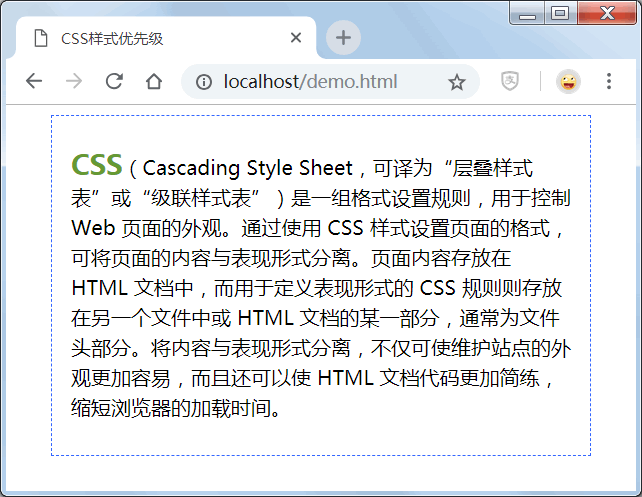

# CSS 样式优先级顺序

如果按照 CSS 的来源，可以将网页定义的样式分为 4 种：

*   HTML 默认样式；
*   作者（网站开发者/程序员）定义的样式；
*   用户（网站使用者）设置的样式；
*   浏览器默认样式。

原则上讲，作者定义的样式优先于用户设置的样式，用户设置的样式优先于浏览器的默认样式，而浏览器的默认样式会优先于 HTML 的默认样式。

> 注意：当用户设置的样式中使用了`!important`命令声明之后，用户的`!important`命令会优先于作者声明的`!important`命令。

对于相同来源的 CSS 来说，不同位置的样式其优先级也是不同的。一般来说，行内样式会优先于内嵌样式表，内嵌样式表会优先于外部样式表。而被附加了`!important`关键字的声明会拥有最高的优先级。

在实际开发中，如果作者将网页字体设计为 14 号黑色，而用户在浏览器中利用火狐浏览器的插件 firebug 修改页面字体为 18 号红色字体，那么浏览器该如何处理呢？

根据 CSS 优先级规则：作者定义的样式能够覆盖浏览器默认设置的样式，而用户在浏览器中设置的样式可以覆盖作者的样式。

同时，CSS 根据样式的远近关系来决定最终的优先级：在同等条件下，距离应用对象的距离越近就越有较大的优先权，因而行内样式大于内部样式和外部样式。

如果多个不同类型的选择器同时为一个对象设置样式时，该对象将如何显示最终样式，下面给出一个简单的计算方法。对于常规选择器它们都拥有一个优先级加权值，说明如下。

*   标签选择器：优先级加权值为 1。
*   伪元素或伪对象选择器：优先级加权值为 1。
*   类选择器：优先级加权值为 10。
*   属性选择器：优先级加权值为 10。
*   ID 选择器：优先级加权值为 100。
*   其他选择器：优先级加权值为 0，如通配选择器等。

然后，以上面加权值数为起点来计算每个样式中选择器的总加权值数。计算的规则如下：

*   统计选择器中 ID 选择器的个数，然后乘以 100。
*   统计选择器中类选择器的个数，然后乘以 10。
*   统计选择器中的标签选择器的个数，然后乘以 1。

依此方法类推，最后把所有加权值数相加，即可得到当前选择器的总加权值，最后根据加权值来决定哪个样式的优先级大。

对于由多个选择器组合而成的复合型选择器，首先分别计算每个组成选择器的加权值，接着相加得出当前选择器的总分，最后根据选择器的分值大小，分值越高则优先级越高，那么就将应用它所设置的样式。

如果分值相同，则根据位置关系来进行判断，靠近对象的样式就应有高的优先级。

【示例 1】根据上面的计算规则，计算下面样式的加权值：

```
h3{ color: #ff7300; }  /*加权值=1 分*/
.fl4{ font-size: 14px; }  /*加权值=10 分*/
#head{ width: 960px; }  /*加权值=100 分*/
h3 .f14 { font-weight: bold; }  /*加权值=1 分+10 分=11 分*/
#head h2 { border: 1px solid #ff7300; }  /*加权值=100 分+1 分=101 分*/
div p{ padding: 0 10px; }  /*加权值=1 分+1 分=2 分*/
div #head{ margin: 0 auto; }  /*加权值=1 分+100 分=101 分*/
#head h2 span{ float: right; }  /*加权值=100 分+1 分+1 分=102 分*/
#head .fl4 em{ float: right; }  /*加权值=100 分+10 分+1 分=111 分*/
#head .fl4 span em{ float: right; }  /*加权值=100 分+10 分+1 分+1 分=112 分*/
#head div h2 .fl2 span em{ color: #000; }  /*加权值=100 分+1 分+1 分+10 分+1 分+1 分=114 分*/
```

如果用户要调整样式的优先级，还可以使用 !important 命令，它表示最大优先级，凡是标注 !important 命令的声明将拥有最终的样式控制权，需要注意的是必须把 !important 命令放置在声明语句与分号之间，否则无效。

【示例 2】通过内嵌样式为同一个元素使用不同的复合选择器为其设置样式属性，通过优先级规则进行比较得出最终样式属性值。

```
<!doctype html>
<html>
<head>
<meta charset="utf-8">
<title>CSS 样式优先级</title>
<style type="text/css">
div{
    margin: 0 auto;  /*div 居中*/
    text-align: center;  /*文本居中*/
}
.Cent{
    width: 400px;  /*设置宽度，否则居中看不见效果*/
    border: 1px dashed #CC0099;  /*类别选择器设置边框线*/
    padding: 10px 15px;  /*设置间距*/
}
#imp{border: 1px dashed #3366FF;  /*ID 选择器设置边框线*/ }
.Cent{ font-size: 14px;  /*类别选择器设置字体大小*/ }
.Cent p{
    font-size: 16px;  /*类别选择器和标记选择器一起设置字体大小*/
    font-weight: bold;  /*字体加粗*/
}
.Cent .duanluo {
    font-weight: normal;  /*两次类别选择器设置取消加粗效果*/
    line-height:1.5em;  /*段落行髙*/
    text-align:left;  /*文本左对齐*/
}
.Cent .duanluo span{ color:#009966;  /*复合选择器设置字体彦员色*/ }
#imp span{
    color: #669933;  /*ID 选择器和标签选择器进行定义*/
    font-weight: bold;  /*字体加粗*/
    font-size:22px;  /*字体 22 像素，要比较的地方*/
}
span{ font-size: 30px important;  /*<span>标签使用优先级最高的 !important 命令*/ }
span{ font-size: 40px; ! important  /*错误手写 !important 命令的位置*/ }
</style>
</head>
<body>
<div class="Cent" id="imp">
    <p class="duanluo" id="DL"><span>CSS</span>（Cascading Style Sheet，可译为“层叠样式表”或“级联样式表”）是一组格式设置规则，用于控制 Web 页面的外观。通过使用 CSS 样式设置页面的格式，可将页面的内容与表现形式分离。页面内容存放在 HTML 文档中，而用于定义表现形式的 CSS 规则则存放在另一个文件中或 HTML 文档的某一部分，通常为文件头部分。将内容与表现形式分离，不仅可使维护站点的外观更加容易，而且还可以使 HTML 文档代码更加简练，缩短浏览器的加载时间。
</p>
</div>
</body>
</html>
```

页面效果如下图所示。


在上面示例中，查看浏览器效果并进行逐步分析代码，需要注意的是测试时：下面每一步测试时，后面的代码需要删除，故浏览器有多次显示结果，每一步都进行浏览器显示查看结果。

#### 第 1 步

实现浏览器居中，针对 div 标签设置元素居中属性`margin: 0 auto;`，以及文本居中属性`text-align:center;`。

```
div { margin: 0 auto; text-align: center; }
```

#### 第 2 步

Cent 层设置宽度为 400 像素，如果没有宽度设置，则浏览器上的居中也将无效，接着设置 4 个方向的内间距，最后设置 1 像素颜色为粉红色虚线边框线。

```
.Cent{ width: 400px; border: 1px dashed #CC0099; padding:10px 15px; }
```

#### 第 3 步

通过 ID 值引用 Cent 层，定义 1 像素颜色为粉蓝色虚线边框线，根据前面介绍的优先级规则：类选择器 10 分、ID 选择器 100 分，最终边框线颜色为蓝色。

如果将类别选择器 Cent 层和 ID 选择器 #imp 定义的顺序颠倒过来（如下所示），最终结果依然是蓝色，其原因在于 ID 选择器优先级别高于类选择器。

```
.Cent{ width: 400px; border: 1px dashed #CC0099; padding: 10px 15px; }
#imp { border: 1px dashed #3366FF; }
```

#### 第 4 步

.Cent{ } 定义字体大小为 14 像素，而 .Cent p{} 定义字体大小为 16 像素。根据前面介绍的优先级规则：类选择器 10 分、标签选择器 1 分，那么 .Cent{ } 为 10 分、.Cent p{} = 10+1 = 11 分，故最终结果为段落字体大小为 16 像素且字体加粗显示。

```
.Cent { font-size: 14px; }
.Cent p { font-size: 16px; font-weight: bold; }
```

#### 第 5 步

Cent 层中段落添加 class 名 duanluo，定义字体不再加粗显示、行高 1.5em、文本左对齐，上一步的加粗设置如果字体大小无效，则查看加粗结果，行高设置使用相对单位，这样可以避免字体大小的改变而影响原先段落文字之间的距离。

段落内的 <span> 标签设置字体颜色为 #009966，而通过 ID 值设置字体颜色为 #669933。根据前面介绍的优先级规则：类选择器 10 分、标签选择器 1 分、ID 选择器 100 分，故 .Cent .duanluo span 得分 = 10+10+1 = 21 分，而 #imp span 得分 = 100+1 = 101 分，最终字体颜色为 #669933。

```
.Cent .duanluo { font-weight:normal; line-height:1.5em; text-align:left }
.Cent .duanluo span{ color: #009966; }
#imp span{ color:#669933; font-weight:bold; font-size:22px }
```

#### 第 6 步

在设置段落字体大小时，最终 .Cent p 设置的字体大小为浏览器显示结果：16 像素，而通过 ID 选择器定义字体大小后，字体大小变为 22 像素。

这里通过 !important 命令将 <span> 字体大小设置为 30 像素，因 !important 命令权限无限大，即分数值较高，暂定值为 1000，故 #imp span 分数为 101，小于 !important 命令值 1000，最终结果为 30 像素。

若`span{ font-size:30px !important; }`和`#imp span{ font-size:5Opx !important; }`进行比较，根据前面介绍的优先级规则：ID 选择器 100 分、标签选择器 1 分、!important 命令值 1000，故 span{} 得分为 1000（内部属性中 !important）+1（标签选择器）= 1001 分，而 #imp span 得分为 1000（内部属性中 !important）+100（ID 选择器）+1（标签选择器）= 1101 分。

针对 !important 命令进行一次错误的写法并定义字体大小为 40 像素，通过浏览器发现：!important 命令放置在声明语句与分号之间，否则无效。

```
.Cent p { font-size: 16px; }
#imp span{ color:#669933; font-weight:bold; font-size:22px }
span{ font-size: 30px !important; }
span { font-size: 40px; !important }  /*错误书写方法*/
```

## 注意事项/特殊情况

1) 在特殊性逻辑框架下，被继承的值具有特殊性 0。即不管父级样式的优先权多大，被子级元素继承时，它的特殊性为 0；也就是说，一个元素显示声明的样式都可以覆盖继承来的样式。

【示例 3】在下面示例中，由于 <span> 标签自己定义了颜色样式，虽然标签选择符优先级不及继承样式的 id 选择符，但是依然根据 span{color: gray;} 样式声明进行显示。

CSS 样式：

```
span {color: gray;}
#header{ color: black; }
```

HTML 结构：

```
<div id="header" class="blue">
    <span>遗产继承不如白手起家</span>
</div>
```

在上面示例中，虽然 div 具有 100 的特殊性，但被 span 继承时，特殊性就为 0，而 span 选择器的特殊性虽然仅为 1，但它大于继承样式的特殊性，所以元素最后显示颜色为灰色。

2) 内联样式优先。带有 style 属性的元素，其内联样式的特殊性可以为 100 或者更高，总之，它比上面提到的选择器具有更大的优先权。

【示例 4】在下面示例中，分别为当前 <div> 标签定义多个样式，最后浏览器将根据内联样式 style="color: yellow" 显示字体为黄色。

```
<!doctype html>
<html>
<head>
<meta charset="utf-8">

<title>CSS 样式优先级顺序</title>
<style type="text/css">
    div { color: green; }  /*元素样式*/
    .blue { color: blue; }  /*class 样式*/
    #header { color: gray; }  /*id 样式*/
</style>
</head>
<body>
    <div id="header" class="blue" style="color: yellow">内部优先</div>
</body>
</html>
```

在上面示例中，虽然通过 id 和 class 分别定义了 div 元素的字体属性，但由于 div 元素同时定义了内联样式，内联样式的特殊性大于 id 和 class 定义的样式，因此 div 元素最终显示为黄色。

3) 在相同特殊性下，CSS 将遵循就近原则，也就是说靠近元素的样式具有最大优先权，或者说排在最后的样式具有最大优先权。

【示例 5】请输入下面外部样式表文件：

```
/*CSS 文档，名称为 style.css*/
#header{  /*外部样式*/
    color:Rred;
}
```

HTML 文档结构：

```
<!doctype html>
<html>
<head>
<meta charset="utf-8">
<title>CSS 样式优先级顺序</title>
<link href="style.css" rel="stylesheet" type="text/css" />
<!-- 导入外部样式 -->
<style type="text/css">
    #header { color: gray; }  /*内部样式*/
</style>
</head>
<body>
    <div id="header">就近优先</div>
</body>
</html>
```

上面页面被解析后，则 <div> 元素显示为灰色。如果此时把内部样式改为：

```
div{ color: gray; }  /*内部样式*/
```

则特殊性不同，最终文字显示为外部样式所定义的红色。同样的道理，如果同时导入两个外部样式表，则排在下面的样式表会比上面样式表具有较大优先权。

4) CSS 定义了一个 !important 命令，该命令被赋予最大权力。也就是说不管特殊性如何，以及样式位置的远近，!important 都具有最大优先权。