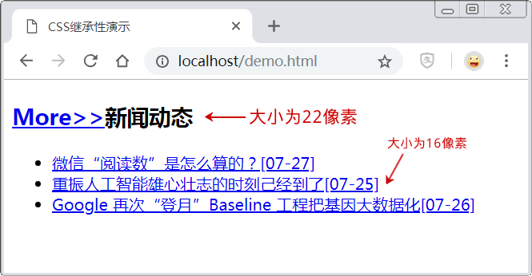
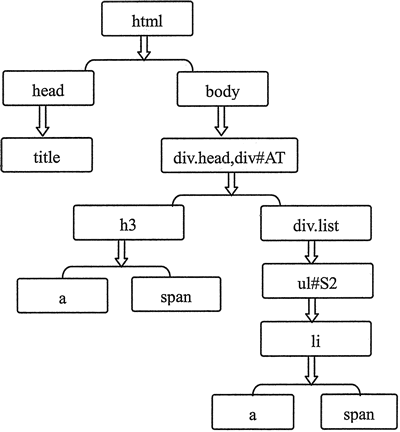

# CSS 继承性

所谓继承性，就是指被包含的元素将拥有外层元素的样式效果。继承性最典型的应用就是在默认样式的预设上。

【示例】在本示例中，将给出 HTML 结构而不书写 CSS 样式，查看 DOM 结构。

```
<!doctype html>
<html>
<head>
<meta charset="utf-8">
<title>CSS 继承性演示</title>
<style type="text/css">
    html, body{ font-size: 16px}
    h3{font-size: 22px;}
</style>
</head>
<body>
<div class="head" id="AT">
    <h3><a href="#">More&gt;&gt;</a><span>新闻动态</span></h3>
    <div class="list">
        <ul id="S2">
            <li><a href="#">微信“阅读数”是怎么算的？<span>[07-27]</span></a></li>
            <li><a href="#">重振人工智能雄心壮志的时刻己经到了<span>[07-25]</span></a></li>
            <li><a href="#">Google 再次“登月”Baseline 工程把基因大数据化<span>[07-26]</span></a></li>
        </ul>
    </div>
    <!-- list end -->
</div>
</body>
</html>
```

页面效果如下图所示。


图 1：HTML 页面显示效果
在上面示例中，通过继承的角度考虑标记直接的树形关系，在图 2 中给出“继承关系树形图”，对比“HTML 页面效果图”，<html> 标签是根元素，它是所有 HTML 元素的源头。

在每一个分支中下层是上层的子元素、上层是下层的父元素，故定义 CSS 样式时，编写样式`html, body{ font-size: 16px}`，则页面所有元素都将继承根元素、父元素的字体大小设置，而编写的基本标记选择器、类别选择器、ID 选择器以及复合选择器都是根据 HTML 结构进行编写，尤其是复合选择器中前后标记的位置就是实际 HTML 结构，即下面的树形图，如图 2 所示。


图 2：继承关系树形图