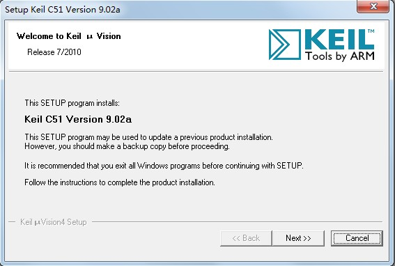
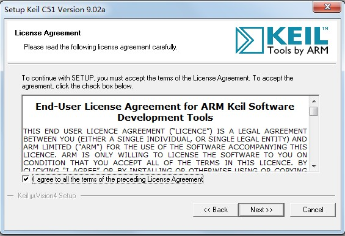
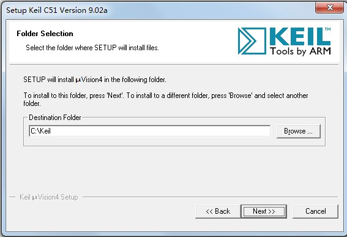
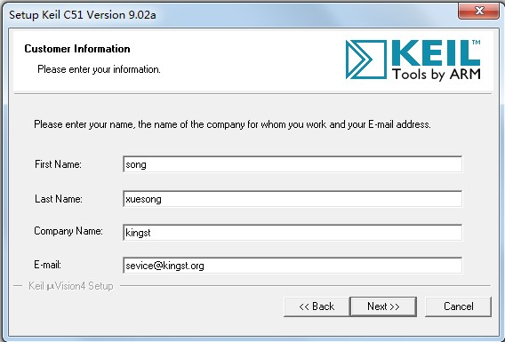
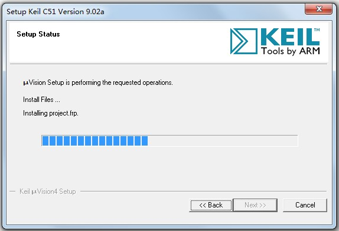
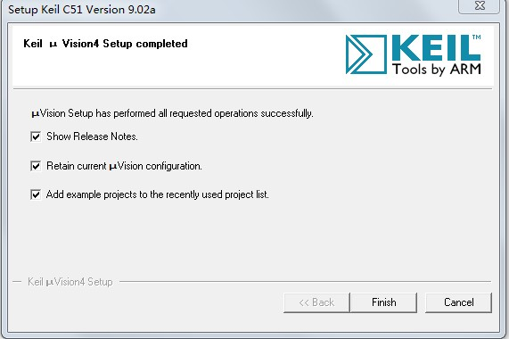

# 单片机开发环境搭建--Keil uVision4 安装教程

单片机开发，首要的两个软件一个是编程软件，一个是下载软件。编程软件我们用 Keil uVision4 的 51 版本，也叫做 Keil C51，不做过多介绍，先直接讲如何安装。

1) 首先准备 Keil uVision4 安装源文件，双击安装文件，弹出安装的欢迎界面，如图 1-1 所示。

图 1-1 Keil 安装欢迎界面

2) 点击“Next”按钮，弹出“License Agreement”对话框，如图 1-2 所示。这里显示的是安装许可协议，需要在“I agree to all the terms of the preceding License Agreement”打勾。

图 1-2 “License Agreement”对话框

3) 点击“Next”按钮，弹出“Folder Selection”对话框，如图 1-3 所示。这里可以设置安装路径，默认安装路径在“C:\Keil”文件夹下。点击“Browse...”按钮，可以修改安装路径，这里建议大家用默认的安装路径，如果你要修改，也必须使用英文路径，不要使用包含有中文字符的路径。

图 1-3 “Folder Selection”对话框

4) 点击“Next”按钮，弹出“Customer Information”对话框，如图 1-4 所示。大家输入用户名、公司名称以及 E-mail 地址即可。

图 1-4 用户信息

5) 单击“Next”，就会自动安装软件，如图 1-5 所示。

图 1-5 安装过程

6) 安装完成后，弹出来安装完成对话框，如图 1-6 所示，并且出现几个选项，大家刚开始把这几个选项的对号全部去掉就可以了，先不用关注有什么作用。

图 1-6 安装完成

7) 最后，点击“Finish”，Keil 编程软件开发环境就这么装好了。