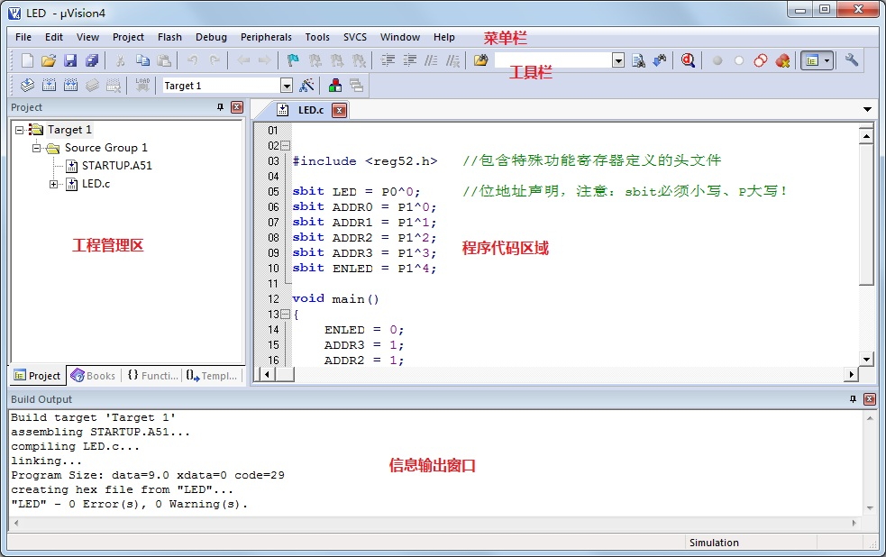
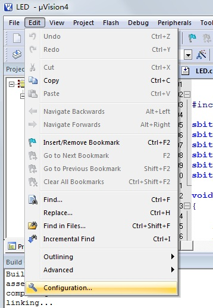
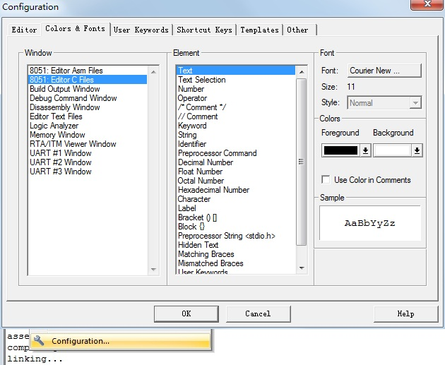

# Keil uVision4 简单使用教程

首先，我们用 Keil 先打开一个现成的工程，来认识一下 Keil 软件，如图 1-7 所示。

图 1-7 工程文件

从图 1-7 我们可以很轻松的分辨出菜单栏、工具栏、工程管理区、程序代码区和信息输出窗口。这个是 Keil4 的英文版，网上有一些汉化版本的，但不建议使用。即使你的英语不好，使用英文版本的软件也一点问题没有，刚开始大家先跟着我去使用，一共没几个单词，不需要你去翻译，用几次你就记住怎么用了。因为以后做实际开发的时候，大多数软件都是英文版的，如果现在学习的时候一直用中文软件，将来一旦换了其它的英文软件就会慌了，所以从现在开始，我们就慢慢的来熟悉英文软件，将来再用到其他英文软件的时候，就可以做到触类旁通、驾轻就熟了。

Keil 软件菜单栏和工具栏的具体细化功能，都可以很方便的从网上查到，不需要记忆，随用随查即可。在这里我们只介绍一点，关于 Keil 软件里边的字体大小和颜色设置。在菜单 Edit-->Configuration-->Colors &Fonts 里边，可以进行字体类型、颜色、大小的设置，如图 1-8 所示。

图 1-8 字体设置(一) 

因为我们用的是 C 语言编程，所以我们在 Window 栏中选择 8051:Editor C Files，然后在右侧 Element 栏目里可以选择要修改的内容，一般我们平时用到的，只是其中几项而已，比如：Text——普通文本、Text Selection——选中的文本、Number——数字、/*Comment*/——多行注释、//Comment——单行注释、Keyword——C 语言关键字、String——字符串，Keil 本身都是有默认设置的，可以直接使用默认设置，但如果你觉得不合你的口味，那就在这里更改一下，改完后直接点 OK 看效果就可以了。

图 1-9 字体设置(二)