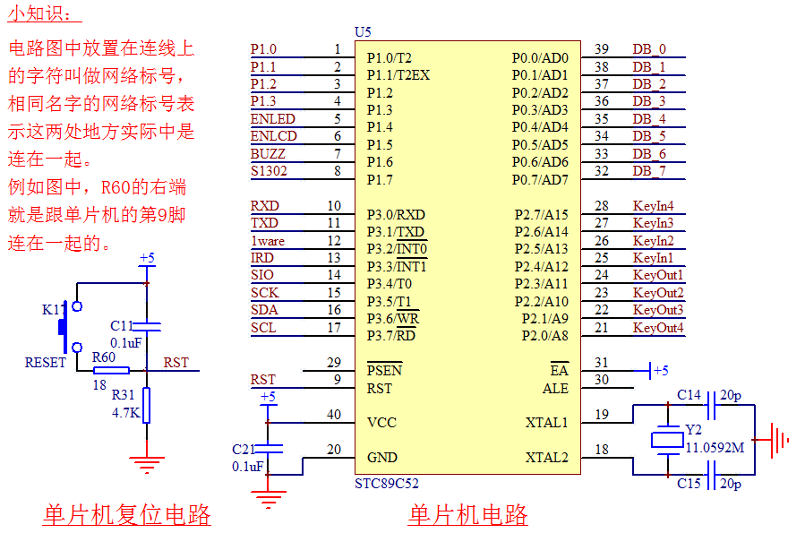
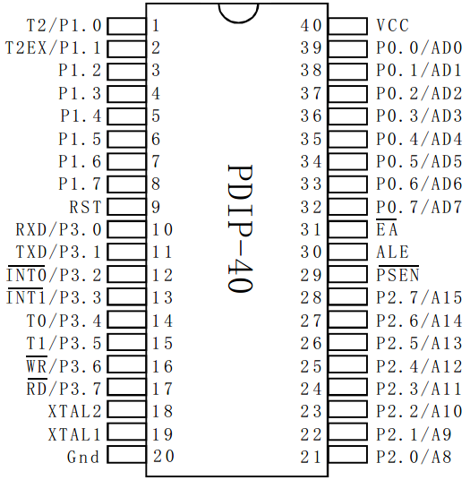

# 单片机最小系统[配图][超详细]

为什么称之为单片机最小系统呢？单片机最小系统，也叫做单片机最小应用系统，是指用最少的原件组成单片机可以工作的系统。单片机最小系统的三要素就是电源、晶振、复位电路，如图 2-1 所示。

图 2-1  单片机最小系统电路

这张最小系统的电路图节选自我们的 KST-51 开发板原理图，下面我们就照这张电路图来具体分析最小系统的三要素。

## 1) 电源

这个很好理解，电子设备都需要供电，就连我们的家用电器（手电筒^_^）也不例外。目前主流单片机的电源分为 5V 和 3.3V 这两个标准，当然现在还有对电压要求更低的单片机系统，一般多用在一些特定场合，在学习中我们不做过多的关注。

我们所选用的 STC89C52，它需要 5V 的供电系统，我们的开发板是使用 USB 口输出的 5V 直流直接供电的。从图 2-1 可以看到，供电电路在 40 脚和 20 脚的位置上，40 脚接的是+5V，通常也称为 VCC 或 VDD，代表的是电源正极，20 脚接的是 GND，代表的是电源的负极。+5V 和 GND 之间还有个电容，作用我们下节课介绍。

这个地方我们还要普及一个看原理图的知识。电路原理图是为了表达这个电路的工作原理而存在的，很多器件在绘制的时候更多考虑的是方便原理分析，而不是表达各个器件实际位置。比如原理图中的单片机引脚图，引脚的位置我们是可以随意放的，但是每个引脚上有一个数字标号，这个数字标号代表的才是单片机真正的引脚位置。一般情况下，这种双列直插封装的芯片，左上角是 1 脚，逆时针旋转引脚号依次增加，一直到右上角是最大脚位，我们现在选用的单片机一共是 40 个引脚，因此右上角就是 40（在表示芯片的方框的内部），如图 2-2 所示，大家要分清原理图引脚标号和实际引脚位置的区别。

图 2-2  单片机封装图

## 2) 晶振

晶振，又叫晶体振荡器，从这个名字我们就可以看出来，它注定一生都要不停振荡的。

他起到的作用是为单片机系统提供基准时钟信号，类似于我们部队训练时喊口令的人，单片机内部所有的工作都是以这个时钟信号为步调基准来进行工作的。STC89C52 单片机的 18 脚和 19 脚是晶振引脚，我们接了一个 11.0592M 的晶振（它每秒钟振荡 11,059,200 次），外加两个 20pF 的电容，电容的作用是帮助晶振起振，并维持振荡信号的稳定。

## 3) 复位电路

在图 2-1 左侧是一个复位电路，接到了单片机的 9 脚 RST(Reset)复位引脚上，这个复位电路如何起作用我们后边再讲，现在着重讲一下复位对单片机的作用。单片机复位一般是 3 种情况：上电复位、手动复位、程序自动复位。

假如我们的单片机程序有 100 行，当某一次运行到第 50 行的时候，突然停电了，这个时候单片机内部有的区域数据会丢失掉，有的区域数据可能还没丢失。那么下次打开设备的时候，我们希望单片机能正常运行，所以上电后，单片机要进行一个内部的初始化过程，这个过程就可以理解为上电复位，上电复位保证单片机每次都从一个固定的相同的状态开始工作。这个过程跟我们打开电脑电源开电脑的过程是一致的。

当我们的程序运行时，如果遭受到意外干扰而导致程序死机，或者程序跑飞的时候，我们就可以按下一个复位按键，让程序重新初始化重新运行，这个过程就叫做手动复位，最典型的就是我们电脑的重启按钮。

当程序死机或者跑飞的时候，我们的单片机往往有一套自动复位机制，比如看门狗，具体应用以后再了解。在这种情况下，如果程序长时间失去响应，单片机看门狗模块会自动复位重启单片机。还有一些情况是我们程序故意重启复位单片机。

电源、晶振、复位构成了单片机最小系统的三要素，也就是说，一个单片机具备了这三个条件，就可以运行我们下载的程序了，其他的比如 LED 小灯、数码管、液晶等设备都是属于单片机的外部设备，即外设。最终完成我们想要的功能就是通过对单片机编程来控制各种各样的外设实现的。